# Architecture

This document describes the internal structure, dependency rules, and runtime data flows of
`iam-delegation`.

`iam-delegation` is a **private Go service** (`github.com/BCBP-SOLUTIONS-FZC-LLC/iam-delegation`,
Go 1.26.6 pinned exactly) that owns out-of-office delegation: who delegated their work to whom,
over what scope (all work / one department / one tender), for how long, and why it ended (expired,
cancelled, the delegate was removed, the delegate was disabled, or the review window lapsed). It
is the fourth and last wave of ADR-0008's decomposition of `iam-org-membership` (Option C) — not
yet deployed to any live environment, and no Git tag has ever been pushed (see
[`VERSIONING.md`](VERSIONING.md)).

## Mental model

This service is the system of record for out-of-office delegations: two business tables
(`delegations`, `delegation_tenant_settings`), an eleven-route API (DLG-1..7 public, DLG-I1..I4
mesh-internal), two synchronous outbound dependencies of its own (`iam-org-membership` for
grant-time membership checks, `iam-user-profile` for availability-first pointer set/clear), one
inbound async subscription (`delegation-cascade-q`, now fed by **two** upstream SNS topics), and
its own outbound event topic (`iam.delegation.events`, four event types) — it is **both a producer
and a consumer**, the one structural difference from most of its O&M-extraction siblings.

Under Option C, Core drops the `delegations` table and its `active_delegations[]` I-8 embed
entirely rather than keeping any FK/projection back to this service (§6.1) — nothing here feeds
I-8. This is also the only sibling service where a *third* IAM service (`iam-user-profile`) is
itself an inbound event producer into this service's own cascade queue, not just a synchronous
dependency: disabling a delegate in User Profile now asynchronously ends their delegations here
(Bug 2/DLG-D26).

---

## Layer model

The service is organised in concentric Clean Architecture layers. Inner layers have **zero
knowledge** of outer layers; dependencies always point inward. Lifted near-verbatim from
`iam-org-membership`'s `internal/core/{domain,port,service}/delegation*.go`,
`delegation_handler.go`, `delegation_repository.go`, and
`cmd/reconciler/jobs/delegation_{expiry,review}.go` — domain/port/service moved with almost no
change; adapters were rehosted; the tenant-policy read became a local table
(`delegation_tenant_settings`) instead of two `tenants` columns Core owned.

> Source: [`docs/architecture/mermaid/layer-model.mmd`](docs/architecture/mermaid/layer-model.mmd)

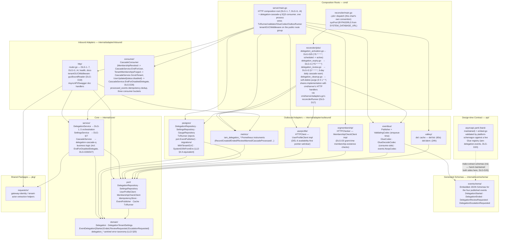

Directory layout, for reference:

```
iam-delegation/
├── cmd/
│   ├── server/                              -- HTTP composition root (DLG-1..7, DLG-I1..I4)
│   │                                            + delegation-cascade-q SQS consumer, one process
│   │   ├── main.go
│   │   ├── adapters.go                      -- gucBoundReader · reconcilerRunner · redisPinger
│   │   ├── config.go                        -- loadConfig() + fail-fast checks
│   │   └── exporters.go                     -- runActiveGaugeExporter (5-min sysPool snapshot)
│   └── reconciler/
│       ├── main.go                          -- --job=<name> dispatch (this chart's own convention)
│       └── jobs/
│           ├── context.go                   -- jobs.Context — shared deps for all four jobs
│           ├── delegation_activation.go     -- DLG-D25 (*/5 * * * *)
│           ├── delegation_expiry.go         -- DLG-I1 (*/5 * * * *, LLD §11.3)
│           ├── delegation_review.go         -- DLG-I2 (0 * * * *, 3-day daily cascade warn, LLD §11.4)
│           └── delegation_cleanup.go        -- soft-delete purge (0 4 1 * *, LLD §11.6/§18.4)
├── internal/
│   ├── core/
│   │   ├── domain/
│   │   │   ├── delegation.go                -- Delegation, enums (incl. status=scheduled, DLG-D25)
│   │   │   ├── tenant_settings.go           -- DelegationTenantSettings (policy)
│   │   │   ├── event.go / event_payloads.go -- outbound event envelope + payload shapes
│   │   │   └── errors.go                    -- delegation_* sentinel error taxonomy (LLD §20)
│   │   ├── port/
│   │   │   ├── delegation_repository.go
│   │   │   ├── settings_repository.go       -- delegation_tenant_settings
│   │   │   ├── user_profile_client.go       -- UserProfileClient (DEL-6)
│   │   │   ├── membership_check_client.go   -- MembershipCheckClient (§7.6.2, swappable)
│   │   │   ├── idempotency_store.go         -- create-dedup (DLG-Q3)
│   │   │   ├── event_publisher.go
│   │   │   ├── cache.go
│   │   │   └── tx_runner.go
│   │   └── service/
│   │       ├── delegation_service.go        -- DLG-1..5 orchestration
│   │       ├── settings_service.go          -- DLG-6/7
│   │       ├── cascade_service.go           -- delegation-cascade-q business logic
│   │       └── metrics.go                   -- injected Metrics port (DLG-D19)
│   └── adapter/
│       ├── inbound/
│       │   ├── http/                        -- DLG-1..7, DLG-I1..I4, health, docs, router
│       │   └── consumer/                    -- delegation-cascade-q (§11.5/§11.5a/§11.6)
│       └── outbound/
│           ├── postgres/                    -- repositories, migrations, processed_events, gauge_repository.go
│           ├── userprofile/                 -- UserProfileClient HTTP impl
│           ├── orgmembership/                -- MembershipCheckClient HTTP impl
│           ├── eventbus/                    -- SNS publisher (iam-delegation-events) + Glue codec (encode+decode)
│           ├── valkey/                      -- del: cache + idempotency store
│           └── metrics/                     -- iam_delegation_* Prometheus instruments
├── internal/eventschema/                    -- embedded JSON Schemas for the four published events
├── pkg/requestctx/                          -- gateway-identity / tenant-actor extraction helpers
├── api/                                     -- asyncapi.yaml (hand-maintained) + embed.go
└── deploy/helm/iam-delegation/              -- this service's independent Helm chart
```

**Dependency rule** (CI-enforced — `.go-arch-lint.yml`, `make arch-lint`, LLD §6.2):
`internal/core/*` imports no adapter, Gin, pgx, or AWS SDK; `port` depends only on `domain`;
`service` depends on `domain`+`port`+`requestctx`; inbound adapters depend on
`service`+`port`+`domain` (never an outbound adapter directly — that's wired only from `cmd`);
outbound adapters depend on `port`+`domain`+`eventschema` (never `service`, never inbound);
`cmd/*` is the only place concretes get wired together. No session-scoped
`SET app.tenant_id` — only `SET LOCAL` via `pgcommon.GUCSetFromContext` (CI greps the forbidden
form — `.github/scripts/check-forbidden-set-guc.sh`, RLS-6). Every outbound client sits behind a
port interface; every event publish goes through the transactional outbox.

---

## Package dependency graph

Arrows represent Go `import` relationships (module-internal only), read from each package's actual
import block — not derived from the Layer model diagram above, which shows composition-root wiring
rather than package-level imports. `core/domain` imports nothing internal (LLD §6.2); `core/port`
imports only `domain`; the two `core/service` types (`DelegationService`/`SettingsService` and
`CascadeService`) both stay inside `domain`+`port` (+`requestctx` for the two DLG-1..7 services).
Notably, `adapter/inbound/consumer` does **not** import `core/service` directly — it accepts
`*service.CascadeService` through a small duck-typed interface defined locally in the `consumer`
package (the same seam pattern as `postgres.PayloadValidator`), so the inbound adapter layer never
has a compile-time dependency on the service layer's concrete type. `adapter/outbound/metrics` and
`pkg/requestctx` have zero internal imports.

> Source: [`docs/architecture/mermaid/package-dependencies.mmd`](docs/architecture/mermaid/package-dependencies.mmd)

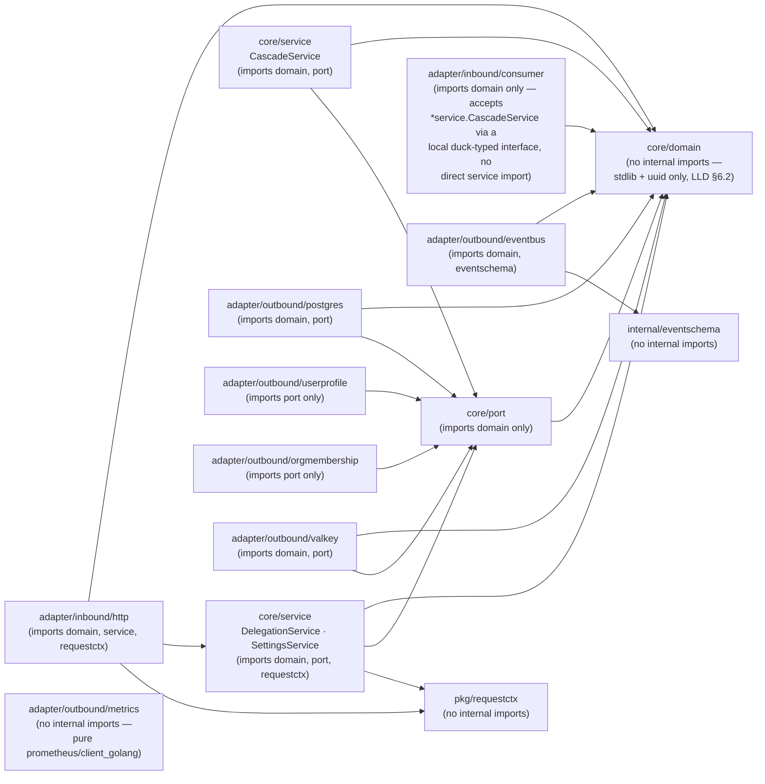

---

## Data model

Three tables in the `delegation` logical database, RLS via the `app.tenant_id` GUC on the two
business tables, no cross-database foreign keys — the composite FKs the O&M split loses are
replaced with logical references plus the synchronous/async patterns described below (LLD §7.6).

> Source: [`docs/architecture/mermaid/data-model.mmd`](docs/architecture/mermaid/data-model.mmd)

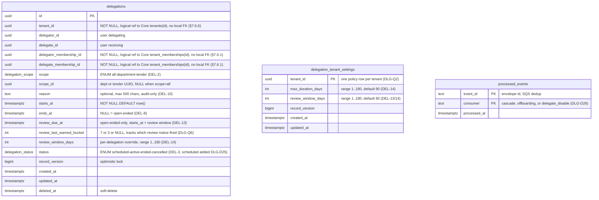

`rls_violation_log` also exists (not a business table — RLS-disabled audit sink, see Row-Level
Security below) and is omitted from the ER diagram for that reason.

---

## Key request flows

One sequence diagram per meaningful path (LLD §11), covering the shared preamble every public
route runs, the two mutating public endpoints, the four CronJobs, the two inbound cascades, and
the remaining read/policy endpoints. See `docs/architecture/README.md` for the full index and the
LLD cross-references.

### Request preamble

Every public route runs the same gateway hand-off before reaching a handler.

> Source: [`docs/architecture/mermaid/request-preamble-flow.mmd`](docs/architecture/mermaid/request-preamble-flow.mmd)

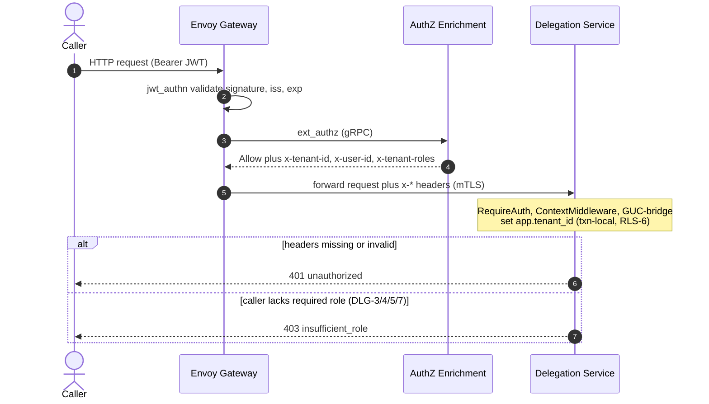

### Create (DLG-2)

Availability-first ordering: both membership checks, then User Profile, then the atomic write +
outbox enqueue — unless `starts_at` is genuinely in the future, in which case the row is created
`scheduled` and neither User Profile nor the outbox is touched yet (DLG-D25).

> Source: [`docs/architecture/mermaid/create-flow.mmd`](docs/architecture/mermaid/create-flow.mmd)

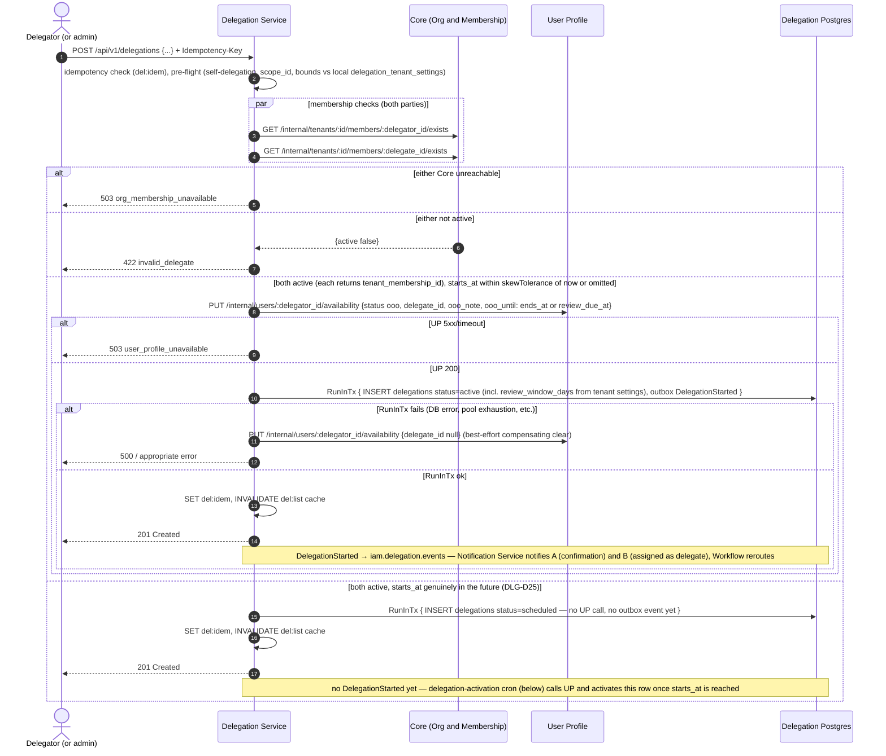

`OOOUntil` is always the already-computed `review_due_at` for open-ended delegations — never `nil`
— since User Profile's `ValidateOOOWindow` unconditionally requires a bounded `ooo_until` whenever
`status="ooo"` (DLG-D29).

### Activation cron (`delegation-activation`, DLG-D25) — availability-first, self-retrying

Mirrors the expiry cron's structure exactly, but promotes `scheduled → active` instead of
`active → ended`. Closes DLG-D25: a delegation created with a future `starts_at` is inserted as
`scheduled` by Create (above) rather than calling User Profile immediately; this CronJob activates
it once `starts_at` is actually reached.

> Source: [`docs/architecture/mermaid/activation-cron-flow.mmd`](docs/architecture/mermaid/activation-cron-flow.mmd)

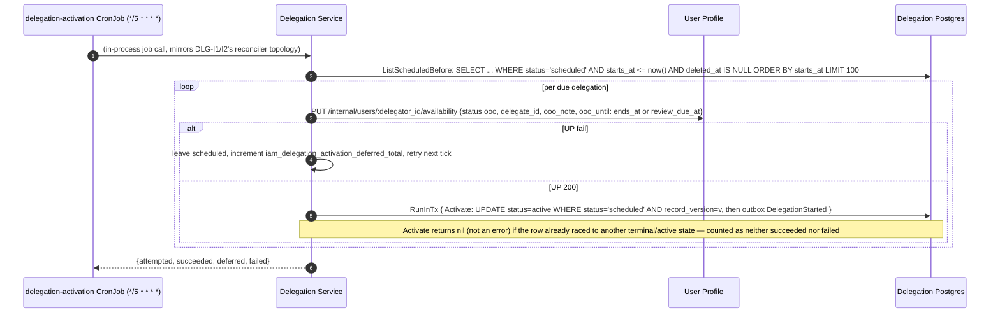

### Cancel (DLG-3) — fail-open

> Source: [`docs/architecture/mermaid/cancel-flow.mmd`](docs/architecture/mermaid/cancel-flow.mmd)

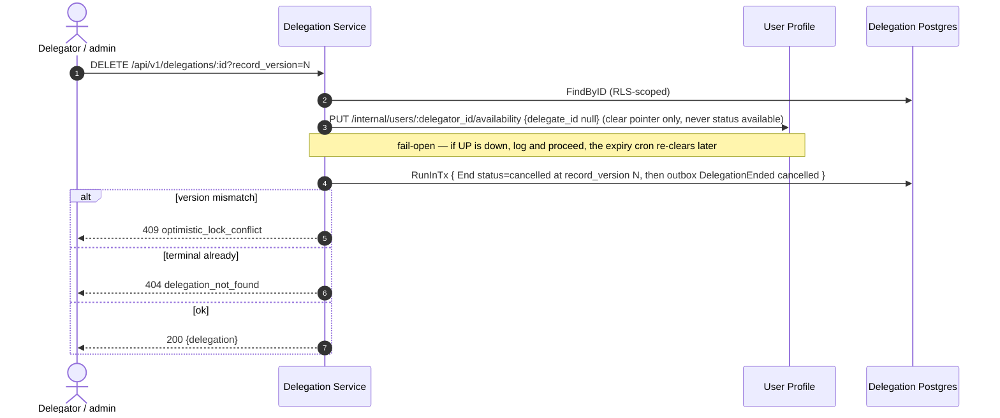

### Expiry cron (DLG-I1) — self-retrying

> Source: [`docs/architecture/mermaid/expiry-cron-flow.mmd`](docs/architecture/mermaid/expiry-cron-flow.mmd)

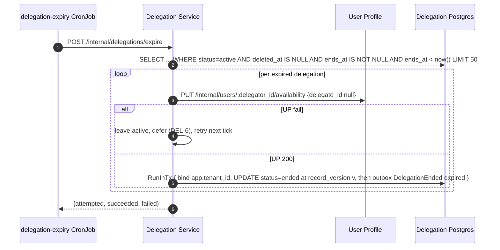

### Review-window cron (DLG-I2) — 3-day daily cascade warn, then auto-end

> Source: [`docs/architecture/mermaid/review-cron-flow.mmd`](docs/architecture/mermaid/review-cron-flow.mmd)

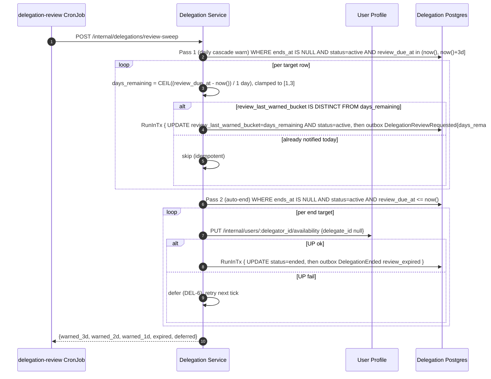

`Extend` (DLG-4) re-syncs `ooo_until` in User Profile on every successful extend, fail-open,
matching Cancel's pattern — otherwise an extended open-ended delegation's bound in User Profile
would go stale and eventually trigger a premature reset to `available` (DLG-D29).

### Cascade removal — Core `MembershipRevoked`

The stranding hazard (workflow reassignment) is resolved synchronously in Core before removal;
row-ending here is asynchronous and safe.

> Source: [`docs/architecture/mermaid/cascade-removal-flow.mmd`](docs/architecture/mermaid/cascade-removal-flow.mmd)

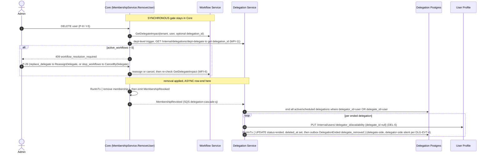

### Delegate-disabled cascade — User Profile `UserUpdated{status:disabled}` (Bug 2, DLG-D26/D27)

"Disabled ≠ removed": a disabled user is still a tenant member, so this is a **separate** inbound
signal from `MembershipRevoked` above, on a **second** SNS subscription onto the same
`delegation-cascade-q`. Every ended row here is delegate-side by construction, so — unlike the
removal cascade's delegator-side silence (DLG-EVT-4) — every row emits both events.

> Source: [`docs/architecture/mermaid/delegate-disabled-cascade-flow.mmd`](docs/architecture/mermaid/delegate-disabled-cascade-flow.mmd)

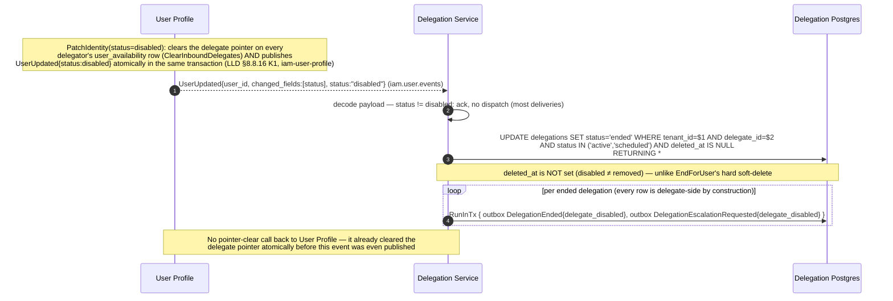

**Pre-deploy action item (DLG-D26):** the SNS subscription this flow depends on — User Profile's
`iam.user.events` filtered to `EventType = "UserUpdated"`, feeding the existing
`delegation-cascade-q` — is documented (LLD §10.1/§11.5a, `api/asyncapi.yaml`) but not yet
provisioned in any real environment; this repo owns no Terraform/CDK for SNS subscriptions.
`EndForDisabledDelegate`/`DelegationEscalationRequested` are fully implemented and tested but will
never run until platform/infra adds the subscription (same DLQ/`maxReceiveCount=5` convention as
the existing `iam.membership.events` subscriptions).

### Read and policy endpoints (DLG-1/4/5/6/7)

> Source: [`docs/architecture/mermaid/read-policy-flow.mmd`](docs/architecture/mermaid/read-policy-flow.mmd)

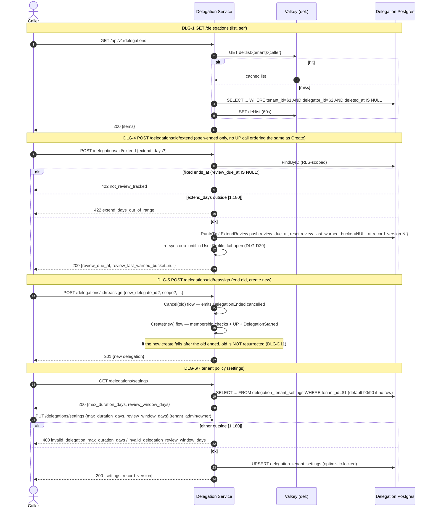

Not diagrammed: LLD §11.6 tenant-lifecycle cleanup (`TenantMembershipsPurged` → soft-delete,
monthly hard-purge) and LLD §11.5b (escalation prose only, already covered above) are both one or
two sentences of prose in the LLD, not sequences worth their own diagram.

---

## Cache strategy

Much simpler than a projection-heavy cache: Valkey `del:` keyspace, two keys, both advisory —
correctness never depends on either (LLD §9).

| Key | Value | TTL | Invalidated by |
|---|---|---|---|
| `del:list:{tenant}:{delegator}` | DLG-1 list projection | 60 s | DLG-2/3/4/5 for that delegator (explicit `DEL` on write) |
| `del:idem:{tenant}:{key}` | `{delegation_id, status}` for a create `Idempotency-Key` (DLG-Q3) | 24 h | TTL only |

**Read algorithm (DLG-1, LLD §9.1):** `GET del:list:{tenant}:{delegator}` → on hit, deserialize and
return; on miss, `SELECT ... FROM delegations WHERE tenant_id=$1 AND delegator_id=$2 AND
deleted_at IS NULL ORDER BY starts_at DESC`, then `SET` the key with a 60 s TTL before returning.
**Failure mode (LLD §9.3):** a down Valkey falls straight through to Postgres on every read and the
idempotency check degrades to best-effort (a retried create within the outage window could in rare
cases create a duplicate delegation rather than replaying the original `201`) — correctness of the
delegation data itself is never affected, only the idempotency guarantee's strength. **Concurrent
requests, Valkey up (DLG-D35):** the create guard is an atomic `SETNX`-based reservation
(`IdempotencyStore.Reserve`/`Release`), not a plain `GET`-then-`SET` — two requests racing on the
same key cannot both pass the check and both insert; the loser gets `409
idempotency_key_in_flight`. See Session-specific decisions below for the gap this closed. There is no
cross-service config cache (tenant policy is a local table, `delegation_tenant_settings`) and no
I-8 projection cache — both existed in the O&M-era design and were removed under Option C.

---

## Event and outbox flow

Every mutating operation writes the business row and the domain event in the **same transaction**
via `TxRunner.RunInTx` — no dual-write risk. `eventbus.Publisher` (injected into `ctx` by
`postgres.TxRunner`) owns enqueue; `ValidatingCodec` validates the payload against its registered
JSON Schema at enqueue time (missing schema = pass-through, DLG-D24/D33), storing plain JSON in
`outbox_events.payload` (`TEXT`, with `outbox_normalize_payload` decoding PgBouncer SimpleProtocol
bytea-hex on INSERT — DLG-D38, matching `iam-realm-provisioner` / `iam-org-membership`). Wire-format
(Glue) encoding happens later, transiently, at SNS-publish time only —
never written back to the outbox row.

### Published — `iam.delegation.events` (one dedicated topic, four types, no RoutingPublisher)

| Event | Emitted when | Consumers (LLD §10.5) |
|---|---|---|
| `DelegationStarted` | DLG-2 create (immediate), create-leg of DLG-5 reassign, `delegation-activation` flip (DLG-D25) | **Workflow Service** (reroute), Notification, Audit |
| `DelegationEnded` | DLG-3 cancel, `ends_at` expiry (DLG-I1), review auto-end (DLG-I2), end-leg of DLG-5 (`ended_reason=reassigned`, distinct from a plain cancel), delegate-removed cascade, delegate-disabled cascade (DLG-D26) — `ended_reason ∈ {expired, cancelled, reassigned, delegate_removed, review_expired, delegate_disabled}` | **Workflow Service** (restore), Notification, Audit |
| `DelegationReviewRequested` | `delegation-review` sweep — once per calendar day for each of the 3 days before `review_due_at`, `days_remaining ∈ {3,2,1}` | Notification, Audit |
| `DelegationEscalationRequested` | Immediately after `DelegationEnded`, same transaction, only when `ended_reason=delegate_disabled` (DLG-D27) | Notification (`tenant_admin`/`tenant_owner` only), Workflow Service (hook, not yet consumed), Audit |

Cron-origin events carry system sentinels: `ip_address: "system"`, `user_agent:
"iam-delegation/<job>-cron"`, `actor: SystemActorID`. The delegator-side end of a removal cascade is
intentionally **silent — no event** (DEL-7 asymmetry, DLG-EVT-4) — only the delegate-side row emits
`DelegationEnded`; this silence rule does **not** apply to the delegate-disabled cascade, where
every ended row is delegate-side by construction and emits both `DelegationEnded` and
`DelegationEscalationRequested`. Every envelope carries `specversion: "1"` (DLG-D24/D33).

`Escalation`, not auto-remediation: `DelegationEscalationRequested` notifies `tenant_admin`/
`tenant_owner` specifically — this service owns no org-structure data, and admin/owner is the only
role it already recognizes as escalation-capable and the only one that can call DLG-5 Reassign.
Notify-only: it never auto-creates a replacement delegation (see Known gaps below for the
Workflow-side fallback this unblocks but does not itself build).

### Consumed — `delegation-cascade-q` (one SQS queue, two upstream SNS topics, three event types)

| Source topic | Event | Dispatched to | `processed_events.consumer` bucket |
|---|---|---|---|
| `iam.membership.events` (Core) | `MembershipRevoked` | `CascadeService.EndForUser` | `"cascade"` |
| `iam.membership.events` (Core) | `TenantMembershipsPurged` | `CascadeService.ScrubTenant` | `"offboarding"` |
| `iam.user.events` (User Profile) | `UserUpdated` (only when decoded `status=="disabled"`; other deliveries acked and recorded in `processed_events` without dispatch) | `CascadeService.EndForDisabledDelegate` (DLG-D26) | `"delegate_disable"` |

`TenantMembershipsPurged` was renamed from `TenantOffboarded` by Core to avoid colliding with Realm
Provisioner's own, differently-scoped `TenantOffboarded` event on `iam.tenant.events`, which this
service does not consume. `UserUpdated` is produced by User Profile on a third, distinct topic — a
second SNS subscription onto this same queue — whose filter policy can only match on `EventType`,
not payload content, so this service decodes every delivery and dispatches only on
`status=="disabled"`. Three distinct idempotency buckets (`cascade`/`offboarding`/
`delegate_disable`), keyed into `processed_events (event_id, consumer)`. Filtered
(non-disabled) `UserUpdated` deliveries use the same `"delegate_disable"` bucket so
redelivery does not re-decode the same no-op. Cascade PG writes, outbox enqueue, and
the `processed_events` insert commit in one `TxRunner.RunInTx` (IDEMP-2, DLG-D38). DLQ:
`delegation-cascade-q-dlq`, `maxReceiveCount=5`.

**Consumer-side Glue decoding (DLG-D21):** Core Glue-encodes `MembershipRevoked`/
`TenantMembershipsPurged` independently of this service's own `GLUE_REGISTRY_NAME` (an
outbound-only setting). `eventbus.GlueDecodeCodec` — a registry-agnostic decode-only `events.Codec`
— is wired unconditionally via `events.WithConsumerCodec(...)` in `cmd/server/main.go`: the 18-byte
Glue wire header is fully self-describing, so decoding needs no Glue client, registry name, or
cross-service IAM permission, only encoding does. `platform-events` only invokes `Codec.Decode`
when the inbound envelope's `SchemaID` is non-empty, so a NoopCodec-published message never
triggers it — safe in every environment.

### Wire format — AWS Glue Schema Registry `iam-delegation-events`

**No runtime name translation, unlike `iam-user-profile`'s `domain.GlueSchemaName` switch:** this
repo's event-type constants (`internal/core/domain/event.go`) already ARE the PascalCase Glue
schema names — `DelegationStarted`, `DelegationEnded`, `DelegationReviewRequested`,
`DelegationEscalationRequested` — used verbatim as both the envelope `type` and the Glue
`SchemaName`.

18-byte header, identical to every sibling service: `byte 0 = 0x03` (header version), `byte 1 =
0x00` (no compression), `bytes 2-17` = schema version UUID (big-endian). `GlueCodec` pre-fetches
each schema's latest version ID from Glue at startup (`StartRefresher` keeps it current on a
ticker); `events.NoopCodec` is the SNS pass-through when `GLUE_REGISTRY_NAME` is unset (local dev
default — LocalStack Community has no Glue).

### Consumer conformance checklist

`iam.delegation.events` has three real consumers (LLD §10.4): **Workflow Service**
(`DelegationStarted`/`DelegationEnded` — reroute/restore, DEL-4/DEL-5, plus the
`DelegationEscalationRequested` hook, not yet consumed), **Notification** (all four types, the
escalation notice `tenant_admin`/`tenant_owner`-only), and **Audit Log** (all four, no filter). All
four payload schemas declare `"additionalProperties": true` — an explicit open-schema contract
enforced by CI (`schema-gov validate` Pass 5 rejects any schema that re-introduces
`additionalProperties: false`). Before subscribing, a consumer must be configured for lenient
decoding — see `api/asyncapi.yaml`'s `x-forward-compatibility.required-settings` block for the
exact Go `encoding/json`/`sonic` settings this service's own (internal Go) consumers need.

### Schema lifecycle

Schema states (`active`/`deprecated`/`retired`) and the compaction protocol for a schema that has
accumulated too many Glue versions are governed by `api/asyncapi.yaml`'s `x-version-governance`/
`x-usage-override` blocks and enforced by the CI pipeline added under DLG-D20 (`schema-registry.yml`
validates/registers on every push, `schema-prune.yml` handles monthly orphan cleanup,
`schema-health-quarterly.yml` is a read-only quarterly report, `freeze-watchdog.yml` guards against
a forgotten `SCHEMA_FREEZE`). See `docs/runbook-schema-registry.md` for the operational detail
(pre-deploy checklist, failure modes, adding a new event type) — this section intentionally doesn't
re-derive it.

---

## Observability stack

**Tracing:** entirely `platform-gincommon`'s — `gincommon.InitTracingFromEnv` then
`ObservabilityMiddlewares` run, in that order, before any tracer is created or collector registered
(DLG-D31) in both binaries; there is no hand-rolled span code. One `postgres.NewOTelTracer` is
shared across the app pool and sysPool so `db.query` spans share the HTTP OTLP pipeline. Outbound
User Profile / Org Membership calls go through `internal/adapter/outbound/httpx` (`otelhttp`) so
they emit client spans and inject `traceparent` (DLG-D31). The reconciler wraps each job in a
`reconciler.<job>` span. The outbox stamps `trace_id` onto every published event (LLD §14.3) so a
create → `DelegationStarted` → Workflow reroute is one trace end-to-end. Process exit flushes the
TracerProvider then `gincommon.Shutdown` (Zap Sync) after pool drain — the same order as
`iam-realm-provisioner` / `iam-org-membership` (DLG-D36).

**Logging:** the Zap-backed logger `platform-gincommon/pkg/logger.NewLogger` returns is constructed
once in each binary's `main()` and threaded everywhere — `gincommon.Config.Logger`,
`platform-events`' publisher/consumer/outbox `Logger` fields, this repo's own outbound-adapter/jobs
`Logger` interfaces, and (via `internal/adapter/outbound/postgres.NewLoggerAdapter`)
`platform-pgcommon`'s `domain.Logger` — with no separate hand-rolled logger anywhere in the process
(DLG-D22). HTTP `http_request` lines come from `ObservabilityMiddlewares`' LoggingMiddleware; inbound
`HandleError` logs unclassified 500s through that same logger (DLG-D36). Logs carry `delegation_id`,
`tenant_id`, `actor`, and DEL-6 defer reasons (LLD §14.3) — no PII beyond what's already
gateway-scoped.

**Metrics — CLOSED (DLG-D19).** Every registered `iam_delegation_*` Prometheus instrument now has a
real call site: `DelegationService.WithMetrics`/`CascadeService.WithMetrics` (an injected `Metrics`
port, `internal/core/service/metrics.go`) increment `created`/`ended`/`idempotency_hits`/
`up_availability_failures` after the matching outcome; the membership-check client records duration
and failures; the cascade consumer records processed/DLQ; the reconciler jobs record
deferred/warned/expired/ended via `cmd/reconciler/jobs.Context.Metrics`; and
`iam_delegation_active_gauge{tenant}` is refreshed every 5 minutes from a BYPASSRLS
`COUNT(*) GROUP BY tenant_id` snapshot (`cmd/server/exporters.go`'s `runActiveGaugeExporter`,
emit-once at start so the first scrape is populated).

| Metric | Type | Labels | Recorder |
|---|---|---|---|
| `iam_delegation_created_total` | Counter | — | `RecordCreated(scope)` |
| `iam_delegation_ended_total` | Counter | — | `RecordEnded(reason)` |
| `iam_delegation_active_gauge` | Gauge | tenant | `ReplaceActiveGauges` (5-min sysPool snapshot) |
| `iam_delegation_expiry_deferred_total` | Counter | — | `RecordExpiryDeferred()` |
| `iam_delegation_review_deferred_total` | Counter | — | `RecordReviewDeferred()` |
| `iam_delegation_activation_deferred_total` | Counter | — | `RecordActivationDeferred()` (DLG-D25) |
| `iam_delegation_review_warned_total` | Counter | days_remaining | `RecordReviewWarned(daysRemaining)` |
| `iam_delegation_review_expired_total` | Counter | — | `RecordReviewExpired()` |
| `iam_delegation_membership_check_duration_seconds` | Histogram | — | `ObserveMembershipCheckDuration(seconds)` |
| `iam_delegation_membership_check_failures_total` | Counter | — | `RecordMembershipCheckFailure()` |
| `iam_delegation_up_availability_failures_total` | Counter | path | `RecordUPAvailabilityFailure(path)` |
| `iam_delegation_idempotency_hits_total` | Counter | — | `RecordIdempotencyHit()` |
| `iam_delegation_cascade_processed_total` | Counter | — | `RecordCascadeProcessed()` |
| `iam_delegation_cascade_dlq_total` | Counter | — | `RecordCascadeDLQ()` |

`cmd/reconciler`'s standalone CronJob binary registers its own `*metrics.Metrics` (for
`jobs.Context` symmetry) but has no `/metrics` scrape endpoint of its own — the deferred counters
are only actually observable via `cmd/server`'s DLG-I1/I2 on-demand HTTP entry points (DLG-D17),
which share the same `jobs.Context`-calling code and do have a live scrape target.

**Alerting (LLD §14.5, DLG-D39).** Two layers, both sourced from the metrics above and kept in
sync across three files: `deploy/monitoring/app-alerts.yml` and `templates/prometheusrule.yaml`
render the same flat threshold alerts (availability, 5xx rate, per-cron deferral, cascade DLQ,
outbox dead-letters, membership-check failure rate); `deploy/monitoring/slo-rules.yml` and the
same `templates/prometheusrule.yaml`'s `iam_delegation_slo_records`/`iam_delegation_slo_burn`
groups add a multi-window multi-burn-rate layer (SRE book Ch. 5) on top — four SLOs (write-path
error rate 99.9%, DLG-D3 membership-check success 99%, reconciler-defer convergence, cascade
convergence), each a recording rule plus a fast-burn/page and slow-burn/ticket alert pair. Unlike
the three sibling services that already have a standalone `slo-rules.yml`
(`iam-group-mapping`/`iam-org-membership`/`iam-realm-provisioner`), this service also wires the
same groups into the Helm-rendered `PrometheusRule` — the standalone file exists only as the
`--rule-files` copy for environments not installing via the chart, per its own header.

### Background workers — six, not three

`cmd/server/main.go` runs **six** real background goroutines under one `errgroup` (plus a
graceful-shutdown goroutine and `GlueCodec.StartRefresher`'s internal ticker, neither counted among
the six): the outbox runner, the `delegation-cascade-q` SQS consumer, the
`iam_delegation_active_gauge` exporter (above), a daily outbox-prune sweep
(`outboxRunner.PrunePublished`, `OUTBOX_PRUNE_INTERVAL`/`_RETENTION`/`_LIMIT`, DLG-D24 — without it
`outbox_events` grows unbounded, since published rows are never deleted automatically), the HTTP API
server, and a dedicated `:METRICS_PORT` metrics server (split from the API listener so a
NetworkPolicy can grant scrape access without also granting API access).

### sysPool architecture

Both `cmd/server/main.go` and `cmd/reconciler/main.go` build a second `*pgcommon.Pool` from
`SYSTEM_DATABASE_URL` (`postgres.SystemDSNFromEnv()` + `postgres.SystemPoolConfig()`, forcing
`PGBouncerMode: true` unconditionally so the BYPASSRLS pool still works under transaction pooling).
Falls back to `DSNFromEnv()` in dev with a startup warning — cross-tenant reads then return zero
rows under RLS (fail-quiet, not fail-loud); **both binaries now fail fast at startup if
`SYSTEM_DATABASE_URL` is unset outside a recognized local/dev environment** (`development`/`dev`/
`local`/`test`, DLG-D34; originally gated on a literal `ENVIRONMENT=="production"` string compare,
widened in DLG-D35 to every other environment name — staging/uat/etc. would otherwise silently hit
the identical degrade-with-no-alert failure mode), rather than silently degrading every cross-tenant
sweep query to zero rows with no alert. The environment name is resolved via `resolveAppEnv()`
(`APP_ENV` if set, else `ENVIRONMENT`) rather than reading `ENVIRONMENT` directly, and `test` was
added as a fourth dev-like alias so CI doesn't need the variable set — both matching
`iam-org-membership`'s `isDevLikeEnv` (DLG-D37).

**What actually uses `sysPool`:**
- `cmd/server`: `DelegationRepository` backing the mesh-only DLG-I3/I4 internal reads
  (`gucBoundReader`, cross-tenant lookups by design).
- `cmd/server`: `ProcessedEventsRepository` — the cascade consumer's idempotency ledger, RLS-exempt
  by table design but routed through the BYPASSRLS pool and `withPool` (joins an ambient TxRunner
  tx).
- `cmd/server`: `GaugeRepository` — the 5-minute `iam_delegation_active_gauge{tenant}` snapshot
  exporter.
- `cmd/reconciler`: `DelegationRepository` backing all four CronJobs' cross-tenant sweep queries.
- `cmd/reconciler`: `ProcessedEventsRepository` — the monthly `processed_events` prune.

---

## Row-Level Security (RLS) and GUC injection

Unlike a service with a single gateway-bridged GUC path, this service has **three distinct binding
paths** converging on the same `postgres.WithTenantGUC` call (DLG-D18):

1. **Public routes (DLG-1..7):** `tenantGUCMiddleware(bindTenantGUC)`, registered on the public
   route group right after `ContextMiddleware()` (`router.go`). Runs once per request, before the
   handler, binding from the already-bridged `requestctx.RequestContext`.
2. **Mesh-only internal reads (DLG-I3/I4):** `gucBoundReader` (`cmd/server/adapters.go`) wraps
   `*postgres.DelegationRepository` and binds `app.tenant_id` (with `userID="iam-system"`) **per
   call**, immediately before each single-statement query — no middleware runs on `/internal/*`
   (there's no gateway identity to bridge there), and this is safe specifically because these are
   single-statement reads outside any transaction opened earlier by a `TxRunner`.
3. **Reconciler jobs and the cascade consumer:** `jobs.Context.BindTenantGUC` and
   `consumer.GUCBinder` are injected function parameters (both satisfied by
   `postgres.WithTenantGUC` at wire-up), called explicitly per row before each `RunInTx` — there's
   no HTTP request to bridge from in a cron or an SQS message handler.

All three ultimately call the same `postgres.WithTenantGUC(ctx, tenantID, userID)`, which sets a
`pgcommon.GUCSet` on `ctx`; the next pool checkout issues `SET LOCAL app.tenant_id = '...'`
(transaction-scoped — CI greps for the forbidden session-scoped form via
`.github/scripts/check-forbidden-set-guc.sh`, RLS-6), and Postgres enforces `FORCE ROW LEVEL
SECURITY` with a fail-closed policy on both `delegations` and `delegation_tenant_settings` (LLD
§7.3), explicitly mirroring `iam-user-profile`'s `app_tenant_id()`/`rls_check_tenant()`/
`log_rls_violation()`/`rls_violation_log` pattern.

> Source: [`docs/architecture/mermaid/rls-guc-flow.mmd`](docs/architecture/mermaid/rls-guc-flow.mmd)

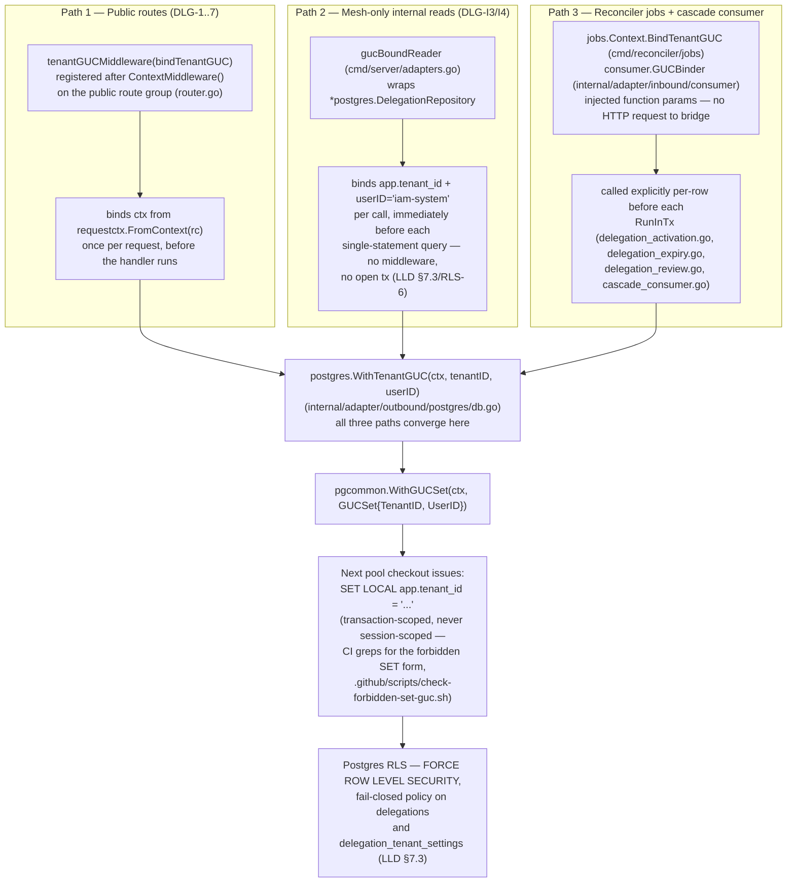

**RLS violation logging.** `rls_check_tenant(tenant_id, table_name)` (`STABLE STRICT SECURITY
DEFINER`) returns `false` (blocking the read) and logs one of two violation types via
`log_rls_violation`: `missing_or_invalid_guc` (no GUC set) or `cross_tenant_access` (GUC present,
wrong tenant), 1%-sampled into `rls_violation_log` — a logging failure never aborts the caller's
transaction. `rls_violation_log` itself has RLS **disabled** (`DISABLE ROW LEVEL SECURITY` + `NO
FORCE`) so `log_rls_violation` (invoked from inside an RLS check) cannot recurse into itself.

---

## Concurrency and optimistic locking

`record_version` is trigger-managed (`touch_row()`, guarded by `WHEN (OLD.* IS DISTINCT FROM
NEW.*)` from day one) on `delegations` and `delegation_tenant_settings`. Cancel/extend/reassign/
activate issue `UPDATE ... WHERE id=$1 AND record_version=$2`, mapping zero affected rows to `409
optimistic_lock_conflict` (current version echoed) or `404 delegation_not_found` (terminal/absent)
— the cascade consumer's bulk row-end is deliberately **not** optimistic-locked (LLD §12.1), since
it's a terminal, one-directional bulk operation, not a user-driven read-modify-write.

Create (DLG-2) runs its two grant-time membership checks **concurrently** (a Go goroutine pair
against Core, not sequential round-trips — LLD §7.6.4: "no cross-service HTTP inside a
transaction"), then the availability-first User Profile call (unless deferred to `scheduled`, DLG-
D25), then the atomic `INSERT` + outbox enqueue inside one `RunInTx`. The mandatory
`Idempotency-Key` (DLG-D8/DLG-Q3, 24 h TTL in `del:idem:`) makes retries of that whole sequence safe
— a repeated key returns the original `201` rather than re-running the side effects — which also
closes the gap left by there being no `UNIQUE(tenant_id, delegator_id)` constraint (a user may
legitimately hold multiple concurrent delegations of different scopes, so that constraint would be
wrong, not just missing). The key itself is claimed via an atomic `SETNX` reservation before any of
those side effects run (`IdempotencyStore.Reserve`, DLG-D35) — a concurrent second request sharing
the same key gets `409 idempotency_key_in_flight` rather than racing the first to a duplicate
insert; a failed reservation-holder releases the claim so a client retry isn't stuck for the 24 h
TTL.

---

## Failure domains

| Scenario | Effect on this service | Effect on the platform |
|---|---|---|
| Core (`iam-org-membership`) membership-check down, during create | `503 org_membership_unavailable`, no write | New grants blocked; I-8 unaffected (Option C removed that coupling entirely) |
| User Profile down, during create/activation | `503 user_profile_unavailable` (create) or deferred (activation, DLG-D25), no write | Create blocked, retryable; a scheduled activation retries every 5 minutes |
| User Profile down, during expiry/review cron or the cascade row-end | Row left in its current state, deferred, retried next tick (DEL-6) | Pointer re-cleared on the next successful tick — no split-brain |
| User Profile down, during cancel (DLG-3) | Fail-open — cancel proceeds anyway | Interactive cancel is never blocked by an availability-service outage; the pointer is re-cleared by the next expiry tick |
| This service itself is down | DLG-1..7 unavailable; CronJobs paused | I-8 unaffected; Core's user-removal gate degrades to tenant-wide impact instead of department-precise (DLG-I3 unreachable) — still correct, just less precise |
| App Postgres pool down | All tenant-scoped reads/writes fail; `/readyz` returns 503 | No fallback — this is the system of record |
| Sys Postgres pool (BYPASSRLS) down | `/readyz` returns 503 (hard-blocking, matching the app pool); all four CronJobs and the mesh-only DLG-I3/I4 reads fail | Cross-tenant sweeps stall entirely rather than silently returning zero rows |
| Valkey down | DLG-1 list falls through to Postgres; idempotency check degrades to best-effort | Slightly higher latency; delegation data correctness is unaffected (see Cache strategy above) |
| SQS/SNS down | Outbox retries up to `OUTBOX_MAX_ATTEMPTS`, then dead-letters | Downstream consumers (Workflow, Notification, Audit) see delayed or (after DLQ) missing events until manually reprocessed |
| The `iam.user.events` SNS subscription is never provisioned (DLG-D26 pre-deploy gap) | Delegate-disabled cascade code path is never invoked | A disabled delegate's active delegations keep routing work indefinitely, exactly the Bug 2 symptom this fix targets |

---

## Key invariants

Hard invariants this service maintains, drawn from the LLD's DLG-D/DEL-/DLG-EVT- decision families:

- **DLG-FAIL-1/2/3:** a Core or User Profile outage during create fails cleanly with no partial
  write; this service's own outage never produces a wrong I-8 authorization answer (I-8 no longer
  references delegations at all under Option C); every synchronous call this service makes is on
  its own write path — the only coupling *toward* Core (the removal cascade) is asynchronous.
- **DLG-EVT-3/DEL-7:** `DelegationEnded` fires on every end path (cancel, expiry, review auto-end,
  delegate-removed cascade, delegate-disabled cascade) — never path-dependent — **except**
  delegator-side removal, which ends the row silently with no event at all (DLG-EVT-4, a deliberate
  carried-over asymmetry from O&M; does not apply to the delegate-disabled cascade, where every row
  is delegate-side).
- **DLG-EVT-5:** the review sweep emits `DelegationReviewRequested` at most once per calendar-day
  bucket (`days_remaining ∈ {3,2,1}`) per delegation per cycle, tracked by
  `review_last_warned_bucket`; only applies to open-ended delegations (`ends_at IS NULL`).
- **DLG-EVT-7:** every published payload is a self-contained snapshot, not a delta — a consumer
  that never saw a `DelegationStarted` can still safely process the matching `DelegationEnded`.
- **DLG-D11:** if a reassign's new-delegation create fails after the old delegation was already
  ended, the old delegation is **not** resurrected.
- **DLG-D8/DLG-Q3:** the create idempotency window is exactly 24 h, keyed on `(tenant,
  Idempotency-Key)`, not on any business field.
- **DLG-D25:** a `scheduled` delegation never calls User Profile or emits `DelegationStarted` until
  `starts_at` is actually reached; `starts_at` within `skewTolerance` (5 s) of `now` is never
  treated as scheduled.
- **DLG-D26:** `EndForDisabledDelegate` never sets `deleted_at` — a disabled user is still a tenant
  member, so the ended row stays a normal historical record, not a scrub.
- **DLG-D29:** `SetAvailability` is never called with `Status: "ooo"` and a `nil` `OOOUntil` — every
  open-ended delegation resolves `ooo_until` to `review_due_at` before the call, at both call sites
  (`Create` and the activation cron).

---

## Threat model

Deliberately narrower than a full STRIDE catalogue — this section covers the trust boundaries the
LLD documents (§13) plus the isolation layers actually implemented, not a speculative analysis of
threats this service has no control over.

| STRIDE | Threat | Component | Mitigation |
|---|---|---|---|
| **Spoofing** | Caller impersonates another tenant via a crafted identity header | HTTP inbound | Gateway-injected `x-tenant-id`/`x-user-id`/`x-tenant-roles` only — raw client headers are never trusted; a JWT is never parsed by this service itself |
| **Spoofing** | Forged SQS cascade message bypasses tenant scope | SQS consumer | `aws:SourceArn` condition on the SQS resource policy (documented, provisioning owned by platform/infra); at-least-once + `processed_events` dedup limits blast radius even on redelivery |
| **Tampering** | Direct PostgreSQL write bypasses RLS and tenant isolation | PostgreSQL | `FORCE ROW LEVEL SECURITY` on both business tables — only a role with explicit `BYPASSRLS` (never granted to `delegation_app`) can bypass |
| **Repudiation** | Write mutation with no auditable actor | All write paths | `actor` field (caller UUID or system sentinel for background workers) stamped on every published event; the outbox provides an immutable per-tenant event log |
| **Information Disclosure** | Cross-tenant row read | PostgreSQL | RLS policy + GUC injection on all three binding paths (see Row-Level Security above) |
| **Information Disclosure** | Cross-tenant read via the mesh-only DLG-I3/I4 routes | `/internal/*` | Deliberately cross-tenant by design (that's the point of DLG-I4's escape hatch) — mitigated at the network layer (mesh-only mTLS, no external ingress), not the application layer |
| **Denial of Service** | Outbox runner or metrics-exporter goroutine starves API handlers under CPU spike | In-process workers | `OUTBOX_BATCH_SIZE` caps per-cycle work; HPA scales replicas on CPU/memory |
| **Denial of Service** | Valkey unavailability cascades to DB overload | Cache layer | Cache failure is non-fatal; all reads fall through to PostgreSQL |
| **Elevation of Privilege** | Non-HTTP code path (SQS consumer, cron) calls a tenant-scoped repo without a bound GUC | Background workers | All three GUC-binding paths are the only sanctioned ways to reach a tenant-scoped repository method; sysPool-backed cross-tenant reads (DLG-I3/I4, reconciler sweeps) are the only intentional bypass, gated by network/mesh trust rather than RLS |
| **Elevation of Privilege** | A consumer of `iam.delegation.events` treats a payload as an authorization grant | Downstream consumers | Events are informational — a consumer making a decision-critical access-control change should re-read authoritative state, not act on the event payload alone |

**Out of scope (platform controls):** JWT issuance, MFA, Keycloak session management (owned by
`iam-keycloakclient`); tenant membership itself (Core / `iam-org-membership`); the synchronous
user-removal gate (stays in Core, DLG-D9); AWS account-level IAM, VPC, and SNS topic policies
(owned by platform infrastructure).

---

## Developer tools

Swagger UI (`/swagger`) and the AsyncAPI viewer (`/asyncapi`, raw spec at `/asyncapi.yaml`) are
described from a usage angle in `README.md`; architecturally, both are served from the same binary
with no external tooling dependency: `api/embed.go`'s `//go:embed asyncapi.yaml` compiles the spec
directly into the binary (`apispec.AsyncAPISpec`), and `router.go` mounts both doc routes gated by
the same `DocsConfig` (`DOCS_ENABLED`/`DOCS_AUTH_TOKEN`, active outside `production`
unconditionally, opt-in with an optional bearer-token gate in `production`).

---

## Deployment

### Container image — two binaries

The `Dockerfile` builds and copies **two** entrypoints into the distroless final image:

| Binary | Path in image | Purpose |
|---|---|---|
| `iam-delegation-server` | `/iam-delegation-server` (image `ENTRYPOINT`) | HTTP API (DLG-1..7, DLG-I1..I4) + the `delegation-cascade-q` SQS consumer, in one process via `errgroup` — six background goroutines total (see Observability stack above) |
| `iam-delegation-reconciler` | `/iam-delegation-reconciler` | The four CronJob entry points, selected at invocation time via `--job=<name>` — no long-running HTTP/metrics server, no ports exposed |

Two-stage build: a `golang:1.26.6-bookworm` builder (digest-pinned) compiles both binaries with
`CGO_ENABLED=0`; the runtime stage is `gcr.io/distroless/static-debian12:nonroot` (no shell, no
package manager, runs as non-root, `EXPOSE 8080 9090`). One image, one GHCR repo — each CronJob
template overrides `command` to invoke `/iam-delegation-reconciler --job=<name>` against the same
image reference; there is no separate reconciler image to build, tag, or scan.

### Helm chart

`deploy/helm/iam-delegation/` renders one `Deployment` (the server) plus four `CronJob`s (the
reconciler), all sharing the same image.

| Setting | Value | Notes |
|---|---|---|
| Replicas | 2 (HPA 2–4) | CPU 70% / memory 80%; `targetRPSPerReplica: 0` (disabled — needs a custom-metrics adapter not yet configured) |
| PodDisruptionBudget | `minAvailable: 1` | single node drain never takes the service to zero at `replicaCount: 2` |
| `terminationGracePeriodSeconds` | 30 s | HTTP+metrics drain budget with buffer for the SQS consumer's in-flight message — a redelivery is safe either way (`processed_events` dedup) |
| `startupProbe` | `GET /healthz`, 12 × 5 s = 60 s budget | covers Postgres pool warmup + AWS SDK config resolution on cold start |
| `livenessProbe` / `readinessProbe` | `GET /healthz` (15 s period) / `GET /readyz` (10 s period) | `startupProbe` owns the initial delay for both |
| `/metrics` | separate `service.metricsPort` (9090), separate `http.Server` from the API port | lets a NetworkPolicy grant the monitoring namespace scrape access without also granting it reach to the tenant-facing API surface |

**CronJobs** (all `concurrencyPolicy: Forbid`):

| CronJob | Schedule | `activeDeadlineSeconds` | Purpose |
|---|---|---|---|
| `delegation-activation` | `*/5 * * * *` | 240 | DLG-D25 — promote `scheduled → active` |
| `delegation-expiry` | `*/5 * * * *` | 240 | DLG-I1 — end delegations past `ends_at` |
| `delegation-review` | `0 * * * *` | 540 | DLG-I2 — 3-day daily-cascade review warning, then auto-end |
| `delegation-cleanup` | `0 4 1 * *` | 1800 | Hard-purge soft-deleted rows and prune `processed_events` |

A shared `cronJobs.batchLimit` (default 50) caps rows-per-tick across all four jobs — raise it or
shorten a job's schedule if it starts saturating.

### Migration safety

Rolling deploy. Because this service has never been deployed, the base schema is one file,
`000001_schema.up.sql`/`.down.sql` (see Row-Level Security above and `.claude/database.md`), folding
every schema fix back into it rather than layering incremental migrations — that stops once this
service is actually deployed. Startup order matters: `outbox.ApplySchema` runs first (creates
`outbox_events`), then the domain migration (which `GRANT`s `delegation_app` on that table) —
reversing this order fails every fresh-database bring-up (DLG-D32).

---

## Testing strategy

Every test in this repo is colocated white-box (`*_test.go` next to the source it covers,
package-internal) — there is no separate `test/` tree, and `go test ./...` alone runs the complete
suite (unit + Postgres/testcontainer integration + the full RLS matrix all together); the
`-tags=integration|rls|e2e` build tags currently select no additional files and are no-ops kept for
future extensibility — the `test-*` Makefile targets differ only in which `-tags` flag they pass,
not in which packages they run. Postgres/Valkey/SQS-compatible containers are provisioned via
`testcontainers-go` (Docker required).

Coverage is measured with `-coverpkg=$(go list ./internal/... ./pkg/...)`, merged across the unit +
integration + RLS suites into one `coverage.out`. CI enforces a single global statement-coverage
gate of **95%** (`.github/scripts/coverage-gate.sh`, `COVERAGE_THRESHOLD` in `validate-test.yml`,
bumped from 70% during the DLG-D34 production-readiness sweep) — well below several per-package
percentages actually achieved. `-race` is a hard gate on every suite via `make test-ci`, not
opt-in — it caught a genuine test-only data race during the DLG-D34 coverage push (a plain `int`
read/written from two goroutines in a fake logger, fixed with `atomic.Int64`).

---

## Documentation assets

This repo's own doc assets, beyond this file: `docs/lld/iam-lld-delegation-service.md` (the full
LLD — data model, event architecture, request flows, observability, testing strategy in depth),
`docs/architecture/` (this file's diagram sources, indexed in `docs/architecture/README.md`),
`docs/runbook-schema-registry.md` (Glue Schema Registry operations), `docs/swagger/` (generated
OpenAPI spec), `VERSIONING.md` (SemVer policy, runtime-contract scope, release process), and
`CHANGELOG.md`. The as-built decision register (DLG-D13 onward) lives in this
file's own "Session-specific decisions" section below. See "Where to look next" below for pointers
by topic.

---

## Decision Register (LLD §23, DLG-D1 through DLG-D12)

These are the decisions the original Low-Level Design (`docs/lld/iam-lld-delegation-service.md`)
shipped with, made before this repo existed:

| # | Decision |
|---|---|
| DLG-D1 | **Option C for I-8** — `active_delegations[]` is removed from I-8 and Core drops the `delegations` table entirely; the would-be consumers (Workflow, Dashboard, AuthZ Enrichment) are re-sourced to this service's own events/endpoints instead (§6.1). |
| DLG-D2 | **Tenant delegation policy moves into this service** as `delegation_tenant_settings`, read in-process at create/extend; Core drops the two `tenants` columns it used to own. |
| DLG-D3 | **The two lost composite membership FKs → two synchronous grant-time checks** against Core's `GET /internal/tenants/:id/members/:user_id/exists`, which must return `tenant_membership_id` when active, behind a swappable `MembershipCheckClient`. |
| DLG-D4 | **The lost `fk_del_tenant` cascade → an async tenant-offboarding consumer** on `delegation-cascade-q` (§11.6). |
| DLG-D5 | **Delegation events get a dedicated topic**, `iam.delegation.events` (`source: iam-delegation`); Core's own AsyncAPI drops them entirely. |
| DLG-D6 | **`DelegationEnded.ended_reason` gains `review_expired`** — the shipped code's value becomes contract, so review auto-ends are distinguishable from plain `ends_at` expiry. |
| DLG-D7 | **The review sweep warns twice, at 7 d and 3 d**, tracked via `review_last_warned_bucket`; `days_remaining` is always one of `{7, 3}`. |
| DLG-D8 | **Create takes a mandatory `Idempotency-Key`** (24 h dedup), closing the duplicate-on-retry gap left by the absence of a `UNIQUE(tenant_id, delegator_id)` constraint. |
| DLG-D9 | **The synchronous removal gate stays in Core; only the row-end moves here (async)** — Core's dept-scope precision check becomes a Core-to-Delegation call (DLG-I3) on the admin removal path. |
| DLG-D10 | **`port.UserProfileClient` + DEL-6 availability-first / pointer-clear-only move here intact** — cancel is fail-open; scheduled ends defer-and-retry rather than fail. |
| DLG-D11 | **Reassign takes the fuller body** (`new_delegate_id?/scope?/scope_id?/ends_at?/reason?`), and the error taxonomy is canonicalised (§20). |
| DLG-D12 | **v1 scope was originally active-at-create only** — no future-dating; superseded by DLG-D25, which added a `scheduled` status for genuinely future-dated `starts_at`. |

## Session-specific decisions (DLG-D13 onward)

Decisions **DLG-D13 onward** were made during this build, not present in the original LLD. Where
this build had to make its own call ahead of any of these existing, it is called out inline as
"this chart's own convention" rather than asserted as an LLD decision.

| # | Decision |
|---|---|
| DLG-D13 | AuthZ Enrichment's `active_delegations[]`-driven department-level elevation (`policy.departmentLevel()`) is removed outright, not just the dead field — research found ADR-0008's "no policy reads it" claim was false. Full Option-C behavior was chosen over reintroducing a hot-path escape-hatch call. |
| DLG-D14 | `MembershipRevoked{tenant_id,user_id,actor_id}` and `TenantOffboarded{tenant_id,actor_id}` were wholly new Core (`iam-org-membership`) event types (DLG-Q4) — built from scratch, not discovered as pre-existing wiring. **Update:** Core later renamed `TenantOffboarded` to `TenantMembershipsPurged` (same payload shape) to avoid colliding with Realm Provisioner's own, differently-scoped `TenantOffboarded` event — this service's consumer and `api/asyncapi.yaml` reflect the new name (see DLG-D21). |
| DLG-D15 | Event-schema governance uses in-house `santhosh-tekuri/jsonschema/v6` validation (mirroring `iam-user-profile`'s proven pattern) instead of `platform-schemagov`, which no sibling service actually depends on or exercises at the library level. `internal/adapter/outbound/eventbus/validator.go`. |
| DLG-D16 | Go toolchain pinned to `1.26.6` (matching every touched repo's actual toolchain) rather than the LLD's stated "Go 1.23". |
| DLG-D17 | DLG-I1/I2 are real HTTP handlers on `cmd/server` **and** `cmd/reconciler`'s CronJobs call the identical implementation in-process (`cmd/reconciler/jobs`) rather than shelling out over HTTP — `cmd/server/adapters.go`'s `reconcilerRunner` adapts the jobs package's functions to the HTTP handler's injected runner interfaces so both paths share one code path. |
| DLG-D18 | The LLD describes RLS/GUC binding without specifying the exact wiring signature. As built, repository methods read whatever GUC is already bound on `ctx` rather than deriving it internally — see Row-Level Security above for the three binding paths this requires. |
| DLG-D19 | **Closed.** Originally partial (GAP-27): only the two deferred-counter metrics an actual alert watches were wired. Now every registered `iam_delegation_*` instrument has a real call site — see Observability stack above for the full closure detail (injected `Metrics` port in `core/service`, `jobs.Context.Metrics` in the reconciler, the active-gauge exporter). |
| DLG-D20 | **Supersedes DLG-D15's CI-governance scope** (the in-house-validator half of DLG-D15 remains correct and unchanged). `platform-schemagov` is a CI-only Docker image, not a Go dependency; `iam-user-profile` uses it exactly the same way this service now does. Closed by adding `.github/workflows/schema-registry.yml` (rewritten to drive `platform-schemagov` validate/diff/register against a dedicated `iam-delegation-events` Glue registry), `schema-prune.yml`, `schema-health-quarterly.yml`, `freeze-watchdog.yml`, `deploy/monitoring/schema-registry-alerts.yml`, `docs/runbook-schema-registry.md`, and the `x-lifecycle`/`x-owner`/`x-forward-compatibility`/`x-semantic-contract`/`x-version-governance`/`x-usage-override` annotations `schema-gov validate` requires. |
| DLG-D21 | **Confirmed production-breaking gap, found via a cross-service compatibility audit against `iam-org-membership`'s actual code.** Core Glue-encodes `MembershipRevoked`/`TenantMembershipsPurged` independently of this service's own `GLUE_REGISTRY_NAME`; the cascade SQS consumer never configured a decode-side codec, so every Glue-encoded message would be retried to DLQ exhaustion, silently breaking the removal cascade end to end. Fixed by adding `eventbus.GlueDecodeCodec` (registry-agnostic decode-only, since the 18-byte Glue header is self-describing) wired unconditionally via `events.WithConsumerCodec(...)`. |
| DLG-D22 | Logging switched from a hand-rolled `slog.Logger` to `platform-gincommon/pkg/logger.NewLogger`, matching `iam-user-profile`'s/`iam-org-membership`'s actual pattern. Both binaries now call `gclogger.NewLogger(env)` once in `main()` and pass that single value everywhere — no wrapper needed, since every consumer already shares gincommon's method shape (only `platform-pgcommon`'s Field-based `domain.Logger` needs an adapter, `postgres.NewLoggerAdapter`, DLG-D23). |
| DLG-D23 | Database connection/configuration/operations audited and aligned to `iam-user-profile`'s/`iam-org-membership`'s exact `pgcommon` pass-through pattern. Two real bugs fixed: `SystemDSNFromEnv()`'s fallback read a bare `os.Getenv("DATABASE_URL")` instead of the pgcommon-built DSN (silently producing an empty DSN under a `PG_HOST`/`PG_PORT`-style deployment); `PG_STATEMENT_TIMEOUT` was entirely unsupported. Fixed by adding `postgres.DSNFromEnv()`/`postgres.MigrationDSNFromEnv()`, exact copies of the sibling services' identical helpers. |
| DLG-D24 | Events/outbox/dedup audited and aligned to the sibling services' exact `platform-events` pass-through pattern. Two real gaps fixed: `EnqueueCtx` never called `events.WithSchemaVersion("1")` (every published event silently omitted `specversion`); `outbox.Runner.PrunePublished` was never called anywhere, so `outbox_events` grew unbounded — fixed by adding a daily `cmd/server` background sweep (`OUTBOX_PRUNE_INTERVAL`/`_RETENTION`/`_LIMIT`). Also added the `outbox_dead_letters_total` alert to both Helm's `prometheusrule.yaml` and `deploy/monitoring/app-alerts.yml`. |
| DLG-D25 | **Cross-service bug fix.** A delegation created with a future `starts_at` immediately called User Profile and emitted `DelegationStarted`, both before the leave actually began. Fixed by adding a `scheduled` status between the implicit initial state and `active`: `Create` computes `isScheduled := starts.After(now)` and, when true, skips the User Profile call and the outbox enqueue entirely. A new `delegation-activation` CronJob (`*/5 * * * *`, mirrors `delegation-expiry`) lists due rows, calls User Profile, and on success activates the row inside the same transaction as the `DelegationStarted` enqueue; a failure increments `iam_delegation_activation_deferred_total` and retries next tick. `End`/`EndForUser` were broadened to treat `scheduled` as non-terminal alongside `active`. See `iam-user-profile`'s matching CHANGELOG entry for the server-side counterpart fix. |
| DLG-D26 | **Cross-service bug fix (Bug 2).** Disabling a delegate never ended their active delegations — this service's only inbound cascade signal was Core's `MembershipRevoked` (a full tenant departure), and "disabled" is a status flip within the tenant, not a departure. Fixed by treating `delegation-cascade-q` as carrying a **second** SNS subscription onto User Profile's `iam.user.events`, filtered to `EventType = "user.updated"`. `CascadeConsumer.Handle` decodes each `UserUpdated` payload and dispatches only when `status == "disabled"`; `CascadeService.EndForDisabledDelegate` ends every active/scheduled delegation where the disabled user is the delegate and emits `DelegationEnded{ended_reason: delegate_disabled}` — deliberately does **not** set `deleted_at` (the user is still a tenant member). No User Profile pointer-clear call is needed: User Profile's own disable flow already clears the delegate pointer atomically in the same transaction that publishes the `UserUpdated` event this consumer reacts to. **Pre-deploy gap:** the SNS subscription itself is not yet provisioned in any environment — see Event and outbox flow above. **Update:** User Profile migrated its published event types from dot-notation to PascalCase while still undeployed (its CHANGELOG.md/LLD rev 0.46) — the filter value above is now `EventType = "UserUpdated"`, not `"user.updated"`; `domain.EventUserUpdated` in this repo was updated to match (`internal/core/domain/event.go`). Nothing else about this fix changed — `CascadeConsumer.Handle`'s dispatch logic already compared against the symbolic constant, not a hardcoded literal. |
| DLG-D27 | **Cross-service bug fix (Bug 2a).** A generic `DelegationEnded` alone gave nobody a signal that the delegator might now have no valid handler for their work while still OOO after their delegate was disabled. `EndForDisabledDelegate` now also enqueues `DelegationEscalationRequested` immediately after `DelegationEnded`, same transaction — self-contained, escalates to `tenant_admin`/`tenant_owner` specifically (the only role this service already recognizes as escalation-capable and the only one that can call DLG-5 Reassign). Notify-only: never auto-creates a replacement delegation. New JSON Schema (`internal/eventschema/delegation_escalation_requested.json`), registered in `SchemaValidator` and the Glue codec's pre-fetch list. Also fixed two related schema-governance gaps every unit test missed (fake `EventPublisher` skips schema validation): `delegate_disabled` was never added to `delegation_ended.json`'s/`asyncapi.yaml`'s `ended_reason` enum, and the Glue codec's schema pre-fetch list in `cmd/server/main.go` was never updated for the new event type. |
| DLG-D28 | **Production-readiness sweep.** CI's `SCHEMA_NAME_MAP` (all three job blocks in `schema-registry.yml`) had no entry for `DelegationEscalationRequested` — would have registered the new Glue schema under the wrong (snake_case) name, and `cmd/server` would have failed to start in any environment with `GLUE_REGISTRY_NAME` set. Also added the missing `IamDelegationActivationDeferred` Prometheus alert (the DLG-D25 metric was wired but never alerted on) and fixed `scripts/init-localstack.sh`'s missing schema registration/queue filters for local dev. |
| DLG-D29 | **Cross-service bug, pre-existing, unrelated to DLG-D25/26/27.** Open-ended delegations could never actually be created: `Create` sent `OOOUntil: nil` to User Profile for any delegation with no `ends_at` — a first-class case, not an edge case. User Profile's `ValidateOOOWindow` unconditionally requires `ooo_until` whenever `status="ooo"`, so every open-ended create was rejected with a confusing `invalid_delegate`. `Create` now sends the already-computed `review_due_at` as `OOOUntil` — always within User Profile's 180-day cap. `Extend` now re-syncs `review_due_at` on every successful extend, fail-open, matching Cancel's pattern. **A third audit pass found the identical bug at a second, independent call site:** `delegation_activation.go`'s job had its own `OOOUntil: d.EndsAt` — also fixed, falling back to `d.ReviewDueAt`. Unfixed, this would have deferred forever on every 5-minute tick, continuously triggering the DLG-D28 alert rather than resolving. |
| DLG-D30 | Logging/metrics/traces re-audited against `iam-user-profile`'s live wiring, closing init-order and scrape-port gaps left after DLG-D22. |
| DLG-D31 | A third logging/tracing pass against `iam-realm-provisioner` closed the remaining hop-level gaps: outbound User Profile / Org Membership clients wrap `otelhttp` via a shared `internal/adapter/outbound/httpx` transport (client spans + `traceparent` injection); `metrics.Register()` is the no-arg gincommon API (`sync.Once`); both binaries register collectors immediately after `ObservabilityMiddlewares`; the reconciler primes metrics labels and starts a `reconciler.<job>` span; one `NewOTelTracer` is shared across both pools; `cmd/server` listens on `METRICS_PORT`. `iam_delegation_active_gauge{tenant}` is now populated by the 5-minute BYPASSRLS snapshot exporter (was registered but never set) — see Observability stack above. |
| DLG-D32 | Database connection/configuration/operations re-audited against `iam-realm-provisioner`: bumped `platform-pgcommon` to v1.3.0; `TxRunner` retries deadlocks via `RunInTxWithRetryOpts`; `wrapConnErr` uses pgcommon SQLSTATE helpers and `puddle.ErrClosedPool` → `db_unavailable` 503 (no longer masks business errors as 503); `processed_events` moved to the postgres adapter and goes through `withPool`; `MIGRATION_DATABASE_URL` gets `PG_STATEMENT_TIMEOUT`; `/readyz` checks sysPool (see Deployment and Failure domains above); `cmd/server` applies the outbox schema before the domain `GRANT`, matching `postgres.Migrate` (see Migration safety above); both binaries `DrainAndClose` with a timeout. |
| DLG-D33 | Events/outbox/dedup re-audited against `iam-realm-provisioner`: enqueue moved from `postgres.txBoundPublisher` to `eventbus.Publisher` + `ValidatingCodec` (missing schema = pass-through); both binaries inject that publisher into `TxRunner` so cron events are schema-validated; the cascade consumer marks unknown types in `processed_events`, counts duplicates, and `MarkProcessed` goes through `TxRunner.RunInTx`; SQS wiring sets `Region`/`EndpointURL`/`WithConcurrency`; monthly cleanup uses bounded `Prune` instead of unbounded `CleanupExpired`. |
| DLG-D34 | **Production-readiness sweep.** `make lint` failed outright (17 issues — unchecked `os.Setenv`/`gincommon.Shutdown` errors, a missing `//nolint:contextcheck`, missing package comments, an unexported return type, stale `//nolint:errcheck` directives) — all fixed. `go.mod`/`go.sum` had `make tidy` drift — fixed. Both binaries now fail fast at startup if `SYSTEM_DATABASE_URL` is unset when `ENVIRONMENT=production` (see sysPool architecture above), instead of silently degrading every cross-tenant sweep query and the active-gauge exporter to zero rows with no alert. Removed a stray, untracked ~88 MB `server` binary from the repo root and hardened `.gitignore`. Global statement coverage raised from 83.9% to 95.2% (coverage gate threshold bumped 70% → 95% in the same pass) — the largest single gain was direct AWS Glue Schema Registry API mocking via a real `httptest.Server` speaking AWS JSON 1.1. One real bug found along the way: a test-only `fakeLogger` field was read/written from two goroutines with no synchronization, caught by `-race` as a genuine data race. **Superseded in part by DLG-D35:** the `SYSTEM_DATABASE_URL` guard's literal `ENVIRONMENT=="production"` comparison was widened to cover every non-dev environment name. |
| DLG-D35 | **Production-readiness sweep, prompted by a direct "is this production ready" review with a follow-up "fix all."** One real correctness bug, one config-guard gap, two hardening fixes — `go build`/`go vet`/`golangci-lint`/`go-arch-lint`/the full test suite (unit + Postgres/RLS/Valkey testcontainers) all stayed green throughout, coverage held ≥95%. (1) **Idempotency race:** `DelegationService.Create`'s dedup check was a plain Valkey `GET`-then-`SET` — LLD §9.2 always specified `SETNX`, so this was an implementation gap, not a design change. Two concurrent `POST /delegations` calls sharing one `Idempotency-Key` could both miss the `GET` and both insert a delegation. Fixed by adding `Reserve`/`Release` to `port.IdempotencyStore` (`internal/adapter/outbound/valkey/idempotency.go`, atomic `SET NX`): `Create` reserves the key before any membership check/User Profile call/insert, releases it on any failure (so a retry isn't stuck for the 24 h TTL), and a losing concurrent caller gets a new `409 idempotency_key_in_flight` (`domain.ErrIdempotencyKeyInFlight`). (2) **`SYSTEM_DATABASE_URL` guard too narrow (DLG-D34 follow-up):** widened from a literal `ENVIRONMENT=="production"` compare to a new `isDevLikeEnvironment` helper (`development`/`dev`/`local`/empty are exempt, everything else fails fast) — staging/uat previously fell through to the same "cross-tenant sweeps silently return zero rows, no alert" failure mode DLG-D34 was written to close. Also used to simplify `resolveAppEnv`'s equivalent switch. (3) **Docs bearer-token compare wasn't constant-time:** `router.go`'s `docsAuthMiddleware` switched from `!=` to `crypto/subtle.ConstantTimeCompare`, closing a timing side-channel on the Swagger/AsyncAPI gate (not the API itself). (4) **Outbound response bodies were unbounded:** added `httpx.LimitBody` (1 MiB `io.LimitReader`) and applied it at both JSON-decode call sites in the User Profile and Org Membership HTTP clients, capping worst-case memory use against a misbehaving mesh peer. |
| DLG-D36 | Logging/metrics/traces re-checked against `iam-realm-provisioner` / `iam-org-membership`. Init path was already gincommon-native (`logger.NewLogger` → `InitTracingFromEnv` → `ObservabilityMiddlewares` → `metrics.Register` onto `MetricsRegisterer` → `events`/`pgmetrics` InitWithRegisterer → dedicated `:9090/metrics` → `otelhttp` outbound + `PropagateHeaders`). Two remaining gaps vs the siblings: (1) both binaries flushed `gincommon.Shutdown` (Zap Sync + `otel.Shutdown`) *before* the `InitTracingFromEnv` shutdown func — reversed so pool drain → TracerProvider flush → `gincommon.Shutdown`, matching the siblings' explicit shutdown block; (2) inbound `HandleError` wrote unclassified 500 JSON without logging — now logs through `ginCfg.Logger` the same way realm-provisioner's `errorLogger` does. |
| DLG-D37 | Database connection/configuration/operations re-checked against `iam-realm-provisioner` / `iam-org-membership`. The pgcommon pass-through from DLG-D32 was already in place (`ConfigFromEnv`, `NewPool`, `RunInTxWithRetryOpts`, dual-pool `Health`/`DrainAndClose`, outbox-then-domain migrations). Remaining sibling gaps: `wrapConnErr` now maps Go-level network/IO failures to `db_unavailable` (realm-provisioner's `isNetworkError`; pgcommon v1.3.0 has no helper); `loadConfig` requires `DATABASE_URL` or the split `PG_*` vars and `MIGRATION_DATABASE_URL` whenever `PG_BOUNCER_MODE=true` (sibling `validateRequiredEnv`, with the bouncer check actually firing when Helm sets `DATABASE_URL`); both binaries key the `SYSTEM_DATABASE_URL` fail-fast off `resolveAppEnv()` (`APP_ENV`, then `ENVIRONMENT`) and treat `test` as a local/dev alias, matching `iam-org-membership`'s `isDevLikeEnv`; both pools `defer Close()` after `DrainAndClose`; `cmd/server` calls `postgres.Migrate` (variadic logger, matching sibling `RunMigrations`) instead of inlining `outbox.ApplySchema` + `RunMigrations`. |
| DLG-D38 | Events/outbox/dedup re-checked against `iam-realm-provisioner` / `iam-org-membership`. The platform-events pass-through from DLG-D24/D33 was already in place (`ValidatingCodec` enqueue, Glue/Noop publish, `outbox.NewRunner` + `OUTBOX_*`, `ApplySchema` before the domain GRANT, SQS `GlueDecodeCodec`, `processed_events` via `withPool`). Remaining sibling gaps: `outbox_events.payload` is now `TEXT` with `outbox_normalize_payload` (PgBouncer SimpleProtocol `[]byte` as bytea hex — folded into `000001_schema`, service not deployed); `CascadeConsumer` commits cascade PG writes + `MarkProcessed` in one `TxRunner.RunInTx` (`TxRunner` joins an ambient tx so `CascadeService` does not Begin a second one); filtered (non-disabled) `UserUpdated` acks record `processed_events` like unknown-type acks; `idx_processed_events_processed_at` backs the prune path; `PROCESSED_EVENTS_TTL_DAYS` drives monthly cleanup (default 30, LLD §18.4 — not realm's dedicated 8-day CronJob). This service still uses `GlueDecodeCodec` on consume (O&M's catalog-only consume is an explicit LLD A68 deferral) and does not copy O&M's dual-topic `RoutingPublisher`. |
| DLG-D39 | **SLO burn-rate alerting added** (LLD §14.5), on top of the existing threshold alerts in `deploy/monitoring/app-alerts.yml`/`templates/prometheusrule.yaml`. Four sibling services already carry a standalone `deploy/monitoring/slo-rules.yml` (`iam-group-mapping`/`iam-org-membership`/`iam-realm-provisioner`/`iam-tender-acl`); this service's own copy is grounded in its actual metrics and LLD §14.1/§14.5 targets, not copied verbatim from any one sibling (`iam-realm-provisioner`'s SLO-2, for example, targets its own Keycloak dependency — this service has no such call). Two SLOs are new burn-rate framings of existing threshold alerts (write-path error rate 99.9%; DLG-D3 membership-check success 99%, tightening the existing 5%-failure warning); two combine several existing per-cron/per-queue counters into one convergence signal (reconciler-defer sum across activation/expiry/review; cascade DLQ-vs-processed ratio). Unlike every sibling with a `slo-rules.yml`, this service also renders the same two groups inside `templates/prometheusrule.yaml` (`iam_delegation_slo_records`/`iam_delegation_slo_burn`) — a deliberate deviation, so the SLOs ship with every Helm install rather than needing a separate `--rule-files` deploy step; the standalone file is kept only as that fallback copy, per its own header comment. |

**Known deviations from a literal reading of the LLD:**

- **§8.4 DLG-2's `ooo_note`/`reason` fields**: the LLD's prose reads as two fields but the example
  request body only shows `ooo_note`. Resolved as one wire field (`ooo_note`, DTO) mapped to one
  domain field (`CreateInput.Reason`, stored in `delegations.reason`, forwarded to User Profile as
  the note) — not a second, separate field.
- **§10.5's "I-8 join" framing**: confirmed via the `iam-org-membership` survey that I-8's SQL is
  four separate queries in one transaction, not one literal multi-table `LEFT JOIN` statement —
  Option C's subtraction removes the fourth query and the `ActiveDelegations` field, with an
  identical functional outcome to what the LLD describes.

### Known gaps

- HPA on `delegation-cascade-q` queue depth (LLD §16.3) is not wired — the chart scales on
  CPU/memory (and, optionally, RPS) only.
- Workflow Service (a separate repo/team) has no fallback logic yet when a delegate becomes
  unavailable during an active OOO window. `DelegationEscalationRequested` (DLG-D27) plus User
  Profile's corrected `UserAvailabilityChanged` (DLG-D26) together give that team everything needed
  to build one — closing it is a cross-team dependency this repo cannot resolve on its own.
- **Pre-deploy action item (DLG-D26):** see Event and outbox flow above — the second SNS
  subscription the delegate-disabled cascade depends on is not yet provisioned anywhere.

---

## Where to look next

- `README.md` — what the service does, local dev setup, testing.
- `VERSIONING.md` — SemVer policy, runtime-contract scope, release process, compatibility matrix.
- `CHANGELOG.md` — notable changes.
- `deploy/helm/iam-delegation/values.yaml` — every configuration key this service reads, with
  production defaults; the single source of truth `docker-compose.yml` and this document's env
  var references are kept in sync with.
- `docs/lld/iam-lld-delegation-service.md` — the full LLD, in particular §7 (data
  model/RLS), §10 (event architecture), §11 (request flows), §14 (observability/alerting), and
  §17 (testing strategy).
- `.claude/` — `database.md`, `api-and-events.md`, `operations.md`, `development-guide.md` — the
  same technical ground this file covers, organized for quick lookup rather than narrative reading.
