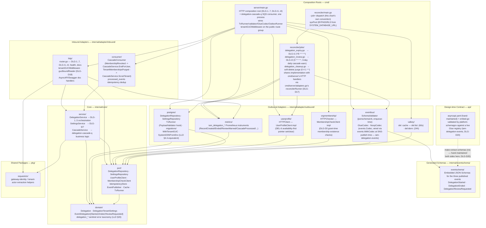
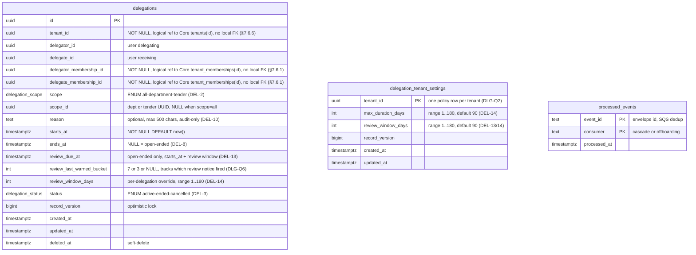
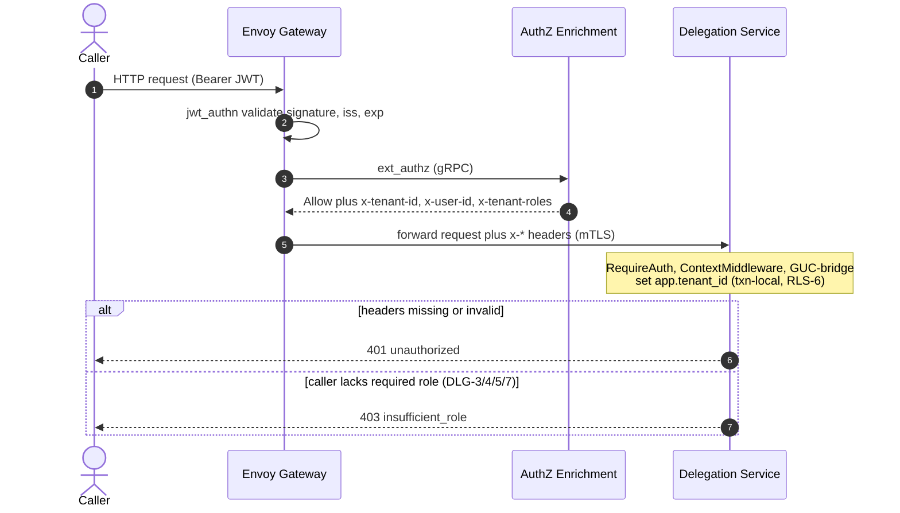
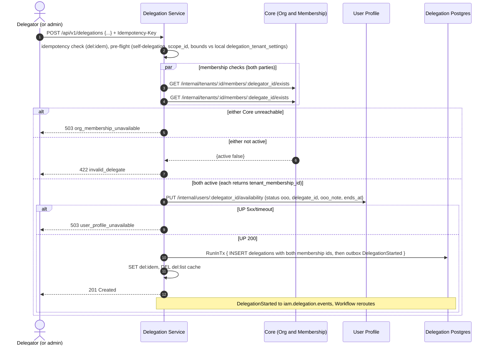
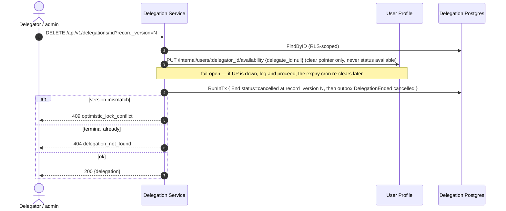
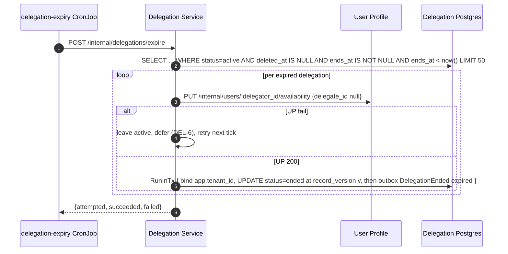
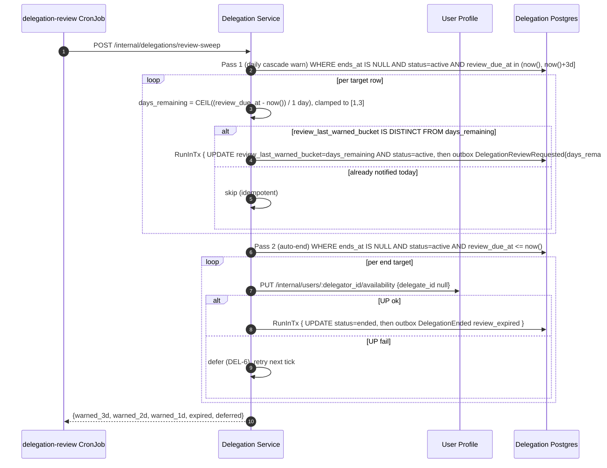
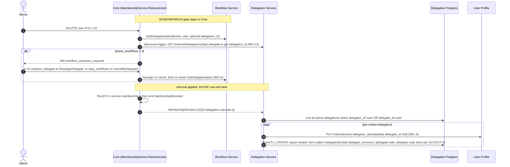
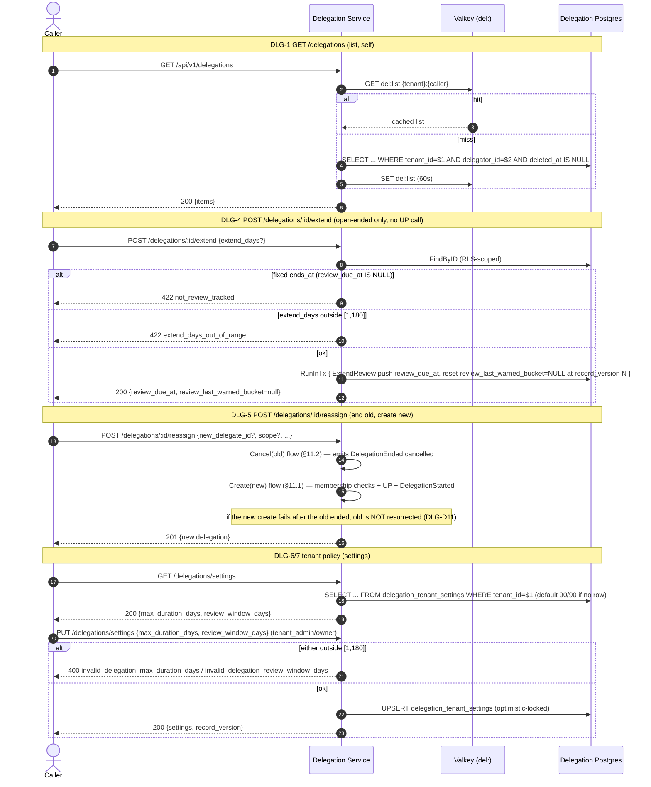
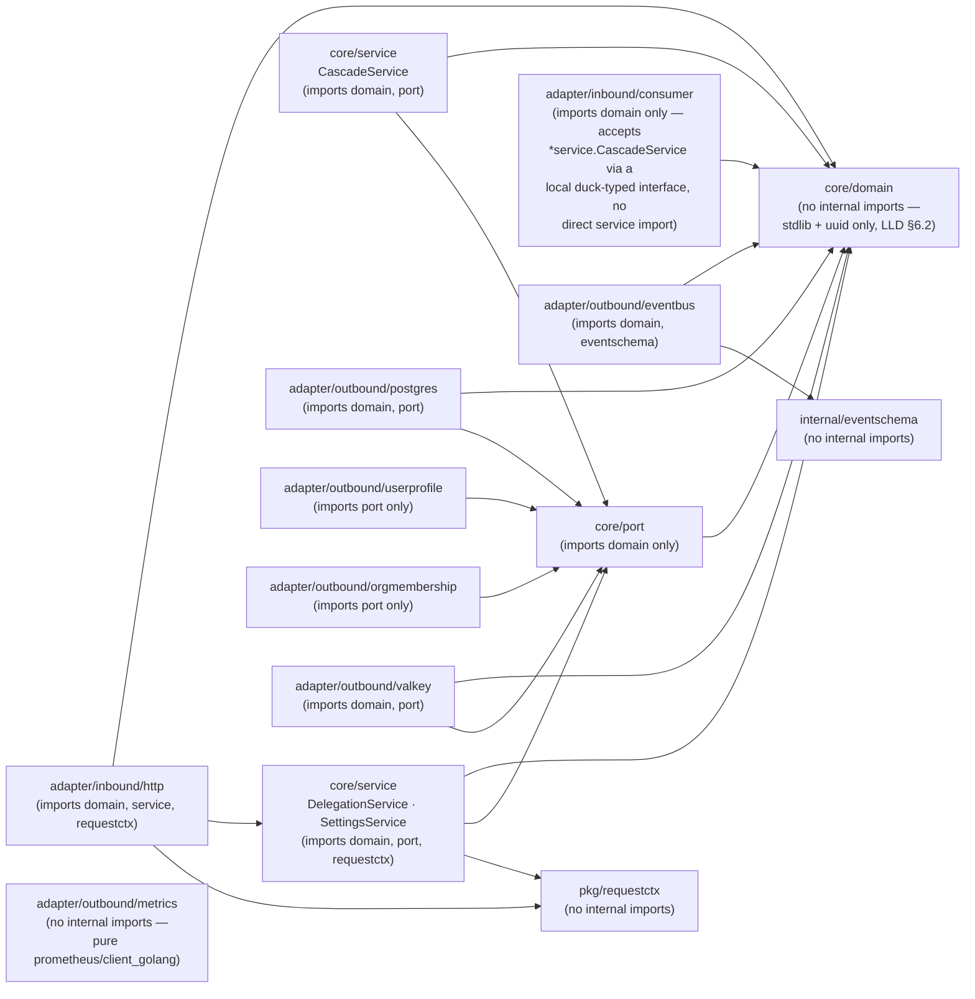

# Architecture

## Mental model

This service is the system of record for out-of-office delegations: two tables
(`delegations`, `delegation_tenant_settings`), an eleven-route API (DLG-1..7 public,
DLG-I1..I4 mesh-internal), two synchronous outbound dependencies of its own
(`iam-org-membership` for grant-time membership checks, `iam-user-profile` for
availability-first pointer set/clear), one inbound async subscription
(`delegation-cascade-q`), and its own outbound event topic (`iam.delegation.events`) — it is
both a producer and a consumer, the one structural difference from most of its O&M
extraction siblings.

It is the fourth and last wave of ADR-0008's decomposition of `iam-org-membership`, and the
only wave that changes Core's own I-8 endpoint: under Option C, Core drops the `delegations`
table and its `active_delegations[]` embed entirely rather than keeping any FK/projection back
to this service (§6.1). Nothing here feeds I-8.

## Layer model — Clean Architecture / Ports-and-Adapters

Same split its siblings (`iam-org-membership`, `iam-catalog-admin`, `iam-group-mapping`,
`iam-tender-acl`) use: `internal/core/{domain,port,service}` +
`internal/adapter/{inbound,outbound}`. Lifted near-verbatim from
`iam-org-membership`'s `internal/core/{domain,port,service}/delegation*.go`,
`delegation_handler.go`, `delegation_repository.go`, and
`cmd/reconciler/jobs/delegation_{expiry,review}.go` (LLD §6) — domain/port/service moved with
almost no change; adapters were rehosted; the tenant-policy read became a local table
(`delegation_tenant_settings`) instead of two `tenants` columns Core owned.

> Source: [`docs/architecture/mermaid/layer-model.mmd`](docs/architecture/mermaid/layer-model.mmd)



Directory layout, for reference:

```
iam-delegation/
├── cmd/
│   ├── server/                              -- HTTP composition root (DLG-1..7, DLG-I1..I4)
│   │                                            + delegation-cascade-q SQS consumer, one process
│   │   └── main.go
│   └── reconciler/
│       ├── main.go                          -- --job=<name> dispatch (this chart's own convention)
│       └── jobs/
│           ├── delegation_expiry.go         -- DLG-I1 (*/5 * * * *, LLD §11.3)
│           ├── delegation_review.go         -- DLG-I2 (0 * * * *, 3-day daily cascade warn, LLD §11.4)
│           └── delegation_cleanup.go        -- soft-delete purge (0 4 1 * *, LLD §11.6/§18.4)
├── internal/
│   ├── core/
│   │   ├── domain/
│   │   │   ├── delegation.go                -- Delegation, enums, EndReason (incl. review_expired)
│   │   │   ├── tenant_settings.go           -- DelegationTenantSettings (policy)
│   │   │   ├── event.go / event_payloads.go -- outbound event envelope + payload shapes
│   │   │   └── errors.go                    -- delegation_* sentinel error taxonomy (LLD §20)
│   │   ├── port/
│   │   │   ├── delegation_repository.go
│   │   │   ├── settings_repository.go       -- delegation_tenant_settings
│   │   │   ├── user_profile_client.go       -- UserProfileClient (DEL-6)
│   │   │   ├── membership_check_client.go   -- MembershipCheckClient (§7.6.2, swappable)
│   │   │   ├── idempotency_store.go         -- create-dedup (DLG-Q3)
│   │   │   ├── event_publisher.go
│   │   │   ├── cache.go
│   │   │   └── tx_runner.go
│   │   └── service/
│   │       ├── delegation_service.go        -- DLG-1..5 orchestration
│   │       ├── settings_service.go          -- DLG-6/7
│   │       └── cascade_service.go           -- delegation-cascade-q business logic
│   └── adapter/
│       ├── inbound/
│       │   ├── http/                        -- DLG-1..7, DLG-I1..I4, health, docs, router
│       │   └── consumer/                    -- delegation-cascade-q (§11.5/§11.6)
│       └── outbound/
│           ├── postgres/                    -- repositories, migrations, processed_events
│           ├── userprofile/                 -- UserProfileClient HTTP impl
│           ├── orgmembership/               -- MembershipCheckClient HTTP impl
│           ├── eventbus/                    -- SNS publisher (iam-delegation-events) + Glue codec
│           ├── valkey/                      -- del: cache + idempotency store
│           └── metrics/                     -- iam_delegation_* Prometheus instruments
├── internal/eventschema/                    -- embedded JSON Schemas for the three published events
├── pkg/requestctx/                          -- gateway-identity / tenant-actor extraction helpers
├── api/                                     -- asyncapi.yaml (hand-maintained) + embed.go
└── deploy/helm/iam-delegation/              -- this service's independent Helm chart
```

**Dependency rule** (CI-enforced — `.go-arch-lint.yml`, `make arch-lint`, LLD §6.2):
`internal/core/*` imports no adapter, Gin, pgx, or AWS SDK; `port` depends only on `domain`;
`service` depends on `domain`+`port`+`requestctx`; inbound adapters depend on
`service`+`port`+`domain` (never an outbound adapter directly — that's wired only from `cmd`);
outbound adapters depend on `port`+`domain`+`eventschema` (never `service`, never inbound);
`cmd/*` is the only place concretes get wired together. No session-scoped
`SET app.tenant_id` — only `SET LOCAL` via `pgcommon.GUCSetFromContext` (CI greps the forbidden
form — `.github/scripts/check-forbidden-set-guc.sh`, RLS-6). Every outbound client sits behind a
port interface; every event publish goes through the transactional outbox.

## Data model

Two tenant-scoped tables in the `delegation` logical database, RLS via the `app.tenant_id` GUC, no cross-database foreign keys — the three FKs the O&M split loses are replaced with logical references plus the synchronous/async patterns below (LLD §7.6).

> Source: [`docs/architecture/mermaid/data-model.mmd`](docs/architecture/mermaid/data-model.mmd)



## Key request flows

One sequence diagram per meaningful path (LLD §11), covering the shared preamble every public route runs, the two mutating public endpoints, the two CronJobs, the inbound cascade, and the remaining read/policy endpoints. See `docs/architecture/README.md` for the full index.

### Request preamble

Every public route runs the same gateway hand-off before reaching a handler.

> Source: [`docs/architecture/mermaid/request-preamble-flow.mmd`](docs/architecture/mermaid/request-preamble-flow.mmd)



### Create (DLG-2)

Availability-first ordering: both membership checks, then User Profile, then the atomic write + outbox enqueue.

> Source: [`docs/architecture/mermaid/create-flow.mmd`](docs/architecture/mermaid/create-flow.mmd)



### Cancel (DLG-3) — fail-open

> Source: [`docs/architecture/mermaid/cancel-flow.mmd`](docs/architecture/mermaid/cancel-flow.mmd)



### Expiry cron (DLG-I1) — self-retrying

> Source: [`docs/architecture/mermaid/expiry-cron-flow.mmd`](docs/architecture/mermaid/expiry-cron-flow.mmd)



### Review-window cron (DLG-I2) — 3-day daily cascade warn, then auto-end

> Source: [`docs/architecture/mermaid/review-cron-flow.mmd`](docs/architecture/mermaid/review-cron-flow.mmd)



### Cascade removal — Core `MembershipRevoked`

The stranding hazard (workflow reassignment) is resolved synchronously in Core before removal; row-ending here is asynchronous and safe.

> Source: [`docs/architecture/mermaid/cascade-removal-flow.mmd`](docs/architecture/mermaid/cascade-removal-flow.mmd)



**Wire-format note (DLG-D21, see "Session-specific decisions" below):** Core Glue-encodes both `MembershipRevoked` and `TenantMembershipsPurged` by default in its own committed deployment configuration, independently of this service's own outbound publish-side Glue configuration. The SQS consumer (`cmd/server/main.go`) therefore always configures `events.WithConsumerCodec(eventbus.GlueDecodeCodec{})` — a registry-agnostic decode-only codec, since the Glue wire header is self-describing and needs no schema lookup to strip. Without it, every Glue-encoded delivery fails decode, retries to exhaustion, and lands in `delegation-cascade-q-dlq`, silently breaking this entire cascade.

### Read and policy endpoints (DLG-1/4/5/6/7)

> Source: [`docs/architecture/mermaid/read-policy-flow.mmd`](docs/architecture/mermaid/read-policy-flow.mmd)



Not diagrammed: LLD §11.6 tenant-lifecycle cleanup (`TenantMembershipsPurged` → soft-delete, monthly hard-purge) is one sentence of prose in the LLD, not a sequence.

## Package dependency graph

Arrows represent Go `import` relationships (module-internal only), read from each package's actual import block — not derived from the Layer model diagram above, which shows composition-root wiring rather than package-level imports. `core/domain` imports nothing internal (LLD §6.2); `core/port` imports only `domain`; the two `core/service` types (`DelegationService`/`SettingsService` and `CascadeService`) both stay inside `domain`+`port` (+`requestctx` for the two DLG-1..7 services). Notably, `adapter/inbound/consumer` does **not** import `core/service` directly — it accepts `*service.CascadeService` through a small duck-typed interface defined locally in the `consumer` package (the same seam pattern as `postgres.PayloadValidator`), so the inbound adapter layer never has a compile-time dependency on the service layer's concrete type. `adapter/outbound/metrics` and `pkg/requestctx` have zero internal imports.

> Source: [`docs/architecture/mermaid/package-dependencies.mmd`](docs/architecture/mermaid/package-dependencies.mmd)



## Cache strategy

Much simpler than a projection-heavy cache: Valkey `del:` keyspace, two keys, both advisory — correctness never depends on either (LLD §9).

| Key | Value | TTL | Invalidated by |
|---|---|---|---|
| `del:list:{tenant}:{delegator}` | DLG-1 list projection | 60 s | DLG-2/3/4/5 for that delegator (explicit `DEL` on write) |
| `del:idem:{tenant}:{key}` | `{delegation_id, status}` for a create `Idempotency-Key` (DLG-Q3) | 24 h | TTL only |

**Read algorithm (DLG-1, LLD §9.1):** `GET del:list:{tenant}:{delegator}` → on hit, deserialize and return; on miss, `SELECT ... FROM delegations WHERE tenant_id=$1 AND delegator_id=$2 AND deleted_at IS NULL ORDER BY starts_at DESC`, then `SET` the key with a 60 s TTL before returning. **Failure mode (LLD §9.3):** a down Valkey falls straight through to Postgres on every read and the idempotency check degrades to best-effort (a retried create within the outage window could in rare cases create a duplicate delegation rather than replaying the original `201`) — correctness of the delegation data itself is never affected, only the idempotency guarantee's strength. There is no cross-service config cache (tenant policy is a local table, `delegation_tenant_settings`) and no I-8 projection cache — both existed in the O&M-era design and were removed under Option C.

## Observability stack

**Tracing:** entirely `platform-gincommon`'s — `gincommon.TracingOptions` configures OTel export in `cmd/server/main.go`; there is no hand-rolled span code in this service. The outbox stamps `trace_id` onto every published event (LLD §14.3) so a create → `DelegationStarted` → Workflow reroute is one trace end-to-end.

**Logging:** the Zap-backed logger `platform-gincommon/pkg/logger.NewLogger` returns is constructed once in each binary's `main()` and threaded everywhere — `gincommon.Config.Logger`, `platform-events`' publisher/consumer/outbox `Logger` fields, this repo's own outbound-adapter/jobs `Logger` interfaces, and (via `internal/adapter/outbound/postgres.NewLoggerAdapter`) `platform-pgcommon`'s `domain.Logger` — with no separate hand-rolled logger anywhere in the process (DLG-D22, matching `iam-user-profile`'s/`iam-org-membership`'s pattern exactly, not just its interface shape). Logs carry `delegation_id`, `tenant_id`, `actor`, and DEL-6 defer reasons (LLD §14.3) — no PII beyond what's already gateway-scoped.

**Metrics:** `internal/adapter/outbound/metrics` defines every `iam_delegation_*` Prometheus instrument this service is specified to emit (LLD §14.2: `iam_delegation_created_total{scope}`, `iam_delegation_ended_total{ended_reason}`, `iam_delegation_active_gauge{tenant}`, `iam_delegation_expiry_deferred_total`, `iam_delegation_review_deferred_total`, `iam_delegation_review_warned_total{days_remaining}`, `iam_delegation_review_expired_total`, `iam_delegation_membership_check_duration_seconds`, `iam_delegation_membership_check_failures_total`, `iam_delegation_up_availability_failures_total{path}`, `iam_delegation_idempotency_hits_total`, `iam_delegation_cascade_processed_total`, `iam_delegation_cascade_dlq_total`), registered onto `gincommon.MetricsRegisterer()` at `cmd/server` startup. Generic per-request HTTP metrics and SQS/events metrics are deliberately not reimplemented here — `gincommon.ObservabilityMiddlewares` and `platform-events`' consumer already emit `http_*`/`events_*`/`sqs_*`.

**Partially closed gap (DLG-D19, see "Session-specific decisions" below):** `iam_delegation_expiry_deferred_total`/`iam_delegation_review_deferred_total` — the two counters the Prometheus alerts actually watch (`deploy/monitoring/app-alerts.yml`, `deploy/helm/iam-delegation/templates/prometheusrule.yaml`) — are wired: `cmd/reconciler/jobs.Context.Metrics` is called on every UP-failure defer in `delegation_expiry.go`/`delegation_review.go`, and `cmd/server/main.go` passes its registered `*metrics.Metrics` in (GAP-27). The other eight instruments above still have **no call site in `internal/core/service`** — none of that layer's constructors accept a `*metrics.Metrics` yet, so those counters will report zero until a metrics-recorder parameter is threaded through `DelegationService`/`SettingsService`/`CascadeService`. Note also: `cmd/reconciler`'s standalone CronJob binary registers its own `*metrics.Metrics` (for `jobs.Context` symmetry) but has no `/metrics` scrape endpoint of its own, so the deferred counters are only actually observable via `cmd/server`'s DLG-I1/I2 on-demand HTTP entry points, not the CronJob binary directly.

## Row-Level Security (RLS) and GUC injection

Unlike a service with a single gateway-bridged GUC path, this service has **three distinct binding paths** converging on the same `postgres.WithTenantGUC` call (DLG-D18) — the LLD's RLS/GUC wiring description (§7.3/§13.1) doesn't specify the exact seam, so this is "as built":

1. **Public routes (DLG-1..7):** `tenantGUCMiddleware(bindTenantGUC)`, registered on the public route group right after `ContextMiddleware()` (`router.go`). Runs once per request, before the handler, binding from the already-bridged `requestctx.RequestContext`.
2. **Mesh-only internal reads (DLG-I3/I4):** `gucBoundReader` (`cmd/server/adapters.go`) wraps `*postgres.DelegationRepository` and binds `app.tenant_id` (with `userID="iam-system"`) **per call**, immediately before each single-statement query — no middleware runs on `/internal/*` (there's no gateway identity to bridge there), and this is safe specifically because these are single-statement reads outside any transaction opened earlier by a `TxRunner`.
3. **Reconciler jobs and the cascade consumer:** `jobs.Context.BindTenantGUC` and `consumer.GUCBinder` are injected function parameters (both satisfied by `postgres.WithTenantGUC` at wire-up in `cmd/reconciler/main.go` / `cmd/server/main.go`), called explicitly per row before each `RunInTx` — there's no HTTP request to bridge from in a cron or an SQS message handler.

All three ultimately call the same `postgres.WithTenantGUC(ctx, tenantID, userID)`, which sets a `pgcommon.GUCSet` on `ctx`; the next pool checkout issues `SET LOCAL app.tenant_id = '...'` (transaction-scoped — CI greps for the forbidden session-scoped form via `.github/scripts/check-forbidden-set-guc.sh`, RLS-6), and Postgres enforces `FORCE ROW LEVEL SECURITY` with a fail-closed `NULLIF` policy on both `delegations` and `delegation_tenant_settings` (LLD §7.3).

> Source: [`docs/architecture/mermaid/rls-guc-flow.mmd`](docs/architecture/mermaid/rls-guc-flow.mmd)

```mermaid
graph TD
    subgraph path1["Path 1 — Public routes (DLG-1..7)"]
        p1a["tenantGUCMiddleware(bindTenantGUC)\nregistered after ContextMiddleware()\non the public route group (router.go)"]
        p1b["binds ctx from requestctx.FromContext(rc)\nonce per request, before the handler runs"]
        p1a --> p1b
    end

    subgraph path2["Path 2 — Mesh-only internal reads (DLG-I3/I4)"]
        p2a["gucBoundReader (cmd/server/adapters.go)\nwraps *postgres.DelegationRepository"]
        p2b["binds app.tenant_id + userID=\"iam-system\"\nper call, immediately before each\nsingle-statement query — no middleware,\nno open tx (LLD §7.3/RLS-6)"]
        p2a --> p2b
    end

    subgraph path3["Path 3 — Reconciler jobs + cascade consumer"]
        p3a["jobs.Context.BindTenantGUC (cmd/reconciler/jobs)\nconsumer.GUCBinder (internal/adapter/inbound/consumer)\ninjected function params — no HTTP request to bridge"]
        p3b["called explicitly per-row before each\nRunInTx (delegation_expiry.go, delegation_review.go,\ncascade_consumer.go)"]
        p3a --> p3b
    end

    withTenantGUC["postgres.WithTenantGUC(ctx, tenantID, userID)\n(internal/adapter/outbound/postgres/db.go)\nall three paths converge here"]

    p1b --> withTenantGUC
    p2b --> withTenantGUC
    p3b --> withTenantGUC

    gucset["pgcommon.WithGUCSet(ctx, GUCSet{TenantID, UserID})"]
    withTenantGUC --> gucset

    setlocal["Next pool checkout issues:\nSET LOCAL app.tenant_id = '...'\n(transaction-scoped, never session-scoped —\nCI greps for the forbidden SET form,\n.github/scripts/check-forbidden-set-guc.sh)"]
    gucset --> setlocal

    rls["Postgres RLS — FORCE ROW LEVEL SECURITY,\nfail-closed NULLIF policy on delegations\nand delegation_tenant_settings (LLD §7.3)"]
    setlocal --> rls
```

## Concurrency and optimistic locking

`record_version` is trigger-managed (TRG-1..3, LLD §7.5) on `delegations`. Cancel/extend/reassign issue `UPDATE ... WHERE id=$1 AND record_version=$2`, mapping zero affected rows to `409 optimistic_lock_conflict` (current version echoed) or `404 delegation_not_found` (terminal/absent) — the cascade consumer's bulk row-end is deliberately **not** optimistic-locked (LLD §12.1), since it's a terminal, one-directional bulk operation, not a user-driven read-modify-write.

Create (DLG-2) runs its two grant-time membership checks **concurrently** (`par` in the LLD §11.1 sequence — a Go `errgroup`/goroutine pair against Core, not sequential round-trips), then the availability-first User Profile call, then the atomic `INSERT` + outbox enqueue inside one `RunInTx`. The mandatory `Idempotency-Key` (DLG-D8/DLG-Q3, 24 h TTL in `del:idem:`) makes retries of that whole sequence safe — a repeated key returns the original `201` rather than re-running the side effects — which also closes the gap left by there being no `UNIQUE(tenant_id, delegator_id)` constraint (a user may legitimately hold multiple concurrent delegations of different scopes, so that constraint would be wrong, not just missing).

## Failure domains

| Scenario | Effect on this service | Effect on the platform |
|---|---|---|
| Core (`iam-org-membership`) membership-check down, during create | `503 org_membership_unavailable`, no write (DLG-FAIL-1) | New grants blocked; I-8 unaffected (Option C removed that coupling entirely) |
| User Profile down, during create | `503 user_profile_unavailable`, no write | Create blocked, retryable by the caller |
| User Profile down, during expiry/review cron or the cascade row-end | Row left active, deferred, retried next tick (DEL-6) | Pointer re-cleared on the next successful tick — no split-brain |
| User Profile down, during cancel (DLG-3) | Fail-open — cancel proceeds anyway | Interactive cancel is never blocked by an availability-service outage; the pointer is re-cleared by the next expiry tick |
| This service itself is down | DLG-1..7 unavailable; CronJobs paused | I-8 unaffected; Core's user-removal gate degrades to tenant-wide impact instead of department-precise (DLG-I3 unreachable) — still correct, just less precise |
| Postgres down | All reads/writes fail | No fallback — this is the system of record |
| Valkey down | DLG-1 list falls through to Postgres; idempotency check degrades to best-effort | Slightly higher latency; delegation data correctness is unaffected (see Cache strategy above) |
| SQS/SNS down | Outbox retries up to `OUTBOX_MAX_ATTEMPTS`, then dead-letters | Downstream consumers (Workflow, Notification, Audit) see delayed or (after DLQ) missing events until manually reprocessed |

## Key invariants

Hard invariants this service maintains, drawn from the LLD's DLG-D/DEL-/DLG-EVT- decision families (§10.7/§12.4/§12.5):

- **DLG-FAIL-1/2/3:** a Core or User Profile outage during create fails cleanly with no partial write; this service's own outage never produces a wrong I-8 authorization answer (I-8 no longer references delegations at all under Option C); every synchronous call this service makes is on its own write path — the only coupling *toward* Core (the removal cascade) is asynchronous.
- **DLG-EVT-3/DEL-7:** `DelegationEnded` fires on every end path (cancel, expiry, review auto-end, delegate-removed cascade) — never path-dependent — **except** delegator-side removal, which ends the row silently with no event at all (DLG-EVT-4, a deliberate carried-over asymmetry from O&M).
- **DLG-EVT-5:** the review sweep emits `DelegationReviewRequested` at most once per calendar-day bucket (`days_remaining` = 3, then 2, then 1) per delegation per cycle — the 3-day daily cascade, tracked by `review_last_warned_bucket`; `review_last_warned_bucket` only applies to open-ended delegations (`ends_at IS NULL`) — fixed-`ends_at` delegations are never considered by the review sweep at all.
- **DLG-EVT-7:** every published payload is a self-contained snapshot, not a delta — a consumer that never saw a `DelegationStarted` can still safely process the matching `DelegationEnded` (nothing to restore).
- **DLG-D11:** if a reassign's new-delegation create fails after the old delegation was already ended, the old delegation is **not** resurrected — the caller sees a partial failure (old ended, new not created) rather than the service attempting a compensating undo.
- **DLG-D12:** v1 is active-at-create only — no future-dating; a delegation is either active immediately or rejected, never scheduled to start later.
- **DLG-D8/DLG-Q3:** the create idempotency window is exactly 24 h, keyed on `(tenant, Idempotency-Key)`, not on any business field.

## Consumer conformance checklist

`iam.delegation.events` has three real consumers (LLD §10.4): **Workflow Service** (`DelegationStarted`/`DelegationEnded` — reroute/restore, DEL-4/DEL-5), **Notification** (all three types), and **Audit Log** (all three, no filter). All three payload schemas declare `"additionalProperties": true` — an explicit open-schema contract enforced by CI (`schema-gov validate` Pass 5 rejects any schema that re-introduces `additionalProperties: false`). Before subscribing, a consumer must be configured for lenient decoding — see `api/asyncapi.yaml`'s `x-forward-compatibility.required-settings` block (added alongside the CI governance pipeline, DLG-D20) for the exact Go `encoding/json`/`sonic` settings; this service's own consumers are other internal Go services, so that block only documents the Go-side settings, unlike a public multi-language contract.

## Schema lifecycle

Schema states (`active`/`deprecated`/`retired`) and the compaction protocol for a schema that has accumulated too many Glue versions are governed by `api/asyncapi.yaml`'s `x-version-governance`/`x-usage-override` blocks and enforced by the CI pipeline added under DLG-D20 (`schema-registry.yml` validates/registers on every push, `schema-prune.yml` handles monthly orphan cleanup, `schema-health-quarterly.yml` is a read-only quarterly report, `freeze-watchdog.yml` guards against a forgotten `SCHEMA_FREEZE`). See `docs/runbook-schema-registry.md` for the operational detail (pre-deploy checklist, failure modes, adding a new event type) — this section intentionally doesn't re-derive it.

## Trust boundaries and isolation

This is deliberately narrower than a formal threat model — the LLD (§13) documents trust boundaries and isolation layers, not a STRIDE-style analysis, and this section doesn't invent one:

- **Tenant isolation, three layers (LLD §13.1):** Postgres RLS (`FORCE`, fail-closed `NULLIF` policy on both tables — see RLS and GUC injection above); `SET LOCAL app.tenant_id` per transaction, never session-scoped; gateway-identity headers (`x-tenant-id`/`x-user-id`/`x-tenant-roles`), never a request-body-derived tenant or actor.
- **Network isolation (LLD §13.2):** public routes sit behind Envoy; `/internal/*` (DLG-I1..I4) is mesh-only mTLS via the internal-route guard — there is no RBAC/JWT check on those routes because there's no gateway identity to check, only the network boundary. Cross-service calls to `iam-org-membership`/`iam-user-profile` are intra-mesh mTLS.
- **Input validation (LLD §13.3):** mirrors the DB CHECK constraints and DEL invariants directly — scope enum membership, scope↔scope_id consistency, `reason` length ≤ 500, `starts_at` within `(now()−skew, now()+1yr]`, `ends_at > starts_at`, span ≤ tenant `max_duration_days`, `extend_days`/policy days in `[1,180]`.

## Developer tools

Swagger UI (`/swagger`) and the AsyncAPI viewer (`/asyncapi`, raw spec at `/asyncapi.yaml`) are described from a usage angle in `README.md`; architecturally, both are served from the same binary with no external tooling dependency: `api/embed.go`'s `//go:embed asyncapi.yaml` compiles the spec directly into the binary (`apispec.AsyncAPISpec`), and `router.go` mounts both doc routes gated by the same `DocsConfig` (`DOCS_ENABLED`/`DOCS_AUTH_TOKEN`, active outside `production` unconditionally, opt-in with an optional bearer-token gate in `production`).

## Documentation assets

This repo's own doc assets, beyond this file: `docs/lld/iam-lld-delegation-service.md` (the full LLD — data model, event architecture, request flows, observability, testing strategy in depth), `docs/architecture/` (this file's diagram sources, indexed in `docs/architecture/README.md`), `docs/runbook-schema-registry.md` (Glue Schema Registry operations), `docs/swagger/` (generated OpenAPI spec), and `CHANGELOG.md`. The as-built decision register (DLG-D13 onward) lives in this file's own "Session-specific decisions" section above. See "Where to look next" below for pointers by topic.

## Decision Register (LLD §23, DLG-D1 through DLG-D12)

These are the decisions the original Low-Level Design
(`docs/lld/iam-lld-delegation-service.md`) shipped with, made before this repo existed:

| # | Decision |
|---|---|
| DLG-D1 | **Option C for I-8** — `active_delegations[]` is removed from I-8 and Core drops the `delegations` table entirely; the would-be consumers (Workflow, Dashboard, AuthZ Enrichment) are re-sourced to this service's own events/endpoints instead (§6.1). |
| DLG-D2 | **Tenant delegation policy moves into this service** as `delegation_tenant_settings`, read in-process at create/extend; Core drops the two `tenants` columns it used to own. |
| DLG-D3 | **The two lost composite membership FKs → two synchronous grant-time checks** against Core's `GET /internal/tenants/:id/members/:user_id/exists`, which must return `tenant_membership_id` when active, behind a swappable `MembershipCheckClient`. |
| DLG-D4 | **The lost `fk_del_tenant` cascade → an async tenant-offboarding consumer** on `delegation-cascade-q` (§11.6). |
| DLG-D5 | **Delegation events get a dedicated topic**, `iam.delegation.events` (`source: iam-delegation`); Core's own AsyncAPI drops them entirely. |
| DLG-D6 | **`DelegationEnded.ended_reason` gains `review_expired`** — the shipped code's value becomes contract, so review auto-ends are distinguishable from plain `ends_at` expiry. |
| DLG-D7 | **The review sweep warns twice, at 7 d and 3 d**, tracked via `review_last_warned_bucket`; `days_remaining` is always one of `{7, 3}`. |
| DLG-D8 | **Create takes a mandatory `Idempotency-Key`** (24 h dedup), closing the duplicate-on-retry gap left by the absence of a `UNIQUE(tenant_id, delegator_id)` constraint. |
| DLG-D9 | **The synchronous removal gate stays in Core; only the row-end moves here (async)** — Core's dept-scope precision check becomes a Core-to-Delegation call (DLG-I3) on the admin removal path. |
| DLG-D10 | **`port.UserProfileClient` + DEL-6 availability-first / pointer-clear-only move here intact** — cancel is fail-open; scheduled ends defer-and-retry rather than fail. |
| DLG-D11 | **Reassign takes the fuller body** (`new_delegate_id?/scope?/scope_id?/ends_at?/reason?`), and the error taxonomy is canonicalised (§20). |
| DLG-D12 | **v1 scope is active-at-create only** — no future-dating; future-dated activation is deferred to a v2 start-scheduler feature. |

## Session-specific decisions (DLG-D13 onward)

Decisions **DLG-D13 onward** were made during this build, not present in the original LLD.
Where this build had to make its own call ahead of any of these existing (e.g. the
`--job=<name>` CronJob dispatch convention, or the `CRON_BATCH_LIMIT` env var name), it is
called out inline as "this chart's own convention" rather than asserted as an LLD decision.

| # | Decision |
|---|---|
| DLG-D13 | AuthZ Enrichment's `active_delegations[]`-driven department-level elevation (`policy.departmentLevel()`) is removed outright in PR4, not just the dead field — research found ADR-0008's "no policy reads it" claim was false (that method DID fold delegations into an authz decision). Full Option-C behavior was chosen over reintroducing a hot-path escape-hatch call. User-confirmed. |
| DLG-D14 | `MembershipRevoked{tenant_id,user_id,actor_id}` and `TenantOffboarded{tenant_id,actor_id}` were wholly new Core (`iam-org-membership`) event types (DLG-Q4) — Core had neither before this build (only `TenantMembershipRemoved`, tender-ACL's cascade signal). Built from scratch in PR3, not discovered as pre-existing wiring. **Update:** Core later renamed `TenantOffboarded` to `TenantMembershipsPurged` (same payload shape) to avoid colliding with Realm Provisioner's own, differently-scoped `TenantOffboarded` event — this service's consumer and `api/asyncapi.yaml` reflect the new name (confirmed against Core's actual code — see DLG-D21). |
| DLG-D15 | Event-schema governance uses in-house `santhosh-tekuri/jsonschema/v6` validation (mirroring `iam-user-profile`'s proven pattern) instead of `platform-schemagov`, which no sibling service actually depends on or exercises. `internal/adapter/outbound/eventbus/validator.go`. |
| DLG-D16 | Go toolchain pinned to `1.26.6` (matching every touched repo's actual toolchain) rather than the LLD's stated "Go 1.23", which is stale relative to the platform's real toolchain as of this build. |
| DLG-D17 | DLG-I1/I2 (`/internal/delegations/expire`, `/internal/delegations/review-sweep`) are real HTTP handlers on `cmd/server` **and** `cmd/reconciler`'s CronJobs call the identical implementation in-process (`cmd/reconciler/jobs`) rather than the CronJob shelling out over HTTP to the server pod. This matches `iam-org-membership`'s actual lift-source pattern and LLD §16.1's "a `reconciler` runs the CronJobs" — several other LLD passages phrase DLG-I1/I2 as if they're the *only* entry point, but §16.1 is authoritative on topology. `cmd/server/adapters.go`'s `reconcilerRunner` adapts `cmd/reconciler/jobs`' `Expiry`/`ReviewSweep` functions to the HTTP handler's injected `ExpiryRunner`/`ReviewRunner` interfaces so both paths share one code path. |
| DLG-D18 | The LLD describes RLS/GUC binding as happening "in the postgres outbound adapter" (§7.3/§13.1) without specifying the exact wiring signature. As built, `postgres.DelegationRepository`/`SettingsRepository` methods read whatever GUC is already bound on `ctx` (via `pgcommon.GUCSetFromContext`) — they do **not** derive it from their own `tenantID` parameter internally. This means the GUC must be bound *before* the call reaches the repository: `internal/adapter/inbound/http/router.go` adds a `BindTenantGUC`-typed seam (`tenantGUCMiddleware`, run right after `ContextMiddleware` on the public route group) so `cmd/server` can inject `postgres.WithTenantGUC` without the `http` package importing `pgcommon` directly (Clean Architecture); the mesh-only DLG-I3/I4 routes (no per-request middleware) instead use a small `gucBoundReader` wrapper (`cmd/server/adapters.go`) that binds per-call from the tenantID argument, which is safe there because those are single-statement reads outside any open transaction. The reconciler jobs and cascade consumer bind via their own injected `BindTenantGUC`/`GUCBinder` function parameters, per RLS-6. |
| DLG-D19 | **Partially closed (GAP-27, LLD v2.2 §11.4).** The two deferred-counter metrics — `iam_delegation_expiry_deferred_total`/`iam_delegation_review_deferred_total`, the ones an actual Prometheus alert (`deploy/monitoring/app-alerts.yml`, `deploy/helm/iam-delegation/templates/prometheusrule.yaml`) fires on — are wired: `cmd/reconciler/jobs.Context` has an optional `Metrics` seam (`RecordExpiryDeferred`/`RecordReviewDeferred`), called at both `res.Deferred++` sites in `delegation_expiry.go`/`delegation_review.go`; `cmd/server/main.go` passes its real `*metrics.Metrics` into `jctx.Metrics`. The remaining LLD §14.2 metric methods (`RecordCreated`, `RecordEnded`, `RecordReviewWarned`, `RecordMembershipCheckFailure`, `RecordUPAvailabilityFailure`, `RecordIdempotencyHit`, `RecordCascadeProcessed`, `RecordCascadeDLQ`, etc.) still have no call site in `internal/core/service` — that part of the gap remains open, needing a metrics-recorder parameter threaded through `DelegationService`/`SettingsService`/`CascadeService` rather than the narrow `jobs.Context` seam GAP-27 needed. `cmd/reconciler`'s standalone CronJob binary also registers a `*metrics.Metrics` (via `gincommon.MetricsRegisterer()`, purely to keep its `jobs.Context` symmetric with `cmd/server`'s and to keep every Prometheus registration in this repo going through platform-gincommon rather than a hand-rolled `prometheus.NewRegistry()`) and wires it into `jctx.Metrics`. Since this binary never runs `gincommon.ObservabilityMiddlewares`/`DefaultMiddlewares`, `MetricsRegisterer()` falls back to `prometheus.DefaultRegisterer` — and being a short-lived, one-shot process with no `/metrics` endpoint of its own under the alert's `job` label, nothing actually scrapes it either way; "deferred" is visible in its structured completion log in the meantime. The counters that do reach the alert fire via `cmd/server`'s DLG-I1/I2 on-demand HTTP entry points (DLG-D17), which share the same `jobs.Context`-calling code and do have a live scrape target. |
| DLG-D20 | **Supersedes DLG-D15's CI-governance scope** (the in-house-validator half of DLG-D15 remains correct and unchanged). `platform-schemagov` is not a Go dependency (it's a CI-only Docker image); it turns out `iam-user-profile` uses it exactly the same way this service now does, alongside the identical in-house `jsonschema/v6` `SchemaValidator` DLG-D15 describes. This service already shipped `eventbus.GlueCodec` (`codec.go`), the `aws-sdk-go-v2/service/glue` dependency, and a `GlueSchemaRegistryReadOnly` IAM SID in `deploy/iam/policy.json` from the initial build — only the CI-time governance pipeline and monitoring were missing. Closed by adding: `.github/workflows/schema-registry.yml` (rewritten to drive `platform-schemagov` validate/diff/register against a dedicated `iam-delegation-events` Glue registry, replacing the old Python-only structural check), `schema-prune.yml`, `schema-health-quarterly.yml`, `freeze-watchdog.yml`, `deploy/monitoring/schema-registry-alerts.yml`, `docs/runbook-schema-registry.md`, `Makefile`'s `schema-*` targets, `docker-compose.pro.yml`, and `GLUE_REGISTRY_NAME`/`GLUE_REGISTRY_ARN` in `deploy/helm/iam-delegation/values.yaml`. Also added the `x-lifecycle`/`x-owner`/`x-forward-compatibility`/`x-semantic-contract`/`x-version-governance`/`x-usage-override` annotations `schema-gov validate` requires to `api/asyncapi.yaml`. Requires the `staging` GitHub Environment (`AWS_ACCESS_KEY_ID`/`AWS_SECRET_ACCESS_KEY`/`AWS_REGION`) and the `iam-delegation-events` Glue registry provisioned in each AWS account (Terraform shape in `deploy/iam/policy.tf.example`) — neither is done by this change. |
| DLG-D21 | **Confirmed production-breaking gap, found and closed via a cross-service compatibility audit against `iam-org-membership`'s actual code, not just the LLD.** Core's committed Helm defaults (`deploy/helm/values.yaml`) set `GLUE_REGISTRY_MEMBERSHIP_NAME: "iam-membership-events"` (non-empty), so in any environment using that default, Core Glue-encodes every `MembershipRevoked`/`TenantMembershipsPurged` payload on `iam.membership.events` before publish — independently of this service's own `GLUE_REGISTRY_NAME` (outbound side only). `internal/adapter/inbound/consumer/wiring.go`'s `NewCascadeSQSConsumer` never configured `events.WithConsumerCodec(...)`, so `platform-events`' SQS consumer would hit its `codec == nil` branch on every message with a non-empty `SchemaID` — `"message has schema_id ... but no Codec is configured"` — retried to `maxReceiveCount` exhaustion and parked in `delegation-cascade-q-dlq`, silently breaking the removal cascade (DEL-6/DEL-7) and tenant-purge scrub end to end. Fixed by adding `eventbus.GlueDecodeCodec` — a registry/schema-agnostic decode-only `events.Codec`: the 18-byte Glue wire header is fully self-describing, so no Glue client, registry name, or cross-service IAM permission is needed to decode, only to encode. Wired unconditionally in `cmd/server/main.go` via `events.WithConsumerCodec(eventbus.GlueDecodeCodec{})` — safe in every environment, since `platform-events` only invokes `Codec.Decode` when the inbound envelope's `SchemaID` is non-empty (a NoopCodec-published message never triggers it). Also confirmed by the same audit: the membership-existence check, Core's `DeptDelegate` call into this service's DLG-I3, and Core's confirmed drop of the `delegations` table (Option C) all check out byte-for-byte; Core's business metrics use a bare `iam_*` prefix rather than this service's `iam_delegation_*` convention — a pre-existing naming-style divergence, not a collision, not changed here. |
| DLG-D22 | **Logging switched from a hand-rolled `slog.Logger` to `platform-gincommon/pkg/logger.NewLogger`**, to match `iam-user-profile`'s and `iam-org-membership`'s actual pattern rather than `iam-tender-acl`'s (this service's original source, which also hand-rolls `slog`). Previously, `cmd/server/observability.go`/`cmd/reconciler/observability.go` built their own `*slog.Logger` and only satisfied `gincommon.Config.Logger`'s interface shape via a wrapper (`mapLogger`) — every log line in the process still worked, but the underlying implementation wasn't literally platform-gincommon's own. Now both binaries call `gclogger.NewLogger(env)` once in `main()` and pass that single value everywhere (`gincommon.Config.Logger`, `events.SNSConfig`/`outbox.Config`/`events.SQSConfig` `Logger` fields, `valkey.NewCache`/`NewIdempotencyStore`, `jobs.Context.Logger`, `consumer.NewCascadeConsumer`/`NewCascadeSQSConsumer`, `httpadapter.NewRouter`) — no wrapper needed for any of them, since they all already share gincommon's `map[string]interface{}`-based method shape. Only `platform-pgcommon`'s Field-based `domain.Logger` needs an adapter, moved to `internal/adapter/outbound/postgres.NewLoggerAdapter` in DLG-D23 below (mirroring `iam-user-profile`'s/`iam-org-membership`'s identical `postgres.LoggerAdapter`, rather than staying duplicated per-binary). Also closed in the same pass: `eventbus.GlueCodec.StartRefresher`'s background refresh-failure warnings were silently falling back to an unconfigured `slog.Default()` because `main.go` never called `.WithLogger(...)` on the codec before starting the refresher — now wired to the real logger. |
| DLG-D23 | **Database connection/configuration/operations audited and aligned to `iam-user-profile`'s/`iam-org-membership`'s exact `pgcommon` pass-through pattern.** Two real, confirmed bugs found and fixed: (1) `SystemDSNFromEnv()`'s fallback (and `cmd/server/main.go`'s inlined migration-DSN fallback) read a bare `os.Getenv("DATABASE_URL")` instead of the pgcommon-built DSN — under a `PG_HOST`/`PG_PORT`-style deployment (no single `DATABASE_URL`), this silently produced an **empty DSN**, not the intended "reuse the app pool" degrade-to-RLS-filtered behavior the code comments claimed; (2) `PG_STATEMENT_TIMEOUT` was entirely unsupported — the app pool's DSN was never run through a statement-timeout-appending step at all. Fixed by adding `postgres.DSNFromEnv()` (the pgcommon-built DSN, with `ApplyStatementTimeout` layered on top when not using a verbatim `DATABASE_URL`) and `postgres.MigrationDSNFromEnv()`, and rewiring `SystemDSNFromEnv()` to fall back to `DSNFromEnv()` — exact copies of the sibling services' identical helpers. `postgres.NewPool`'s wrapper function (which never applied `DSNFromEnv`'s statement-timeout step) was removed; both `main()`s now inline `pgcommon.ConfigFromEnv()` + `pgCfg.DSN = dsn` + `pgCfg.GUCProvider`/`pgCfg.Logger` + `pgcommon.NewPool(...)`, matching the sibling call sites line-for-line. Also moved the Field-based logger adapter out of each binary's `observability.go` (previously duplicated as a private `pgDomainLogger` in both) into `internal/adapter/outbound/postgres.LoggerAdapter`/`NewLoggerAdapter`, an exported type in the same package sibling services define it in. `PGBouncerMode`/`Tracer` usage on the sysPool, and `DrainAndClose` vs `Close` for shutdown, were already using `pgcommon`'s own supported `Config`/`Pool` surface (not a bypass) and were left unchanged. |
| DLG-D24 | **Events/outbox/dedup audited and aligned to `iam-user-profile`'s/`iam-org-membership`'s exact `platform-events` pass-through pattern.** `internal/adapter/inbound/consumer.ProcessedEvents` (the dedup ledger) and the outbox-enqueue path already matched the sibling services' `ProcessedEventsRepository`/`OutboxPublisher` byte-for-byte in schema and SQL shape — no bypass found there. Two real, confirmed gaps found and fixed: (1) `postgres.txBoundPublisher.EnqueueCtx` never called `events.WithSchemaVersion("1")` — both siblings stamp `"1"` onto every published envelope's `specversion` field; this service silently omitted it from every `DelegationStarted`/`DelegationEnded`/`DelegationReviewRequested` event. Fixed, with an integration test asserting the real `outbox_events.payload->>'specversion'` value. (2) `outbox.Runner.PrunePublished` — the library's own method for deleting published `outbox_events` rows past a retention window — was never called anywhere; `iam-user-profile` calls it directly from a daily `runMaintenanceSweep` goroutine in `cmd/server` (this service's chosen approach, since it reuses the already-constructed `Runner`+`Publisher` rather than requiring a second `Publisher` just to prune), while `iam-org-membership` instead hand-rolls the equivalent `DELETE` in a reconciler job. Without either, `outbox_events` grows unbounded. Fixed by adding a fourth `cmd/server` background goroutine (`OUTBOX_PRUNE_INTERVAL`/`_RETENTION`/`_LIMIT`, defaults matching `iam-user-profile`'s: daily, 7 days, 1000 rows). Also closed along the way: `outbox.Config`'s tunables (`PollInterval`/`BatchSize`/`MaxAttempts`/`DrainTimeout`/`PublishConcurrency`/`PublishTimeout`/`StartupJitter`/`ClaimLeaseDuration`) were hardcoded with no env-var override, unlike both siblings' `OUTBOX_*` surface (`iam-org-membership`'s is the fuller of the two — matched exactly, including its defaults) — now sourced from `cmd/server/config.go`. Also added the `outbox_dead_letters_total` alert (`platform-events`' own metric, not one this service defines) to both `deploy/helm/iam-delegation/templates/prometheusrule.yaml` and `deploy/monitoring/app-alerts.yml`, matching `IAMUserProfileOutboxStuck`/`IAMOrgMembershipOutboxDeadLetters` — this service had no dead-letter alert at all before. **Found while documenting this fix:** `api/asyncapi.yaml`'s `EventEnvelope.specversion` declared `const: "1.0"` — both siblings' `asyncapi.yaml` document `"1"`, matching the wire value `WithSchemaVersion("1")` actually produces; fixed to `const: "1"`. See `docs/lld/iam-lld-delegation-service.md` revision 2.4 for the corresponding LLD correction. |

**Known deviations from a literal reading of the LLD:**

- **§8.4 DLG-2's `ooo_note`/`reason` fields**: the LLD's prose ("`ooo_note` rides the UP call (not stored); `reason` is stored and forwarded to UP as the display note") reads as two fields but the example request body only shows `ooo_note`. Resolved as one wire field (`ooo_note`, DTO) mapped to one domain field (`CreateInput.Reason`, stored in `delegations.reason`, forwarded to User Profile as the note) — not a second, separate field.
- **§10.5's "I-8 join" framing**: confirmed via the `iam-org-membership` survey that I-8's SQL is four separate queries in one transaction, not one literal multi-table `LEFT JOIN` statement — Option C's subtraction removes the fourth query and the `ActiveDelegations` field, with an identical functional outcome to what the LLD describes.

## Where to look next

- `README.md` — what the service does, local dev setup, testing.
- `CHANGELOG.md` — notable changes.
- `deploy/helm/iam-delegation/values.yaml` — every configuration key this service reads, with
  production defaults; the single source of truth `docker-compose.yml` and this document's env
  var references are kept in sync with.
- `docs/lld/iam-lld-delegation-service.md` — the full LLD, in particular §7 (data
  model/RLS), §10 (event architecture), §11 (request flows), §14 (observability/alerting), and
  §17 (testing strategy).
