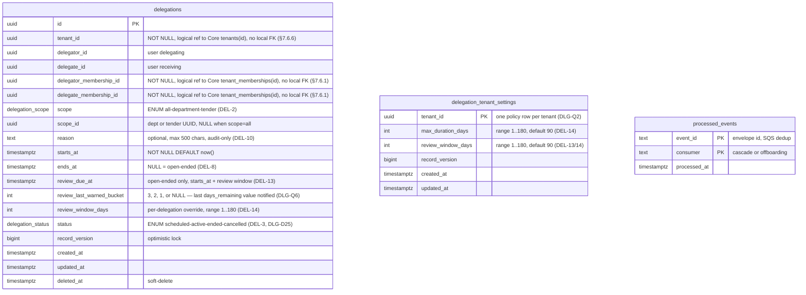
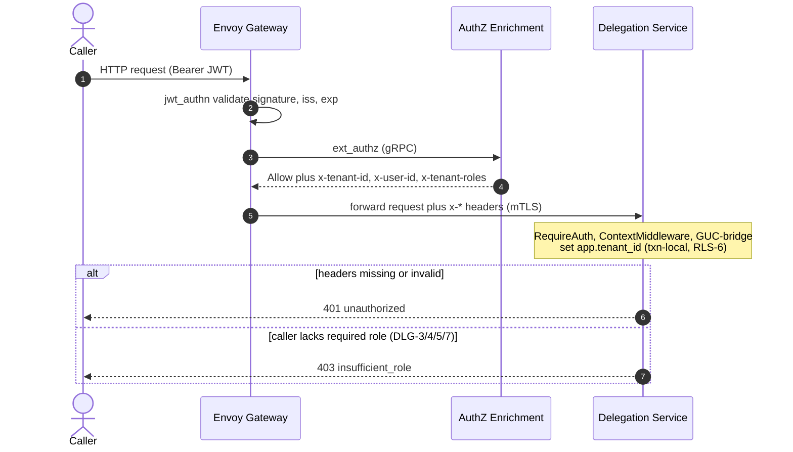
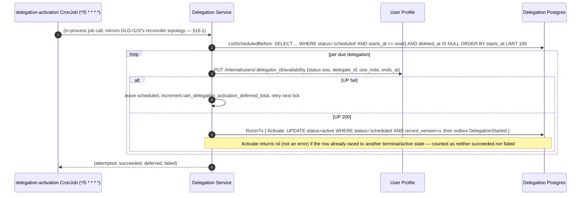
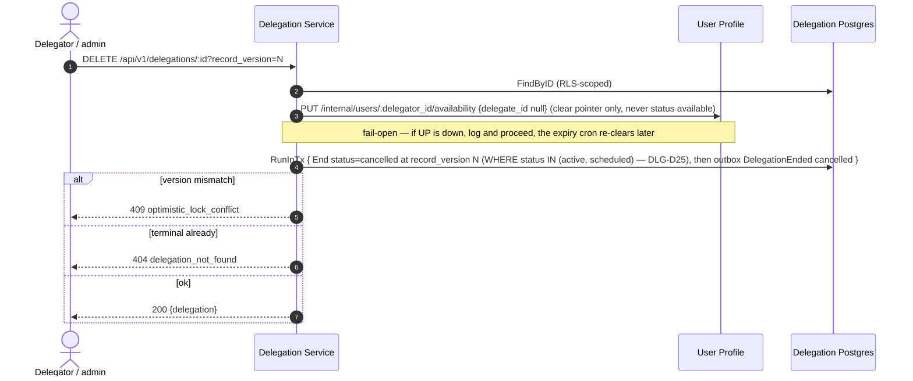
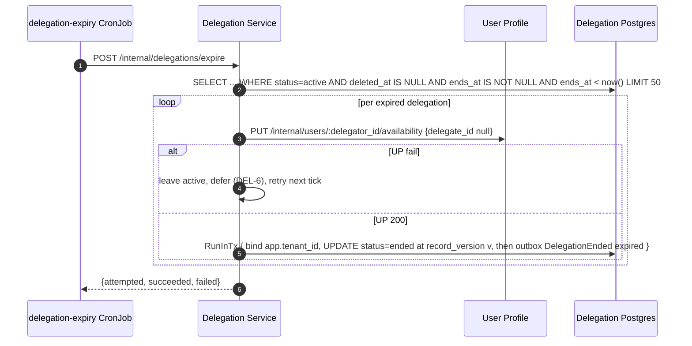
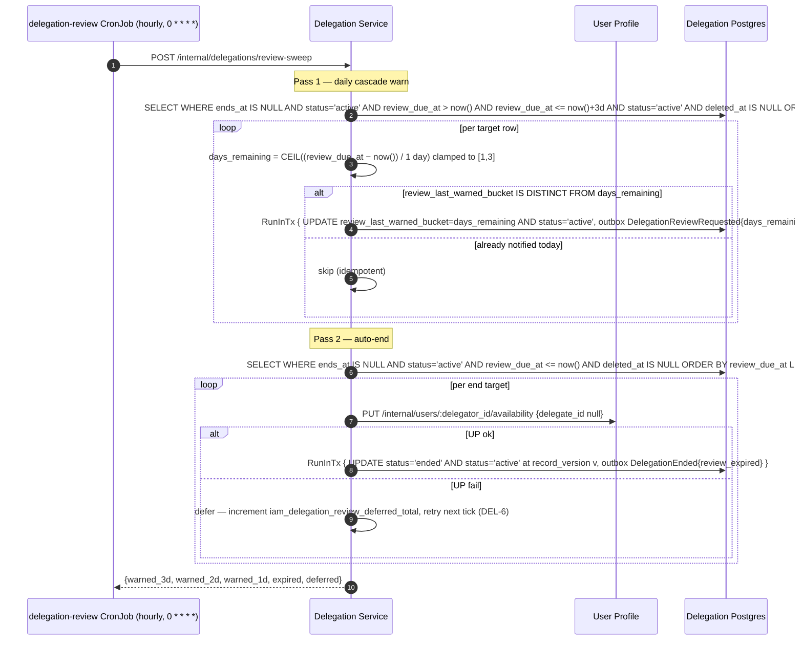
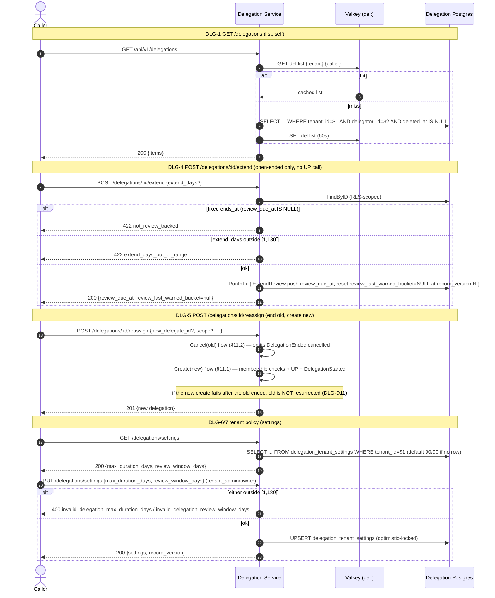

# Delegation Service — Low-Level Design

## Tender Management SaaS Platform — IAM Subsystem

| Field | Value |
|---|---|
| Document Type | Low-Level Design (LLD) |
| Service | Delegation Service (`iam-delegation`) |
| Parent decision | **ADR-0008** (`02-hld-delta-delegation.md`, v2 / Option C) — the fourth O&M extraction, authorised by ADR-0007's explicit deferral of `delegations` |
| Subsystem | Identity & Access Management |
| Wave | 4 of 4 (the deferred hot-path table; resolved by removing delegations from I-8 entirely) |
| Version | 2.15 |
| Date | 2026-09-19 |
| Status | Approved for implementation |
| Audience | IAM platform engineering (owner), Core Org & Membership engineering (drops `delegations`; membership-existence + dept-delegate callee; removal-signal producer), Workflow Service (delegation-event consumer), User Profile (availability callee), AuthZ Enrichment (drops `active_delegations[]`), SRE |
| Owner database | RDS PostgreSQL `delegation` (Multi-AZ, PgBouncer transaction pooling) |
| Go module | `github.com/BCBP-SOLUTIONS-FZC-LLC/iam-delegation` |

### Revision history

| Version | Date | Notes |
|---|---|---|
| 1.0 | 2026-08-20 | Initial extraction LLD under a no-contract-change constraint (**Option A** — Core kept an event-synced `delegations` projection so I-8 still served `active_delegations[]`). Carried O&M invariants DEL-1…DEL-14, introduced the `DLG-*` families, and left DLG-Q1…Q10 as sign-off items. |
| 2.0 | 2026-08-20 | **Free-hand revision — the IAM subsystem is in development, nothing deployed.** With the backward-compatibility constraint lifted, DLG-Q9 resolves to **Option C**: `active_delegations[]` is removed from I-8 and **Core drops the `delegations` table entirely**, making the extraction symmetric with the three ADR-0007 cuts and leaving I-8 *faster* (four-table join). All other open questions are resolved as decisions (§19/§23): dedicated event topic `iam.delegation.events` (Q1); tenant delegation policy moves into this service as `delegation_tenant_settings` (Q2); mandatory create idempotency key (Q3); Core `MembershipRevoked`/`TenantOffboarded` signals (Q4); `ended_reason` gains `review_expired` (Q5); dual 7 d/3 d review warnings (Q6); fuller reassign body (Q7); canonical error taxonomy (Q8); active-at-create v1 scope (Q10). v1's projection is retained only as a documented fallback (§22). |
| 2.1 | 2026-08-20 | **Depth/quality uplift to the `iam-lld-user-profile.md` standard.** No design change — this revision raises the document to the maturity bar of the User Profile LLD: §10 Event Architecture is expanded to that doc's §7 depth (inbound-consumer table with queue/DLQ/`maxReceiveCount`/filter policy; serialization; a full hand-authored `api/asyncapi.yaml` 3.0.0 skeleton with an `EventEnvelope` + `allOf` per-payload schemas; a Glue Schema Registry layout table, schema-evolution rules, and enqueue-vs-publish Go codec wiring; an outbound consumer→queue→DLQ fan-out table; a published-events catalogue; and an idempotency/ordering subsection). §7.3 RLS is expanded to the three-function fail-closed design (`app_tenant_id()`/`rls_check_tenant()`/`log_rls_violation()`) + `rls_violation_log` + per-table policies + roles + CI-verified RLS-1/2/4/6. §7.5 now shows the `touch_row()` trigger SQL + TRG-1/2/3. §11 gains a shared request preamble (§11.0) and per-endpoint diagrams for the remaining routes (§11.7). §14.1 gains a second SLO table (cache-vs-DB + background freshness) and a 99.9% availability target. No schema, API, or event *content* changed — this revision only brings the write-up to the sibling doc's standard. |
| 2.2 | 2026-08-24 | **Bug-fix and notification-redesign revision.** Addresses five confirmed bugs (BUG-01…BUG-05) and fourteen LLD/design gaps (LLD-GAP-01…LLD-GAP-09, LLD-GAP-27, LLD-GAP-29) discovered during implementation review: (1) DLG-1 `ListByDelegator` must filter `status='active'` — currently returns cancelled/ended rows (BUG-02/GAP-01); (2) `EndForUser` cascade must add `AND status='active'` to prevent re-ending terminal rows and corrupting their `deleted_at` (GAP-02); (3) all time comparisons in Create use a single `now` capture (GAP-03); (4) `actor_id` in `DelegationEnded`/`DelegationReviewRequested` must reflect the actual triggering caller, not always the delegator (GAP-04); (5) DLG-4 Extend must invalidate the `del:list` Valkey cache and return `record_version` in its response (BUG-04/GAP-06); (6) `review_window_days` written on INSERT (GAP-07); (7) `DomainEvent.OccurredAt` must be set at enqueue time (GAP-08); (8) `processed_events.CleanupExpired` added to the monthly cleanup job (GAP-09); (9) deferred-counter metrics must be instrumented in reconciler jobs, not only registered (GAP-27); (10) error response `details` field must be included in HTTP responses for `delegation_window_too_long` and `optimistic_lock_conflict` (BUG-01); (11) `reason_too_long` cap is 500 Unicode characters (rune count), not 500 bytes (BUG-03); (12) compensating UP pointer-clear added to Create tx-failure path (BUG-05); (13) DLG-3 Cancel response body documented (GAP-29). **Notification redesign (DLG-Q6/DLG-D7):** the dual 7 d/3 d single-fire model is replaced by a **3-day daily cascade** — `DelegationReviewRequested` fires once per calendar-day in the 3-day window before `review_due_at` (`days_remaining ∈ {3,2,1}`), so delegators receive a notification on each of the three days leading up to auto-end rather than two single notices. `review_last_warned_bucket CHECK` updated accordingly. No code merges were blocked by this revision — all changes are spec corrections and the implementation must be updated to match. |
| 2.3 | 2026-08-25 | **Post-implementation correction, confirmed by a direct cross-service compatibility audit against `iam-org-membership`'s actual (not just documented) code.** Two corrections to §10.1's Core-signal contract (DLG-Q4): (1) Core renamed `TenantOffboarded` to **`TenantMembershipsPurged`** (identical payload shape) to avoid colliding with Realm Provisioner's own, differently-scoped `TenantOffboarded` event, which Core only ever consumes and never re-emits; (2) both consumed event types are published on the **same** topic, `iam.membership.events` — there is no second upstream topic (`iam.tenant.events` was never actually used for this signal). §2, §10.1, §11.6, and §18.2 are updated to match; DLG-Q4's "requires Core to add the emission" cross-team-coordination note is closed — the audit confirmed Core ships `MembershipRevoked` and `TenantMembershipsPurged` today, both correctly enqueued atomically with the triggering write. Also newly documented: Core Glue-encodes both event types by default in its own committed deployment configuration, independently of this service's own outbound Glue configuration (§10.3.1) — the consumer side needs a decode-capable codec regardless of whether this service publishes with `NoopCodec` or `GlueCodec`; the as-built fix is `eventbus.GlueDecodeCodec` (`ARCHITECTURE.md`'s "Session-specific decisions" DLG-D21). No schema, API, or published-event content changed — this revision only corrects the consumed-event contract to match Core's actual production behavior. |
| 2.4 | 2026-08-25 | **Post-implementation correction — logging/database/events pass-through audits against `iam-user-profile`'s/`iam-org-membership`'s actual code (DLG-D22/D23/D24), plus one genuine spec bug found while writing this revision.** (1) **`api/asyncapi.yaml`'s `EventEnvelope.specversion` declared `const: "1.0"`, but the actual (and both siblings') wire value is `"1"`** — `events.WithSchemaVersion("1")` was itself missing from this service's publish path until DLG-D24 fixed it (§10.3 corrected to match; DLG-EVT-2's "byte-identical to O&M" invariant now holds for `specversion` too, not just payload shape). (2) §10.4 now documents that `outbox.Runner`'s tunables are `OUTBOX_*`-env-configurable (previously hardcoded) and that a fourth `cmd/server` background goroutine calls `PrunePublished` on a retention ticker — without it `outbox_events` grew unbounded (DLG-D24). (3) §14.5 gains the `outbox_dead_letters_total` alert, previously undocumented and unalerted (DLG-D24). Logging (DLG-D22: switched to `platform-gincommon/pkg/logger.NewLogger`) and database/`pgcommon` pass-through (DLG-D23: `DSNFromEnv`/`MigrationDSNFromEnv`/`PG_STATEMENT_TIMEOUT` support) were implementation-conformance fixes with no LLD-visible design content and are documented only in `ARCHITECTURE.md`'s decision register and `CHANGELOG.md`, per this doc's existing convention (cf. 2.1's "no design change" precedent) — noted here only for revision-history completeness. No schema, API route, or published-event *payload* content changed in this revision. |
| 2.5 | 2026-09-03 | **Cross-service bug fix (DLG-D25), confirmed against `iam-user-profile`'s actual runtime behavior.** A delegation created with a future `starts_at` immediately called User Profile's `SetAvailability` and emitted `DelegationStarted`, showing the delegator as OOO and routing Workflow work to the delegate before the leave actually began. Fixed by adding a `scheduled` value to `delegation_status` (§7.1/§7.2.1) preceding `active` in the state machine, and a new `idx_delegations_starts_at` partial index. DLG-2 Create (§11.1) now branches on `starts.After(now)`: the existing immediate-`active` path is unchanged for the default/near-now case (within `skewTolerance`, 5s), but a genuinely future `starts_at` skips the User Profile call and `DelegationStarted` entirely and inserts the row as `scheduled`. A new `delegation-activation` CronJob (§11.1a, `*/5 * * * *`, mirrors §11.3's expiry-cron structure) calls User Profile and activates the row (`Activate`, optimistic-lock-guarded) once `starts_at` is reached, emitting `DelegationStarted` then. DLG-3 Cancel (§11.2) and the `MembershipRevoked` cascade (§11.5) were both broadened to treat `scheduled` as non-terminal alongside `active`, so a scheduled delegation is cancellable before activation and is ended (not stranded) if the delegator leaves the tenant first. No public API request/response shape changed; `GET .../delegations` (DLG-1)'s `status='active'` filter is unaffected (a `scheduled` row is, correctly, not yet listed as active). Full implementation rationale in `ARCHITECTURE.md`'s "Session-specific decisions" DLG-D25; §17 test-plan prose (state-machine/coverage bullets) and §11.3/§11.4's cron-topology cross-references were not re-walked line-by-line in this pass — treat this revision as covering the schema/flow/status-machine content only, not a full document reread. |
| 2.6 | 2026-09-03 | **Cross-service bug fix (Bug 2/DLG-D26), confirmed against `iam-user-profile`'s actual runtime behavior.** Disabling a delegate never ended their active delegations — this service's only inbound cascade was Core's `MembershipRevoked` (tenant departure), and "disabled" is a status flip within the tenant, not a departure; a disabled delegate's grants stayed `active` indefinitely. `EndReason` (§7.1) gains a fifth value, `delegate_disabled`, distinct from `delegate_removed`. New §11.5a documents the fix: `delegation-cascade-q` now carries a second SNS subscription onto User Profile's `iam.user.events` (filtered to `EventType = "user.updated"`, provisioned externally), `CascadeConsumer.Handle` dispatches only when the decoded payload's `status == "disabled"`, and the new `CascadeService.EndForDisabledDelegate`/`DelegationRepository.EndForDisabledDelegate` end every active/scheduled delegation where the disabled user is the delegate — deliberately without setting `deleted_at` (unlike `EndForUser`'s hard soft-delete: disabled ≠ removed) and without a User Profile pointer-clear call back (User Profile already cleared it atomically before publishing the triggering event). §10.5's event catalogue and §10.7 DLG-EVT-3/4 updated to match. No schema/API *request* shape changed — `EndReason` is payload-only, never a column. §17 test-plan prose was not re-walked line-by-line in this pass, mirroring 2.5's precedent. |
| 2.7 | 2026-09-03 | **Escalation on delegate-disable (Bug 2a/DLG-D27), a design pass following user-confirmed scope decisions (tenant_admin/tenant_owner as the escalation target, a new dedicated event, notify-only — no auto-remediation).** New §11.5b: `EndForDisabledDelegate` (§11.5a) now enqueues a fourth published event, `DelegationEscalationRequested`, immediately after `DelegationEnded` in the same per-row transaction — a generic `DelegationEnded` alone gives nobody a signal that the delegator may now have no valid handler for their work while still OOO. Escalates to tenant_admin/tenant_owner specifically because this service owns no org-structure/supervisor data; never auto-creates a replacement delegation. New `EndReason`-typed `reason` field (self-contained per DLG-EVT-7, not requiring correlation with the sibling `DelegationEnded`). §10.4's fan-out table, §10.5's event catalogue, the Notification fan-out table, and §10.7 (new DLG-EVT-8) all updated. **Also closed in this pass: two real schema-governance gaps found while implementing, both silent production failures that every existing unit test missed** (unit tests use a fake `EventPublisher` that skips schema validation entirely) — (1) 2.6 added `delegate_disabled` to the Go `EndReason` enum but never to `internal/eventschema/delegation_ended.json`'s or `api/asyncapi.yaml`'s `ended_reason` enum, so publishing that exact payload would have failed real `SchemaValidator` validation at outbox-enqueue time; (2) `cmd/server/main.go`'s `NewGlueCodec` schema-name list was never updated for `delegate_disabled`-carrying `DelegationEnded` payloads either (moot once the enum itself is fixed, but would have caused a Glue pre-fetch/encode failure in any environment with `GLUE_REGISTRY_NAME` set). Both fixed, with a new regression test (`TestSchemaValidator_ValidPayloads/DelegationEnded_DelegateDisabled`) asserting the real validator accepts the payload shape `EndForDisabledDelegate` actually produces. Gap #4 from the bug report (Workflow Service has no fallback) is explicitly out of this repo's reach — documented as a known cross-team dependency in §11.5b, not silently dropped; `DelegationEscalationRequested` plus User Profile's corrected `UserAvailabilityChanged` (Bug 2) together give Workflow everything it needs to build that fallback once that team picks it up. |
| 2.8 | 2026-09-03 | **Production-readiness sweep (DLG-D28)**, prompted by a direct "is this production ready" review. Found and fixed three deploy/observability-time gaps left over from rev 2.6/2.7, none of them application-logic bugs: (1) CI's `SCHEMA_NAME_MAP` (all three job blocks in `.github/workflows/schema-registry.yml`) had no entry for `DelegationEscalationRequested` — would have registered the new Glue schema under the wrong name and made `cmd/server` fail to start wherever `GLUE_REGISTRY_NAME` is set; (2) `iam_delegation_activation_deferred_total` (rev 2.5/DLG-D25) had no Prometheus alert — added `IamDelegationActivationDeferred`/`IAMDelegationActivationDeferredSustained`, mirroring the existing expiry/review alerts; (3) `scripts/init-floci.sh` (then `init-localstack.sh`) didn't register the new schema or subscribe local queues to the new event. Also swept ~15 files of "three CronJobs"/"two deferred counters"/"three event types" documentation drift, and added the two missing steps (Glue codec pre-fetch list; schema-file enum) to `docs/runbook-schema-registry.md`'s "Adding a new event type" checklist — the exact omissions that caused rev 2.7's two silent-failure bugs. Added an explicit pre-deploy action item to `CHANGELOG.md`: the `iam.user.events` SNS subscription (rev 2.6) is documented but not provisioned by any Terraform this repo owns. No schema/API/event *content* changed — this revision only fixes deploy-time and observability gaps. |
| 2.10 | 2026-09-04 | **Documentation/implementation-conformance sweep (DLG-D30 through DLG-D34) plus one genuine LLD-visible fix.** DLG-D30/D31 (logging/metrics/traces re-audited against `iam-user-profile`'s live wiring, then a third pass against `iam-realm-provisioner`: shared `otelhttp` transport for outbound User Profile/Org Membership calls, `iam_delegation_active_gauge` now populated by a 5-minute BYPASSRLS snapshot exporter) and DLG-D32/D33 (database/`pgcommon` and events/outbox re-audited against `iam-realm-provisioner`: `platform-pgcommon` bumped to v1.3.0, deadlock retry via `RunInTxWithRetryOpts`, `/readyz` now checks sysPool, migration order fixed so `outbox.ApplySchema` runs before the domain `GRANT`) are implementation-conformance fixes with no LLD-visible design content, per this doc's existing convention (cf. 2.1/2.4's precedent) — documented only in `ARCHITECTURE.md`'s decision register and `CHANGELOG.md`. **DLG-D34 (production-readiness sweep) has one genuinely LLD-visible change:** both binaries now fail fast at startup if `SYSTEM_DATABASE_URL` is unset when `ENVIRONMENT=production` (§15, previously an unconditional soft fallback with only a startup warning in every environment) — without this, every cross-tenant sweep query and the active-gauge exporter would silently degrade to RLS-filtered zero rows in production with no alert. The CI coverage gate (§17) was also raised from 70% to 95% in the same pass (global coverage 83.9%→95.2%), a process/CI change rather than a design one. §10's producer/consumer summary paragraph is corrected in this revision to say "four events" (it already said so correctly in §10.4 as of rev 2.7, but the §10 intro paragraph itself had drifted to a stale "three events" — a documentation-only inconsistency within this LLD, not a design change). No schema, API route, or published-event *content* changed in this revision. |
| 2.11 | 2026-09-04 | **Cross-service fix: `iam-user-profile` migrated its published event type names from dot-notation to PascalCase while still undeployed (its CHANGELOG.md/LLD rev 0.46) — updated this service's inbound filter/dispatch to match.** `domain.EventUserUpdated` (`internal/core/domain/event.go`) changed from `"user.updated"` to `"UserUpdated"`; `CascadeConsumer.Handle`'s `switch env.Type` dispatch (§11.5a) already compared against this symbolic constant rather than a hardcoded literal, so no logic change was needed there — only the constant's value and every doc/comment quoting the literal SNS `EventType` filter value (§10.5 event catalogue, §11.5a narrative, `api/asyncapi.yaml`, `ARCHITECTURE.md`'s DLG-D26 entry, `.claude/development-guide.md`). Caught during a `iam-user-profile` production-readiness review that traced the cross-service consequence of that migration — the second `delegation-cascade-q` SNS subscription (DLG-D26) is still not provisioned in any real environment (same pre-deploy gap as before), so this was not yet a live outage, but would have silently broken the delegate-disabled cascade (Bug 2) the moment that subscription was provisioned with the old filter value. No schema/API/event *payload* content changed — only the `EventType` string this service filters/dispatches on. |
| 2.9 | 2026-09-03 | **Cross-service bug fix (DLG-D29), pre-existing and unrelated to rev 2.5–2.8, found during the rev 2.8 sweep: open-ended delegations could never actually be created.** §11.1 Create sent `OOOUntil: req.EndsAt` to User Profile — `nil` for an open-ended delegation (§7.1's `EndsAt == nil`, DEL-8; a first-class case, not an edge case — DLG-4 Extend and §11.4's review-cron exist only to serve open-ended delegations, and Extend itself rejects any row with `EndsAt != nil`). User Profile's `ValidateOOOWindow` unconditionally requires `ooo_until` whenever `status="ooo"`, on both its public and internal `PUT .../availability` routes (one shared handler) — every open-ended create was rejected with 422, mapped by Create's own error handling to the confusing `invalid_delegate`. **Confirmed live before fixing**, per explicit instruction to verify rather than assume: a new test in `iam-user-profile` drives the real `PutAvailability` handler — not a fake — shaped exactly like this service's HTTP client output, and observed the real 422. Root cause is a genuine model mismatch: User Profile's OOO is always bounded (≤180 days, actively swept); this service's open-ended delegations are genuinely indefinite, governed by a rolling `review_due_at`/extend cycle instead. Fixed by reusing the review deadline as User Profile's required bound: §11.1's `reviewDueAt` computation moved before the User Profile call (previously computed only for the DB row, inside the transaction) and is now sent as `OOOUntil` whenever `EndsAt` is nil — always within User Profile's 180-day cap, since `review_window_days` is itself tenant-bounded to 1..180. §11.7's DLG-4 Extend, which previously never called User Profile at all, now re-syncs `SetAvailability` with the new `review_due_at` after every successful extend (fail-open, mirroring Cancel's §11.2 pattern) — without this, an extended open-ended delegation's `ooo_until` in User Profile would go stale and User Profile's own expiry sweep would eventually reset the delegator to `available` regardless of the extension. DLG-5 Reassign needed no separate fix — its create leg already calls Create. No schema/API *request* shape changed. §11.1's sequence diagram and §11.7's Extend narrative were not re-drawn in this pass — treat this revision as covering the OOOUntil-computation and Extend-resync content only. **Update, found in a subsequent audit pass: §11.1a's Activation job (DLG-D25) had the identical bug** at its own independent `SetAvailability` call — fixed the same way (falls back to `d.ReviewDueAt`). Without this second fix, an open-ended scheduled delegation would have deferred activation forever, resending the same rejected payload every cron tick. See ARCHITECTURE.md's DLG-D29 entry for the full account, including confirmation that a repo-wide grep found no third affected call site. |
| 2.12 | 2026-09-05 | **Production-readiness sweep (DLG-D35)**, prompted by a direct "is this production ready" review with a follow-up "fix all." One genuinely LLD-visible fix, three implementation-hardening fixes with no LLD-visible design content. **LLD-visible:** §9.2's idempotency store always specified `SETNX` as DLG-2's create guard, but the as-built store only ever did a plain `GET`-then-`SET` — a real conformance gap, not a design change: two concurrent requests sharing one `Idempotency-Key` could both miss the `GET` and both insert a delegation. Closed by adding `Reserve`/`Release` to the idempotency store (atomic `SET NX` claim before any write, released on failure so a retry isn't stuck for the 24h TTL); a losing concurrent caller now gets a new `409 idempotency_key_in_flight` (§12.2/§20) instead of racing to a duplicate row. **Also LLD-visible:** §15's `SYSTEM_DATABASE_URL` fail-fast (DLG-D34) was gated on a literal `ENVIRONMENT=="production"` string compare; widened to fail fast outside any recognized local/dev environment name, since staging/uat/etc. would otherwise silently hit the identical degrade-with-no-alert failure mode DLG-D34 was written to prevent. **Implementation-hardening only (documented in `ARCHITECTURE.md`'s decision register and `CHANGELOG.md`, per this doc's existing convention, cf. 2.1/2.4's precedent):** the Swagger/AsyncAPI docs bearer-token comparison switched from a plain `!=` string compare to `crypto/subtle.ConstantTimeCompare`, closing a timing side-channel; the two outbound HTTP clients (User Profile, Org Membership) now cap response-body decoding at 1 MiB via a shared `io.LimitReader`, bounding worst-case memory use against a misbehaving mesh peer. No schema, API route, or published-event *content* changed in this revision; global statement coverage remains ≥95% (the CI gate, DLG-D34) after the new regression tests this pass added. |
| 2.15 | 2026-09-19 | **Sep-15 cross-service compatibility audit — three correctness fixes (DLG-D43).** Three implementation correctness gaps closed, all with genuine production impact: (1) **Gap 3:** `UserProfileClient` gains a dedicated `ClearDelegatePointer` method (`DELETE /internal/users/:id/availability/delegate` on User Profile) replacing the prior `SetAvailability{ClearDelegate:true}` pattern on all pointer-clear paths (Create compensating clear, Cancel, Expiry cron, cascade `EndForUser`). The old approach over-wrote the full OOO state when the delegator was also OOO for a non-delegation reason. (2) **GAP-DEL-2:** `GetAvailability(delegate)` pre-flight check added to `DelegationService.Create` before `SetAvailability` — the only call site that has `starts_at` context. Immediate: blocks if delegate is OOO. Future-dated (scheduled): blocks only if delegate's `ooo_until` overlaps `starts_at`. Resolves to `422 delegate_unavailable`. Previously this check lived nowhere; a delegate already OOO could be assigned a delegation without any gateway. (3) **Open-ended delegation `ooo_until` clamping:** `SetAvailability` now sends `review_due_at` as `ooo_until` when `ends_at IS NULL`, closing the bug where every open-ended Create was silently rejected by User Profile (`ooo_until` is required whenever `status="ooo"`). `DelegationService.Extend` now calls `SetAvailability` fail-open after each successful extend, re-syncing UP's `ooo_until` to the new `review_due_at` — without this, UP's own OOO-expiry sweep reset the delegator to `available` when the pre-extend deadline lapsed. No public API request/response shape, schema, or event content changed; LLD §11.1/§11.2/§11.7's sequence diagrams are updated to reflect the new call ordering and added resync step. |
| 2.14 | 2026-09-19 | **Local dev AWS emulator migrated from LocalStack to Floci (DLG-D42).** No design content, API, schema, or published-event change — infrastructure-only. `docker-compose.yml` replaces `localstack/localstack:4.4.0` with `floci/floci:2.1.0-compat` (MIT, always-free, port 4570); `docker-compose.pro.yml` deleted; `scripts/init-localstack.sh` replaced by `scripts/init-floci.sh`. Key benefit: Floci includes Glue Schema Registry in its free tier — `GlueCodec` (real 18-byte wire format) is now the local dev default (`GLUE_REGISTRY_NAME`/`GLUE_REGISTRY_ARN` set in `docker-compose.yml`), `NoopCodec` applies only when the registry name is explicitly left empty. A `floci-ui` web console is available at host port 4501. Implementation notes in `ARCHITECTURE.md`'s DLG-D42 entry. |
| 2.13 | 2026-09-09 | **Documentation/implementation-conformance sweep (DLG-D36 through DLG-D38) plus a new SLO burn-rate alerting layer.** DLG-D36 (logging/metrics/traces re-checked against `iam-realm-provisioner`/`iam-org-membership`: shutdown order corrected to pool drain → TracerProvider flush → `gincommon.Shutdown`; unhandled HTTP 500s now log through the gincommon logger instead of staying silent) has no LLD-visible design content, per this doc's existing convention (cf. 2.1/2.4/2.10's precedent) — documented only in `ARCHITECTURE.md`'s decision register and `CHANGELOG.md`. DLG-D38 (events/outbox/dedup re-checked) is likewise mostly implementation-conformance (`outbox_events.payload` is now `TEXT` with a PgBouncer-SimpleProtocol-decoding trigger; cascade PG writes and the `processed_events` insert now commit in one `TxRunner.RunInTx`), **except one LLD-visible correction:** §11.5a's sequence diagram and narrative previously said a filtered (non-`disabled`) `UserUpdated` delivery is "acked, no dispatch" — it is now also recorded in `processed_events` under the same `delegate_disable` bucket, so a redelivery does not re-decode the same no-op; the mermaid note is corrected to match. **DLG-D37 (database connection/configuration re-checked) has two LLD-visible refinements to §15's `SYSTEM_DATABASE_URL` fail-fast (DLG-D34/D35):** the environment name it gates on is now resolved via `resolveAppEnv()` (`APP_ENV` if set, else `ENVIRONMENT`) rather than reading `ENVIRONMENT` directly, and `test` was added as a fourth recognized dev-like alias (`development`/`dev`/`local`/`test`) so CI doesn't need the variable set — both matching `iam-org-membership`'s `isDevLikeEnv`; §15 also now states the (previously undocumented, always-true-in-practice) requirement that `DATABASE_URL` or the split `PG_*` vars be present, and that `MIGRATION_DATABASE_URL` is required whenever `PG_BOUNCER_MODE=true`. **New SLO burn-rate alerting (this revision, not a prior DLG-D):** §14.5 gains four multi-window burn-rate SLOs (write-path error rate, membership-check dependency success, reconciler-defer convergence, cascade convergence) as recording rules + fast/slow-burn alerts (`deploy/monitoring/slo-rules.yml`, also rendered by `templates/prometheusrule.yaml`) — a formalization of targets §14.1/§14.5 already stated, not a new design decision; the four SLO targets themselves are unchanged from what those sections already said. No schema, API route, or published-event *content* changed in this revision. |

---

## Table of Contents

1. [Service Overview](#1-service-overview)
2. [Responsibilities](#2-responsibilities)
3. [Non-goals](#3-non-goals)
4. [Document Overview](#4-document-overview)
5. [Service Responsibilities and Boundaries](#5-service-responsibilities-and-boundaries)
6. [Architecture and Package Layout](#6-architecture-and-package-layout)
7. [Data Model](#7-data-model)
8. [API Contract](#8-api-contract)
9. [Caching Design](#9-caching-design)
10. [Event Architecture](#10-event-architecture)
11. [Key Request Flows](#11-key-request-flows)
12. [Concurrency, Consistency, and Failure Handling](#12-concurrency-consistency-and-failure-handling)
13. [Security](#13-security)
14. [Observability](#14-observability)
15. [Configuration](#15-configuration)
16. [Deployment and Scaling](#16-deployment-and-scaling)
17. [Testing Strategy](#17-testing-strategy)
18. [GDPR, Data Lifecycle, and Compliance](#18-gdpr-data-lifecycle-and-compliance)
19. [Open Questions and Sign-off Register](#19-open-questions-and-sign-off-register)
20. [Appendix — Error Taxonomy](#20-appendix--error-taxonomy)
21. [Migration Plan](#21-migration-plan)
22. [Future Options](#22-future-options)
23. [Decision Register](#23-decision-register)

---

## 1. Service Overview

The Delegation Service (`iam-delegation`) is the system of record for **out-of-office (OOO) delegations** — the authoritative, time-bounded grants that drive workflow rerouting when a user hands their in-flight and incoming work to a colleague. It owns the `delegations` table, the per-tenant delegation policy (`delegation_tenant_settings`), the five public lifecycle endpoints plus two policy endpoints, the two lifecycle CronJobs, and the four delegation events consumed by the Workflow, Notification, and Audit services.

It is the **fourth and last** service carved out of Org & Membership (O&M / "Core"), and the only one whose table sat on a hot path. The other three ADR-0007 extractions were chosen partly because none of their tables was on **I-8** (`GET /api/v1/internal/users/:id/memberships`, 15/30 ms p99 — the platform's tightest SLO). `delegations` was one of the five tables I-8 joined, and I-8's response carried an `active_delegations[]` sub-object. ADR-0007 deferred the table for that reason.

Because the platform is **in development and nothing is deployed**, ADR-0008 resolves the hot-path question by removing the premise rather than engineering around it (**Option C**): `active_delegations[]` is **removed from I-8**, Core **drops the `delegations` table entirely**, and the field's would-be consumers read delegation state where it actually lives — Workflow from events, the dashboard from User Profile's `user_availability.delegate_id` and the Workflow Service, and any future synchronous caller from this service's `GET /internal/users/:id/active-delegations`. No consumer reads I-8's `active_delegations[]` for a decision (§6.1), so dropping it costs nothing and makes I-8 *faster*. This LLD specifies the standalone service and the small, subtractive changes Core and AuthZ Enrichment make to shed the field.

Delegation is a "two records, two owners" concern (O&M §2.3): this service owns the authoritative routing record (`delegations`); User Profile owns the presentation record (`user_availability`). Creating a delegation is an availability-first two-phase coordination between the two (DEL-6), with this service — not Core — holding `port.UserProfileClient`.

---

## 2. Responsibilities

- **Own the `delegations` aggregate** — tenant-scoped, RLS-protected: schema, enums, indexes, optimistic-lock `record_version`, soft-delete, and the `review_*` open-ended-review columns.
- **Own per-tenant delegation policy** — `delegation_tenant_settings` (`max_duration_days`, `review_window_days`), relocated from Core's `tenants` row (DLG-Q2), read in-process at create/extend.
- **Serve the lifecycle + policy API** — DLG-1…DLG-5 (list / create / cancel / extend / reassign) byte-compatible with old P-18/19/20/32/33, plus DLG-6/DLG-7 (get/set tenant policy).
- **Coordinate availability-first with User Profile** — DEL-6 two-phase write on create; pointer-clear-only (`{delegate_id:null}`) on every end path.
- **Run the two reconcilers** — `delegation-expiry` and `delegation-review` (3-day daily-cascade warnings then auto-end — see §11.4), both availability-first and self-retrying.
- **Produce the delegation events** on the dedicated topic `iam.delegation.events`, driving Workflow reroute/restore, Notification fan-out, and Audit.
- **Run the removal / offboarding cascade** — consume Core's `MembershipRevoked` / `TenantMembershipsPurged` and end affected delegations asynchronously.
- **Answer two internal reads for Core/consumers** — `GET /internal/delegations/dept-delegate` (Core's §8.8.4 removal precision) and `GET /internal/users/:id/active-delegations` (the escape hatch replacing I-8's removed field).

---

## 3. Non-goals

- **Not** workflow rerouting/restoration. This service emits events; the **Workflow Service** performs the reroute/restore (DEL-4).
- **Not** OOO presentation state. `user_availability` is owned by **User Profile**; this service only calls it (DEL-6). It is also the dashboard's source for a user's current delegate pointer.
- **Not** the delegate-impact *decision* on user removal. Whether a removal strands active workflows is answered synchronously by **Core's** `MembershipService.RemoveUser` against the **Workflow Service** (O&M §8.8); this service only ends rows afterward, asynchronously (§11.5).
- **Not** an I-8 participant. `GET /internal/users/:id/memberships` stays in **Core** and, after this extraction, does **not** reference delegations at all (§6.1). This service never serves I-8.

---

## 4. Document Overview

This LLD sits below ADR-0008 v2 and is the fourth sibling to the three ADR-0007 LLDs. It follows the tender-ACL LLD's section template. Tender-ACL is the closest precedent — it lost a composite membership FK on its split (its §7.6) and solved it with a grant-time membership-existence check against Core; this service has that problem **doubled** (§7.6) but, thanks to Option C, avoids tender-ACL's hot-path concerns entirely because its data leaves the hot path rather than being projected onto it.

Where the O&M LLD (`org_membership_lld_5.md` rev 1.71) and the shipped `iam-org-membership` code disagreed, v1 flagged the gaps for sign-off; **v2 resolves each as a decision** (§19/§23), and since the code is in development it aligns to this contract.

### 4.1 Relationship to the HLD / ADR-0008

| Source | What it specifies | Where this LLD refines it |
|---|---|---|
| `IAM HLD v1.41` | Platform SLOs, DB topology, shared libs, the delegation concept (§5.6/§7.3) | §7 (schema), §6.1 (I-8 simplification), §13 (security) |
| `ADR-0008` v2 | Option C, the doubled-FK replacement, tenant-policy relocation, dedicated topic, dev-stage migration | §6.1, §7, §7.6, §10, §21 |
| `org_membership_lld_5.md` | Authoritative pre-split delegation surface (DDL, DEL-1…14, P-18/19/20/32/33, §8.6/8.7/8.7.1/8.8, events, §17 errors) | Carried across; re-examined per invariant (§7.5) |
| `iam-lld-tender-acl-service.md` | Section template + single-composite-FK-loss precedent | Doubled (§7.6) |
| `iam-lld-authz-enrichment.md` | That `active_delegations[]` was informational passthrough, consumed by no policy | The basis for removing it from I-8 (§6.1) |

---

## 5. Service Responsibilities and Boundaries

### 5.1 In scope

- `delegations` system of record + `delegation_tenant_settings` policy.
- Lifecycle + policy API (DLG-1…7), cron entry points (DLG-I1/I2), and the two internal reads (DLG-I3/DLG-I4).
- Availability-first coordination (DEL-6) on every create and end path.
- Event production on `iam.delegation.events`; consumption of Core's removal/offboarding signals.
- Two reconcilers and the soft-delete purge job.

### 5.2 Out of scope (owned elsewhere)

| Concern | Owner | Why not here |
|---|---|---|
| Workflow reroute/restore | Workflow Service | This service emits intent; Workflow acts (DEL-4). |
| OOO presentation + delegate pointer display | User Profile | The dashboard reads `user_availability.delegate_id` from User Profile (§6.1). |
| I-8 membership projection | Core | Does not reference delegations after this cut (§6.1). |
| Delegate-impact removal gate (`409`, P-26) | Core | Membership-lifecycle; stays in Core (§11.5). |
| Membership existence / activeness | Core (`tenant_memberships`) | Checked at grant time (§7.6.2). |

### 5.3 The producer-and-coordinator distinction (design note)

Unlike the three ADR-0007 services (config/overlay stores), this service is a **lifecycle coordinator and event producer**: it orchestrates a two-phase availability-first write, publishes four event types on its own topic, and runs two reconcilers. This is why it stays with the IAM platform team — its coupling to membership lifecycle (the removal cascade, §11.5) is intrinsic. Option C means, however, that it has **no coupling at all to the I-8 hot path** — the property that made delegation the hard extraction is gone.

---

## 6. Architecture and Package Layout

**Stack:** Go 1.23, Gin (`platform-gincommon`), pgx v5 over `platform-pgcommon` (RLS/GUC bridge), `platform-events` (outbox publisher + SQS consumer), AWS SNS/SQS, ElastiCache Valkey (`del:` keyspace), RDS PostgreSQL `delegation`. Clean Architecture / ports-and-adapters, identical layout and shared-lib rules to the existing IAM services (HLD §15.3/§15.4).

**History:** lifted from `iam-org-membership`'s `internal/core/{domain,port,service}/delegation*.go`, `delegation_handler.go`, `delegation_repository.go`, and `cmd/reconciler/jobs/delegation_{expiry,review}.go`. Domain/port/service move near-verbatim; adapters are rehosted; the tenant-policy read becomes a local table rather than a `tenants` column.

> As built (verified against the repo — see `ARCHITECTURE.md` §Layer model and its diagram, `docs/architecture/mermaid/layer-model.mmd`, which this tree is kept in sync with):

```
iam-delegation/
├── cmd/
│   ├── server/                              -- HTTP composition root (DLG-1..7, DLG-I1..I4)
│   │                                            + delegation-cascade-q SQS consumer, one process
│   │   └── main.go
│   └── reconciler/
│       ├── main.go                          -- --job=<name> dispatch (this chart's own convention)
│       └── jobs/
│           ├── delegation_expiry.go         -- DLG-I1 (*/5 * * * *, §11.3)
│           ├── delegation_review.go         -- DLG-I2 (0 * * * *, 3-day daily cascade warn, §11.4)
│           └── delegation_cleanup.go        -- soft-delete purge (0 4 1 * *, §11.6/§18.4)
├── internal/
│   ├── core/
│   │   ├── domain/
│   │   │   ├── delegation.go                -- Delegation, enums, EndReason (incl. review_expired)
│   │   │   ├── tenant_settings.go           -- DelegationTenantSettings (policy)
│   │   │   ├── event.go / event_payloads.go -- outbound event envelope + payload shapes
│   │   │   └── errors.go                    -- delegation_* sentinel error taxonomy (§20)
│   │   ├── port/
│   │   │   ├── delegation_repository.go
│   │   │   ├── settings_repository.go       -- delegation_tenant_settings
│   │   │   ├── user_profile_client.go       -- UserProfileClient (DEL-6)
│   │   │   ├── membership_check_client.go   -- MembershipCheckClient (§7.6.2, swappable)
│   │   │   ├── idempotency_store.go         -- create-dedup (DLG-Q3)
│   │   │   ├── event_publisher.go
│   │   │   ├── cache.go
│   │   │   └── tx_runner.go
│   │   └── service/
│   │       ├── delegation_service.go        -- DLG-1..5 orchestration
│   │       ├── settings_service.go          -- DLG-6/7
│   │       └── cascade_service.go           -- delegation-cascade-q business logic (§11.5/§11.6)
│   └── adapter/
│       ├── inbound/
│       │   ├── http/                        -- DLG-1..7, DLG-I1..I4, health, docs, router
│       │   └── consumer/                    -- delegation-cascade-q (§11.5/§11.6)
│       └── outbound/
│           ├── postgres/                    -- repositories, migrations, processed_events
│           ├── userprofile/                 -- UserProfileClient HTTP impl
│           ├── orgmembership/               -- MembershipCheckClient HTTP impl
│           ├── eventbus/                    -- SNS publisher (iam-delegation-events) + Glue codec
│           ├── valkey/                      -- del: cache + idempotency store
│           └── metrics/                     -- iam_delegation_* Prometheus instruments
├── internal/eventschema/                    -- embedded JSON Schemas for the four published events
├── pkg/requestctx/                          -- gateway-identity / tenant-actor extraction helpers
├── api/                                     -- asyncapi.yaml (hand-maintained) + embed.go
└── deploy/helm/iam-delegation/              -- this service's independent Helm chart
```

**Dependency rule:** `internal/core/*` imports no adapter/framework; adapters depend inward; `cmd/*` wires concretes. CI-enforced (§6.2).

### 6.1 The I-8 change (Option C) — what this service does NOT do

This service does **not** feed I-8. Under Option C, Core's I-8 SQL drops the `LEFT JOIN delegations` and its response drops `active_delegations[]`; Core drops the `delegations` table. The would-be consumers of that field are re-sourced:

- **Workflow** reroutes/restores from this service's `DelegationStarted`/`DelegationEnded` events (§10) — never reads I-8.
- **Dashboard** shows a user's current delegate from **User Profile** `user_availability.delegate_id`, and "Delegated To Me" from the **Workflow Service** (OOO-delegation workflow §Stage 4).
- **AuthZ Enrichment** drops `active_delegations[]` from `ae:ctx` and header injection — it consumed the field for no decision.
- **Any future synchronous need** for "delegations a user has handed out" calls this service's `GET /internal/users/:id/active-delegations` (DLG-I4), which returns the identical six-field shape I-8 used to embed. Nothing calls it today; it exists so no one keeps delegations in I-8 "just in case." If a genuine hot-path need ever emerges, v1's Core-side projection is the documented fallback (§22).

### 6.2 Dependency rules (enforced in CI)

- `internal/core` imports no adapter, Gin, pgx, or AWS SDK.
- No session-scoped `SET app.tenant_id` — only `SET LOCAL` via `pgcommon.GUCSetFromContext` (CI greps the forbidden form; RLS-6).
- Every outbound client behind a port interface (swappable/mockable).
- Every event publish goes through the outbox (atomic with the DB write).

### 6.3 Shared-library integration

`platform-gincommon` (ErrorResponse, requestctx, internal-route guard), `platform-pgcommon` (RLS/GUC bridge, reused; `delegation_app` no `BYPASSRLS`, `delegation_migrator` yes), `platform-events` (transactional outbox to `iam-delegation-events` **and** the `delegation-cascade-q` SQS consumer). This service is **both producer and consumer**, so it wires the full surface, and it additionally uses Valkey for the idempotency-key store (DLG-Q3).

---

## 7. Data Model

Two tenant-scoped tables in a new RDS PostgreSQL logical database `delegation` (shared Multi-AZ instance, PgBouncer). RLS via the `app.tenant_id` GUC; **no cross-database foreign keys** (the three FKs the split loses are replaced per §7.6).



### 7.1 Extensions and enums

```sql
CREATE TYPE delegation_scope  AS ENUM ('all', 'department', 'tender');
CREATE TYPE delegation_status AS ENUM ('scheduled', 'active', 'ended', 'cancelled');
```

`scheduled` (DLG-D25) is the initial status for a delegation whose `starts_at` is genuinely in the future — it precedes `active` in the state machine (`scheduled → active → ended|cancelled`, or `scheduled → cancelled` directly). A row created with no `starts_at`, or one within `skewTolerance` (5s) of `now`, still goes straight to `active` as before; this only defers the caller-requested future case. See revision 2.5 below and ARCHITECTURE.md's "Session-specific decisions" DLG-D25 for the full rationale and reconciler flow (a dedicated `delegation-activation` CronJob promotes `scheduled` rows to `active` once `starts_at` is reached).

`EndReason` is **event-payload-only** (never a column), and — per DLG-Q5 — its domain is now `expired | cancelled | delegate_removed | review_expired | delegate_disabled`. Adopting `review_expired` (the shipped code's value) as contract makes review-driven auto-ends distinguishable from `ends_at` expiry in Audit and Notification, which is strictly more useful than overloading `expired`. `delegate_disabled` (Bug 2, DLG-D26) is distinct from `delegate_removed`: the latter fires on `MembershipRevoked` (the delegate leaving the tenant entirely), the former on User Profile's `UserUpdated{status: disabled}` (a status flip within the tenant — "disabled ≠ removed").

### 7.2 Tables

#### 7.2.1 `delegations`

From O&M §4.2, with the three cross-database FKs removed and `review_notice_sent_at` replaced by `review_last_warned_bucket` (DLG-Q6):

```sql
CREATE TABLE delegations (
  id                      uuid PRIMARY KEY DEFAULT gen_random_uuid(),
  tenant_id               uuid NOT NULL,
  delegator_id            uuid NOT NULL,
  delegate_id             uuid NOT NULL,
  delegator_membership_id uuid NOT NULL,   -- composite-FK anchor (delegator); FK dropped on split (§7.6.1)
  delegate_membership_id  uuid NOT NULL,   -- composite-FK anchor (delegate);  FK dropped on split (§7.6.1)
  scope          delegation_scope NOT NULL DEFAULT 'all',
  scope_id       uuid,
  reason         text,
  starts_at      timestamptz NOT NULL DEFAULT now(),
  ends_at        timestamptz,                     -- NULL = open-ended (DEL-8)
  review_due_at            timestamptz,           -- open-ended only (DEL-13)
  review_last_warned_bucket int CHECK (review_last_warned_bucket IS NULL OR review_last_warned_bucket BETWEEN 1 AND 3),  -- last days_remaining value notified (DLG-Q6); NULL = no notification sent this cycle; values: 3, 2, 1
  review_window_days       int CHECK (review_window_days IS NULL OR review_window_days BETWEEN 1 AND 180),  -- seeded from tenant review_window_days at INSERT time so DLG-4 per-row priority works
  status         delegation_status NOT NULL DEFAULT 'active',  -- 'scheduled' when Create computes starts_at > now() (DLG-D25); Insert always passes an explicit status, this DEFAULT only guards a direct/manual insert
  record_version bigint NOT NULL DEFAULT 1 CHECK (record_version > 0),
  created_at     timestamptz NOT NULL DEFAULT now(),
  updated_at     timestamptz NOT NULL DEFAULT now(),
  deleted_at     timestamptz,
  CONSTRAINT chk_scope_id      CHECK ((scope = 'all' AND scope_id IS NULL)
                                      OR (scope IN ('department','tender') AND scope_id IS NOT NULL)),
  CONSTRAINT chk_no_self_delegate  CHECK (delegator_id <> delegate_id),
  CONSTRAINT chk_ends_after_starts CHECK (ends_at IS NULL OR ends_at > starts_at)
);

CREATE INDEX idx_delegations_tenant       ON delegations (tenant_id)               WHERE deleted_at IS NULL AND status = 'active';
CREATE INDEX idx_delegations_delegator    ON delegations (tenant_id, delegator_id) WHERE deleted_at IS NULL AND status = 'active';
CREATE INDEX idx_delegations_delegate     ON delegations (tenant_id, delegate_id)  WHERE deleted_at IS NULL AND status = 'active';
CREATE INDEX idx_delegations_ends_at      ON delegations (ends_at)                 WHERE deleted_at IS NULL AND status = 'active' AND ends_at IS NOT NULL;
CREATE INDEX idx_delegations_review_due   ON delegations (review_due_at)           WHERE ends_at IS NULL AND status = 'active';
CREATE INDEX idx_delegations_starts_at    ON delegations (starts_at)               WHERE deleted_at IS NULL AND status = 'scheduled';  -- delegation-activation cron's ListScheduledBefore query (DLG-D25)
```

The three intra-row CHECKs survive the split unchanged. The two former FK-support indexes (`idx_delegations_*_mem`) are dropped with the FKs. `idx_delegations_delegate` now also serves DLG-I3 (Core's dept-delegate lookup) and DLG-I4. `idx_delegations_starts_at` was added by DLG-D25 alongside the `scheduled` status.

#### 7.2.2 `delegation_tenant_settings` (relocated from Core, DLG-Q2)

```sql
CREATE TABLE delegation_tenant_settings (
  tenant_id          uuid PRIMARY KEY,
  max_duration_days  int NOT NULL DEFAULT 90 CHECK (max_duration_days  BETWEEN 1 AND 180),
  review_window_days int NOT NULL DEFAULT 90 CHECK (review_window_days BETWEEN 1 AND 180),
  record_version     bigint NOT NULL DEFAULT 1 CHECK (record_version > 0),
  created_at         timestamptz NOT NULL DEFAULT now(),
  updated_at         timestamptz NOT NULL DEFAULT now()
);
```

Replaces the `tenants.delegation_max_duration_days` / `delegation_review_window_days` columns Core drops. Read **in-process** at create/extend (DEL-14); a missing row means the 90/90 defaults (lazily created on first DLG-7 write). RLS-scoped like `delegations`.

#### 7.2.3 `processed_events`

Idempotency ledger for the inbound cascade consumer (`consumer ∈ {cascade, offboarding, delegate_disable}` — the third bucket added by Bug 2/DLG-D26). Exempt from RLS (operational). Monthly-pruned.

#### 7.2.4 Data ownership summary

| Table | System of record | Read path | Write path | Note |
|---|---|---|---|---|
| `delegations` | Delegation Service | DLG-1; DLG-I3/I4 (internal) | DLG-2/3/4/5, crons, cascade | **Core drops its copy** — symmetric with the ADR-0007 extractions |
| `delegation_tenant_settings` | Delegation Service | in-process (create/extend), DLG-6 | DLG-7 | relocated from Core's `tenants` (DLG-Q2) |
| `processed_events` | Delegation Service | consumer dedup | consumer | operational |

### 7.3 Row-Level Security

Identical mechanism to Core (O&M RLS-1…RLS-6), reused via `platform-pgcommon`, applied to **both** tenant tables (`delegations`, `delegation_tenant_settings`; `processed_events` is exempt — operational). The design is three SQL helper functions + a per-table policy + a violation-audit table + a read-only role, all fail-closed.

**Enable, force, default-deny (per tenant table):**

```sql
ALTER TABLE delegations ENABLE ROW LEVEL SECURITY;
ALTER TABLE delegations FORCE ROW LEVEL SECURITY;   -- applies even to the table owner
REVOKE ALL ON delegations FROM PUBLIC;              -- default-deny
GRANT SELECT, INSERT, UPDATE, DELETE ON delegations TO delegation_app;
-- delegation_tenant_settings identical
```

**The GUC + fail-closed helpers** (mirroring O&M `app_tenant_id()` / `rls_check_tenant()` / `log_rls_violation()`):

```sql
-- Reads the transaction-local GUC; NULLIF makes an empty-string GUC fail closed (zero rows),
-- not raise a cast error (RLS-2/RLS-6; the pooled-connection hardening §17.5 Case 5 exercises).
CREATE FUNCTION app_tenant_id() RETURNS uuid LANGUAGE sql STABLE AS $$
  SELECT NULLIF(current_setting('app.tenant_id', true), '')::uuid
$$;

-- SECURITY DEFINER: logs an attempted cross-tenant access to rls_violation_log, then returns
-- the boolean the policy uses. Called from USING so a mismatch is both denied and recorded.
CREATE FUNCTION rls_check_tenant(row_tenant uuid, tbl text) RETURNS boolean
  LANGUAGE plpgsql SECURITY DEFINER AS $$
DECLARE current_tenant uuid := app_tenant_id();
BEGIN
  IF current_tenant IS NULL THEN RETURN false; END IF;          -- fail closed (missing/empty GUC)
  IF row_tenant <> current_tenant THEN
    INSERT INTO rls_violation_log (attempted_tenant, row_tenant, table_name, at)
      VALUES (current_tenant, row_tenant, tbl, now());
    RETURN false;
  END IF;
  RETURN true;
END $$;

CREATE TABLE rls_violation_log (            -- audit of denied cross-tenant attempts
  id uuid PRIMARY KEY DEFAULT gen_random_uuid(),
  attempted_tenant uuid, row_tenant uuid, table_name text, at timestamptz NOT NULL DEFAULT now()
);
```

**Per-table policy** (read denies via the logging check; write additionally `WITH CHECK`s the inserted/updated `tenant_id` against the GUC so a row can never be written into another tenant):

```sql
CREATE POLICY delegations_rls ON delegations FOR ALL
  USING      (rls_check_tenant(tenant_id, 'delegations'))
  WITH CHECK (tenant_id = app_tenant_id());
CREATE POLICY delegation_tenant_settings_rls ON delegation_tenant_settings FOR ALL
  USING      (rls_check_tenant(tenant_id, 'delegation_tenant_settings'))
  WITH CHECK (tenant_id = app_tenant_id());
```

**Roles.** `delegation_app` (the runtime role) holds no `BYPASSRLS` (RLS-4); `delegation_migrator` holds `BYPASSRLS` for migrations only; an optional `admin_readonly` role gets `SELECT` for support tooling and is still RLS-bound. **GUC binding** is transaction-local (`SET LOCAL app.tenant_id`, RLS-6) on every pool checkout via `pgcommon.GUCSetFromContext` — from `requestctx` for handlers, and from an `iam-system` + row-tenant binding for the two crons and the cascade consumer.

**Invariants (carried from O&M, verified in CI):**

| # | Invariant |
|---|---|
| RLS-1 | Both tenant tables run `ENABLE` + `FORCE ROW LEVEL SECURITY`, `REVOKE ALL … FROM PUBLIC`, and an `*_rls` policy; CI asserts `rowsecurity = true AND forcerls = true` for each. |
| RLS-2 | A missing/empty/malformed `app.tenant_id` yields **zero rows** on read and **no** writes — fail-closed by construction (`NULLIF` + `IS NULL` guard). |
| RLS-4 | `delegation_app` does **not** hold `BYPASSRLS` (CI-verified); only `delegation_migrator` does. |
| RLS-6 | The GUC is bound `SET LOCAL` (transaction-local), never session-scoped; CI greps for a forbidden non-`LOCAL` `SET app.tenant_id`. **The reconcilers and the cascade consumer MUST bind it before any `UPDATE`**, or the `WITH CHECK` silently affects zero rows — the split-brain trap the shipped cron code guards against (DEL-6). |

Validated by the canonical §17.5 matrix (Cases 1–5).

### 7.4 Migrations

`golang-migrate`, transaction-wrapped (no `CREATE INDEX CONCURRENTLY`). `000001` creates enums, both tables, indexes, RLS, and the `record_version` trigger. Migrator role:

```sql
ALTER ROLE delegation_migrator BYPASSRLS;   -- delegation_app never holds BYPASSRLS (RLS-4)
```

### 7.5 Triggers and the DEL-1…DEL-14 re-examination

**`updated_at` + `record_version` trigger** (moves verbatim from O&M §4.5; TRG-1…TRG-3). The trigger — not application code — owns both `updated_at` and `record_version`; the `WHEN` guard means a no-op `UPDATE` does not churn the version:

```sql
CREATE FUNCTION touch_row() RETURNS trigger LANGUAGE plpgsql AS $$
BEGIN
  NEW.updated_at     := now();
  NEW.record_version := OLD.record_version + 1;
  RETURN NEW;
END $$;

CREATE TRIGGER trg_touch_delegations BEFORE UPDATE ON delegations
  FOR EACH ROW WHEN (OLD.* IS DISTINCT FROM NEW.*) EXECUTE FUNCTION touch_row();
CREATE TRIGGER trg_touch_delegation_tenant_settings BEFORE UPDATE ON delegation_tenant_settings
  FOR EACH ROW WHEN (OLD.* IS DISTINCT FROM NEW.*) EXECUTE FUNCTION touch_row();
```

**Trigger invariants:** TRG-1 — application code never sets `record_version` in a `SET` clause (it reads it in the `WHERE` for optimistic locking, §12.1); TRG-2 — both `updated_at` and `record_version` are DB-managed, not client-controlled; TRG-3 — a no-op update (`OLD.* IS NOT DISTINCT FROM NEW.*`) does not fire, so the version does not advance.

**Per-invariant effect of the split on the O&M data invariants (v2):**

| Invariant | Substance | Effect |
|---|---|---|
| **DEL-1** | Both parties active members of the same tenant at create; no self-delegation | **DB-mechanism changed** — existence + same-tenant half becomes two grant-time Core checks (§7.6.2); `active` half stays service-layer; `chk_no_self_delegate` stays. |
| **DEL-2** | `scope`↔`scope_id` bound | Unchanged (`chk_scope_id`). |
| **DEL-3** | `active→ended/cancelled` terminal | Unchanged. |
| **DEL-4** | Only active rows route; routing owned by Workflow | Unchanged (events on the new topic). |
| **DEL-5** | Prospective effect | Unchanged. |
| **DEL-6** | Availability-first; pointer-clear-only | **Owner changed** — this service holds `UserProfileClient`; mechanics unchanged. |
| **DEL-7** | Every end path emits `DelegationEnded{reason}`; delegator-side removal silent | **Owner changed** — cascade moves here (§11.5); asymmetry preserved (DLG-EVT-4). |
| **DEL-8** | `ends_at IS NULL OR > starts_at`; NULL = open-ended | Unchanged. |
| **DEL-9** | Both sides DB-anchored to same-tenant memberships | **DB-mechanism changed** — the composite FKs → §7.6.2 checks; `*_membership_id` stay `NOT NULL`. |
| **DEL-10** | `reason` optional, ≤500 **Unicode characters** (rune count, not byte length — multi-byte UTF-8 chars count as one character each), audit-only | Unchanged. |
| DEL-11/12 | do not exist | n/a |
| **DEL-13** | Open-ended review window | Unchanged mechanism; **now fires a daily cascade for the 3 days before `review_due_at`** (`days_remaining ∈ {3,2,1}`) via `review_last_warned_bucket` (DLG-Q6). The 7-day single warning is removed. |
| **DEL-14** | Bounds by tenant `[1,180]`; `starts_at ≤ now()+1yr` | **Read-source changed** — caps read **in-process** from `delegation_tenant_settings` (DLG-Q2), no cross-service call; flat start bounds unchanged. |

### 7.6 Loss of the composite FKs — explicit treatment (the doubled §7.6)

Two composite membership FKs (one per party) plus the tenant cascade FK are unenforceable across the split.

#### 7.6.1 What is lost (the two membership FKs)

```sql
-- Source (Core, pre-extraction):
CONSTRAINT fk_del_delegator_membership FOREIGN KEY (delegator_membership_id, tenant_id, delegator_id)
                                         REFERENCES tenant_memberships(id, tenant_id, user_id),
CONSTRAINT fk_del_delegate_membership  FOREIGN KEY (delegate_membership_id,  tenant_id, delegate_id)
                                         REFERENCES tenant_memberships(id, tenant_id, user_id);
```

Each guaranteed the party's membership existed, belonged to this tenant, and matched the id/user pairing (DEL-1's existence + same-tenant half, DEL-9).

#### 7.6.2 What replaces them (two synchronous grant-time checks)

Reusing the endpoint ADR-0007 introduced for tender-ACL, returning the `tenant_membership_id` needed to populate the two `NOT NULL` columns:

```
POST /api/v1/delegations   (DLG-2, and the create leg of DLG-5)
  1. Delegation to Core: GET /internal/tenants/:id/members/:delegator_id/exists
     Delegation to Core: GET /internal/tenants/:id/members/:delegate_id/exists
     each returns { "active": true, "tenant_membership_id": "<uuid>" } | { "active": false }
     (read of tenant_memberships, status='active' AND deleted_at IS NULL — TM-9; never a 404)
  2. either active:false → 422 invalid_delegate
  3. both active:true    → store both tenant_membership_id values in the NOT NULL columns (no local FK)
```

The shipped `Create` already looked up both memberships locally and rejected an inactive delegator (the B-17 fix); those two local lookups become the two Core calls, issued concurrently, on the write path only.

**Call path:** Delegation to Core, two internal `GET`s, DLG-2/DLG-5 only. **Latency:** ≤50 ms p99 each. **Availability:** Core down means `503 org_membership_unavailable`, no write (DLG-FAIL-1); existing delegations, DLG-1, crons unaffected; **I-8 never calls this and no longer references delegations at all**. **Behind a swappable `MembershipCheckClient`** (§6).

#### 7.6.3 Provider-side contract (`tenant_membership_id` required)

The two `*_membership_id` columns are `NOT NULL`, so Core's `GET /internal/tenants/:id/members/:user_id/exists` **must** return `tenant_membership_id` when `active` (tender-ACL's TAC-D11 requirement, needed here twice per create). Decision **DLG-D3**.

#### 7.6.4 Ordering

Local pre-flight → both membership checks → User Profile availability → `RunInTx{ INSERT; outbox }`. No cross-service HTTP inside a transaction (WFI-7).

#### 7.6.5 Why the FK loss (and Option C) does not weaken authorization

The FKs were a grant-time safety net, never a routing/authorization input. Under Option C this is even clearer: **nothing reads `delegations` for an authz decision** — I-8 no longer touches it. A stale row for a departed party is inert (the departed user gets `404` from I-8 and no headers). Losing the FK at grant time (mitigated by §7.6.2) and ending rows asynchronously both cost nothing at authorization time.

#### 7.6.6 The third FK loss — `fk_del_tenant` cascade

Replaced by the async tenant-offboarding consumer (§11.6), the same pattern the sibling services use. Not a live gap (§7.6.5). Decision **DLG-D4**.

---

## 8. API Contract

### 8.1 Conventions

Public routes `/api/v1/delegations*`, Envoy-fronted (`jwt_authn` + `ext_authz`), gateway-injected `x-user-id`/`x-tenant-id`/`x-tenant-roles`. Internal routes `/internal/*` mesh-only (mTLS). Lifecycle shapes are byte-compatible with old P-18/19/20/32/33. Errors via `gincommon.ErrorResponse` (§20).

### 8.2 Authorization rules per route

| Route | Rule |
|---|---|
| DLG-1 `GET /delegations` | self (RLS-scoped) |
| DLG-2 `POST /delegations` | self (delegator = `x-user-id`); requires `Idempotency-Key` |
| DLG-3 `DELETE /delegations/:id` | self or `tenant_admin`/`tenant_owner` |
| DLG-4 `POST /delegations/:id/extend` | self or `tenant_admin`/`tenant_owner` |
| DLG-5 `POST /delegations/:id/reassign` | self or `tenant_admin`/`tenant_owner` |
| DLG-6 `GET /delegations/settings` | any tenant member |
| DLG-7 `PUT /delegations/settings` | `tenant_admin`/`tenant_owner` |
| DLG-I1/I2/I3/I4 `/internal/*` | `iam-system`, mesh-only |

### 8.3 Endpoint catalogue

| ID | Old ID | Method & path | Auth | Notes |
|---|---|---|---|---|
| DLG-1 | P-18 | `GET /api/v1/delegations` | self | List **active** delegations (RLS-scoped; `status='active'` filter applied — cancelled/ended rows excluded) |
| DLG-2 | P-19 | `POST /api/v1/delegations` | self | Create; availability-first; two membership checks; `Idempotency-Key` required (DLG-Q3) |
| DLG-3 | P-20 | `DELETE /api/v1/delegations/:id` | self/admin | Cancel; pointer-clear UP first |
| DLG-4 | P-32 | `POST /api/v1/delegations/:id/extend` | self/admin | Push `review_due_at`; open-ended only |
| DLG-5 | P-33 | `POST /api/v1/delegations/:id/reassign` | self/admin | End + create; fuller body (DLG-Q7) |
| DLG-6 | from P-1 | `GET /api/v1/delegations/settings` | member | Tenant delegation policy (relocated from Core, DLG-Q2) |
| DLG-7 | from P-2 | `PUT /api/v1/delegations/settings` | admin | Set policy `{max_duration_days, review_window_days}` in `[1,180]` |
| DLG-I1 | (cron) | `POST /internal/delegations/expire` | iam-system | `delegation-expiry` |
| DLG-I2 | (cron) | `POST /internal/delegations/review-sweep` | iam-system | `delegation-review` (3-day daily cascade: warns at days_remaining=3, 2, 1 then auto-ends) |
| DLG-I3 | new | `GET /internal/delegations/dept-delegate?tenant_id=&user_id=&dept_id=` | iam-system | Core's §8.8.4 removal precision (WFI-11) |
| DLG-I4 | new | `GET /internal/users/:id/active-delegations` | iam-system | Escape hatch replacing I-8's removed field (§6.1); unused today |

### 8.4 Key endpoint specifications

#### DLG-2 — `POST /api/v1/delegations` (old P-19)

```jsonc
// POST /api/v1/delegations
// x-user-id: <delegator_id>  x-tenant-id: <tenant_id>  Idempotency-Key: <opaque>
{
  "delegate_id": "9ac3...",
  "scope": "department",
  "scope_id": "engr-uuid",
  "starts_at": "2026-07-01T00:00:00Z",
  "ends_at": "2026-07-14T23:59:59Z",
  "ooo_note": "On annual leave — contact Carol for Engineering queries."
}
// 201 Created
{
  "delegation_id": "del-uuid",
  "delegator_id": "2b1f...",
  "delegate_id": "9ac3...",
  "scope": "department",
  "scope_id": "engr-uuid",
  "starts_at": "2026-07-01T00:00:00Z",
  "ends_at": "2026-07-14T23:59:59Z",
  "status": "active",
  "record_version": 1
}
```

Ordering (§7.6.4): a single `now` timestamp is captured at the start of the request and reused for all time comparisons (skew check, future-start check, span check) — this guarantees the deterministic 5-second skew contract (GAP-03). Flow: pre-flight → two concurrent membership checks → UP availability (on `200`) → `RunInTx{ INSERT delegations (including review_window_days from tenant settings), outbox DelegationStarted }` → SET del:idem, INVALIDATE del:list cache. **If `RunInTx` fails after UP.SetAvailability succeeded**, a best-effort compensating `PUT /internal/users/:delegator_id/availability {delegate_id null}` is issued to clear the stale OOO pointer — failure is logged but does not change the error returned to the caller (BUG-05). Bounds from **local** `delegation_tenant_settings` (DEL-14): span ≤ `max_duration_days` (`422 delegation_window_too_long` — response body includes `details.max_duration_days`); `starts_at` within `(now()−5s skew, now()+1yr]`; `ends_at > starts_at`. The wire field for the note is **`ooo_note`** (stored in `delegations.reason`; forwarded to UP as the display note — DEL-10); sending a `reason` key is silently ignored. `reason` ≤ 500 **Unicode characters** (rune count). **Idempotency (DLG-Q3):** a repeated `Idempotency-Key` within 24 h returns the original delegation without creating a second row. Notification: `DelegationStarted` → Notification Service notifies **delegate (B)** ("You have been assigned as delegate") and **delegator (A)** (confirmation).

#### DLG-4 — extend (old P-32)

```jsonc
// POST /api/v1/delegations/:id/extend
{ "extend_days": 90, "record_version": 3 }   // extend_days optional; default = row review_window_days override, else tenant default; must be [1,180]
// 200 OK
{ "delegation_id": "del-uuid", "review_due_at": "2026-11-08T00:00:00Z", "review_last_warned_bucket": null, "record_version": 4 }
```

Open-ended only (`422 not_review_tracked` if fixed `ends_at`); `422 extend_days_out_of_range` outside `[1,180]`; pushes `review_due_at` forward from its current value by `extend_days`; resets `review_last_warned_bucket` to NULL (re-arms the 3-day daily cascade for the new window); **`record_version` is returned** so the caller can issue subsequent OCC operations without an extra DLG-1 round-trip (BUG-04); **invalidates `del:list` Valkey cache** for the delegator (GAP-06); no UP call. Priority for window: caller-supplied `extend_days` > per-row `review_window_days` override > tenant default.

#### DLG-5 — reassign (old P-33; fuller body, DLG-Q7)

```jsonc
// POST /api/v1/delegations/:id/reassign
{ "new_delegate_id": "7cd1...", "scope": "department", "scope_id": "engr-uuid", "ends_at": null, "reason": "..." }
// 201 Created — NEW row; old delegation ended, not mutated
{ "delegation_id": "del-uuid-2", "delegator_id": "2b1f...", "delegate_id": "7cd1...", "status": "active" }
```

Ends the current delegation (`DelegationEnded{cancelled}`) then creates a new one (full DLG-2 pre-flight incl. both membership checks, `max_duration_days` span check, and UP availability call). All body fields optional; each defaults to the current delegation's value. `ends_at: null` (explicitly provided) makes the new delegation open-ended; omitting `ends_at` key preserves the existing `ends_at`. Same for `scope_id`. **Partial-failure semantics (DLG-D11):** if Cancel succeeds but Create fails, the old delegation is permanently ended — the caller must issue a fresh DLG-2. `actor_id` in `DelegationEnded` for the old delegation is the actual triggering caller (admin or delegator).

#### DLG-3 — cancel response body

```jsonc
// DELETE /api/v1/delegations/:id?record_version=N
// 200 OK  (note: DELETE returns 200 with body, not 204)
{
  "delegation_id": "del-uuid",
  "delegator_id": "2b1f...",
  "delegate_id": "9ac3...",
  "scope": "all",
  "scope_id": null,
  "starts_at": "2026-07-01T00:00:00Z",
  "ends_at": "2026-07-14T23:59:59Z",
  "status": "cancelled",
  "record_version": 2,
  "review_due_at": null,
  "review_last_warned_bucket": null,
  "review_window_days": null
}
```

`actor_id` in the `DelegationEnded` event reflects the **actual caller** (the admin or the delegator themselves), not always the delegator. UP pointer-clear (`{delegate_id: null}`) is issued first, fail-open — if UP is down the cancellation still commits locally (DEL-6 pointer-clear-only rule). `record_version` absent or non-integer in the query param defaults to 0, which the optimistic-lock check rejects with `409`.

#### DLG-7 — set tenant policy (relocated from Core P-2, DLG-Q2)

```jsonc
// PUT /api/v1/delegations/settings   (tenant_admin/owner)
{ "max_duration_days": 60, "review_window_days": 45 }
// 200 OK  { "max_duration_days": 60, "review_window_days": 45, "record_version": 2 }
```

Both `[1,180]` (`400 invalid_delegation_max_duration_days` / `invalid_delegation_review_window_days`). Upserts the tenant's `delegation_tenant_settings` row.

#### DLG-I4 — `GET /internal/users/:id/active-delegations` (escape hatch)

```jsonc
// 200 OK — identical shape to I-8's removed active_delegations[]
{ "active_delegations": [
    { "delegation_id":"del-uuid","delegator_id":"2b1f...","delegate_id":"9ac3...","scope":"all","scope_id":null,"ends_at":"2026-07-10T00:00:00Z" }
] }
```

Returns the delegations the user has handed out (delegator side, active). Provided for any future synchronous consumer; **no component calls it today** (§6.1).

### 8.5 Status codes

200 (DLG-1/3/4/6/7, DLG-I3/I4) · 201 (DLG-2, DLG-5) · 400 (malformed / `invalid_delegation_scope` / invalid policy days) · 403 (role) · 404 (`delegation_not_found`) · 409 (`optimistic_lock_conflict`) · 422 (validation, §20) · 503 (`org_membership_unavailable`, `user_profile_unavailable`).

---

## 9. Caching Design

Valkey `del:` keyspace. **No cross-service config cache** (tenant policy is now a local table, §7.2.2) and **no I-8 projection** (Option C). Two small caches:

| Key | Value | TTL | Invalidated by |
|---|---|---|---|
| `del:list:{tenant}:{delegator}` | DLG-1 list projection (optional) | 60 s | DLG-2/3/4/5 for that delegator |
| `del:idem:{tenant}:{key}` | `{delegation_id, status}` for a create idempotency key (DLG-Q3) | 24 h | TTL only |

### 9.1 Read algorithm (DLG-1)

```
key := "del:list:" + tenant + ":" + delegator
if v := valkey.GET(key); hit { return deserialize(v) }
rows := SELECT ... FROM delegations
        WHERE tenant_id=$1 AND delegator_id=$2 AND status='active' AND deleted_at IS NULL
        ORDER BY starts_at DESC          -- status='active' filter is mandatory (BUG-02/GAP-01)
valkey.SET(key, serialize(rows), 60s)
return rows
```

### 9.2 Idempotency store (DLG-Q3)

On DLG-2, a `GET del:idem:{tenant}:{key}` fast path returns the stored `delegation_id`'s `201` without a second insert when the record's `status` is `"created"` (the common case: a client retrying after already seeing a response). Otherwise the key is claimed with `SETNX del:idem:{tenant}:{key}` (a `Status:"pending"` placeholder, same key/TTL a completed write reuses) before any membership check, User Profile call, or insert runs; a losing concurrent caller — one that finds the key already claimed, whether `"pending"` or `"created"` — gets `409 idempotency_key_in_flight` (§20) rather than proceeding. A successful create's write simply overwrites the placeholder with the final record; a failed create releases its claim (`DEL`) so a client retry with the same key isn't stuck waiting out the 24 h TTL. 24 h TTL throughout. Valkey unavailability degrades to best-effort (create proceeds unreserved; duplicate risk reverts to the pre-idempotency behaviour, logged).

**DLG-D35 conformance note:** this section always specified `SETNX` as the guard, but the original implementation used a plain `GET`-then-`SET` with no atomic claim — a real gap (two concurrent requests sharing one key could both miss the `GET` and both insert) rather than a design change, found and closed in a later production-readiness pass. See `ARCHITECTURE.md`'s DLG-D35 entry.

### 9.3 Failure mode

Valkey down means DLG-1 falls through to Postgres (advisory cache); idempotency degrades to best-effort. Correctness never depends on the cache. **Nothing here is on a hot path** — Option C removed the only hot-path relationship delegation ever had.

---

## 10. Event Architecture

This service is **both a producer and a consumer** — the first of the four O&M extractions to be a producer. It publishes four events on its own dedicated topic `iam.delegation.events` (DLG-Q1) and consumes Core's removal/offboarding signals plus, since rev 2.6 (DLG-D26), User Profile's delegate-disabled signal on a second upstream topic. Every published event is written to the transactional outbox in the same transaction as the state change that caused it (DLG-EVT-1); publishing is at-least-once (outbox → SNS → SQS fan-out), and every consumer is idempotent via `processed_events`.

### 10.1 Inbound — SQS consumer

The service has **two** active inbound subscriptions, both landing on the same `delegation-cascade-q` queue: Core's user-removal / tenant-offboarding signals, which drive the delegate-side cascade (§11.5, DLG-Q4), and — as of Bug 2/DLG-D26 — User Profile's `UserUpdated` signal, which drives the delegate-disabled cascade (§11.5a). The two Core-consumed event types are published on the **same** topic, `iam.membership.events` — there is no second upstream topic for that signal (corrected in v2.3; an earlier revision of this table assumed a separate `iam.tenant.events` source). `UserUpdated` is a genuinely separate, third topic (`iam.user.events`, User Profile's own).

| Source topic | Event type(s) | SQS queue | DLQ | `maxReceiveCount` | Filter policy | Dispatched to |
|---|---|---|---|---|---|---|
| `iam.membership.events` | `MembershipRevoked` | `delegation-cascade-q` | `delegation-cascade-q-dlq` | 5 | `EventType IN [MembershipRevoked]` | `CascadeService.EndForUser` (§11.5) |
| `iam.membership.events` | `TenantMembershipsPurged` | `delegation-cascade-q` | `delegation-cascade-q-dlq` | 5 | `EventType IN [TenantMembershipsPurged]` | `CascadeService.ScrubTenant` (§11.6) |
| `iam.user.events` | `UserUpdated` (dispatched only when the decoded payload's `status == "disabled"`; the filter policy admits every `UserUpdated`, since it can only match on `EventType`) | `delegation-cascade-q` | `delegation-cascade-q-dlq` | 5 | `EventType IN [UserUpdated]` | `CascadeService.EndForDisabledDelegate` (§11.5a, Bug 2/DLG-D26) |

The queue takes the `lifecycle`-adjacent naming used by the sibling services (`delegation-cascade-q`, not the plain `<topic>-<consumer>-q`, mirroring `iam-group-mapping`'s and User Profile's `tenant-lifecycle-*-q`). Idempotency is via `processed_events` keyed on the envelope `id` (§7.2.3); a redelivery is a no-op. A message whose payload fails schema-decode is routed to the DLQ rather than retried indefinitely.

**Wire-format note (v2.3, updated v2.14):** Core Glue-encodes both event types by default in its own committed deployment configuration (`GLUE_REGISTRY_MEMBERSHIP_NAME` set), independently of whether this service's own outbound publish path (§10.3.1) uses `GlueCodec` or `NoopCodec`. The SQS consumer must therefore always configure a decode-capable codec (`events.WithConsumerCodec`) regardless of its own publish-side Glue configuration — the as-built fix is a registry-agnostic decode-only codec, since the Glue wire header is self-describing and needs no schema-registry lookup to strip (`ARCHITECTURE.md`'s "Session-specific decisions" DLG-D21). As of v2.14, the local dev compose stack uses Floci (which includes Glue Schema Registry for free) and sets `GLUE_REGISTRY_NAME=iam-delegation-events` by default, so `GlueCodec` is the local dev default — `NoopCodec` applies only when the registry name is explicitly left empty.

### 10.2 Serialization format

Event payloads are serialized as **JSON** (UTF-8) — the format registered in the AWS Glue Schema Registry (§10.3.1), referenced in `api/asyncapi.yaml` (§10.3), and carried on the wire in SNS/SQS. A future migration to Protobuf would follow the platform-wide gRPC adoption (out of scope here).

### 10.3 AsyncAPI contract

The JSON envelope carries `id` (UUID v7, consumer dedup key), `type` (PascalCase event name, e.g. `DelegationStarted`), `source` (`iam-delegation`), `specversion` (`"1"` — `events.WithSchemaVersion("1")`, matching `iam-user-profile`'s/`iam-org-membership`'s identical convention, DLG-D24), `time` (RFC 3339), `data` (the payload), `tenant_id`, `trace_id`, plus optional `subject`, `actor` (who caused it — audit), `dataschema` (Glue schema-version UUID), and `ip_address`/`user_agent` (system sentinels on cron-origin events). SNS `MessageAttributes`: `EventType` (PascalCase, used by consumer filter policies), `TenantID`, `Source`, `EventID`, `Subject`.

Full `api/asyncapi.yaml` (hand-authored; the CI gate `schema-gov validate --asyncapi api/asyncapi.yaml` runs the pinned `platform-schemagov` image and fails the PR on any drift between this file and the Glue registry):

> Current file: [`api/asyncapi.yaml`](../../api/asyncapi.yaml)

The payload field shapes are byte-identical to the O&M §7.4 definitions except `DelegationEnded.ended_reason` gains `review_expired` (DLG-Q5) and the topic/`source` change. `api/asyncapi.yaml` must be updated in the same PR as any Glue registry version bump — the CI gate enforces consistency.

#### 10.3.1 AWS Glue Schema Registry and `platform-schemagov`

The three subjects register under a new Glue registry `iam-delegation-events` (Core's registry drops them — they no longer originate there):

| Glue registry | Glue schema name | Glue data format | Version |
|---|---|---|---|
| `iam-delegation-events` | `DelegationStarted` | JSON | 1 |
| `iam-delegation-events` | `DelegationEnded` | JSON | 1 |
| `iam-delegation-events` | `DelegationReviewRequested` | JSON | 1 |

Schema-evolution rules (identical discipline to User Profile §7.3.1):

- **Additive** (new optional field, or a new enum value like `review_expired`) → register a new Glue schema version, bump `specversion`/`dataschema`, and update `api/asyncapi.yaml` in the same PR. Backward-compatible; consumers dispatch by event `type`.
- **Breaking** (remove/rename a field, change a type) → new Glue schema name + new AsyncAPI message + major version bump.

Encoding is split between enqueue time (plain JSON into the outbox, validated against the registered schema) and publish time (the Glue codec resolves and stamps the schema-version UUID into `dataschema`), exactly as `platform-events` wires it:

```go
// Enqueue time (eventbus/publisher.go) — plain JSON, no codec, inside the state-change tx:
return pgcommon.RunInTx(ctx, pool, pgx.TxOptions{}, func(ctx context.Context, tx pgx.Tx) error {
    created, err := repo.Insert(ctx, tx, d)              // the delegation row
    if err != nil { return err }
    payload, _ := json.Marshal(delegationStartedPayload) // self-contained snapshot
    if err := validator.Validate(ctx, "DelegationStarted", payload); err != nil { return err }
    env := events.NewEnvelope("DelegationStarted", "iam-delegation", json.RawMessage(payload),
        events.WithTenantID(rc.TenantID), events.WithTraceID(rc.TraceID), events.WithActor(rc.UserID))
    return outbox.Enqueue(ctx, tx, env)                  // atomic with the INSERT (DLG-EVT-1)
})

// Publish time (cmd/server/main.go) — Glue encoding happens here, not above:
publisher := events.NewSNSPublisher(snsConfig, events.WithCodec(glueCodec)) // registry "iam-delegation-events"
```

AWS Glue Schema Registry is free in all regions including this service's own, `ap-south-1`.

### 10.4 Outbound — `iam.delegation.events` via the outbox

A single SNS topic, `events.NewSNSPublisher` (no RoutingPublisher — one topic, four types as of `DelegationEscalationRequested`, Bug 2a/DLG-D27). Every state change writes to `outbox_events` in the same transaction; the `outbox.Runner` polls at 500 ms by default (`BatchSize 50`, `MaxAttempts 5`, DLQ on exhaustion) — all eight `outbox.Config` tunables are `OUTBOX_*`-env-configurable (DLG-D24, matching `iam-org-membership`'s identical surface) rather than hardcoded. A fourth `cmd/server` background goroutine calls `outbox.Runner.PrunePublished` on a daily ticker (`OUTBOX_PRUNE_INTERVAL`/`_RETENTION`/`_LIMIT`, default daily/7d/1000 rows, matching `iam-user-profile`'s `runMaintenanceSweep`) — without it, published `outbox_events` rows accumulate forever. Fan-out to consumer queues (each with a DLQ, `maxReceiveCount=5`):

| Consumer | SQS queue | DLQ | Events consumed | Purpose |
|---|---|---|---|---|
| Workflow Service | `delegation-workflow-q` | `delegation-workflow-q-dlq` | `DelegationStarted`, `DelegationEnded`, `DelegationEscalationRequested` | Reroute pending activities on start; restore original assignees on end (DEL-4/DEL-5); `DelegationEscalationRequested` (Bug 2a) is this service's hook for Workflow to build its own hold/escalate fallback — see §11.5b's cross-team note; not yet consumed as of this revision (tracked externally, not this repo's to close) |
| Notification | `delegation-notification-q` | `delegation-notification-q-dlq` | `DelegationStarted`, `DelegationEnded`, `DelegationReviewRequested`, `DelegationEscalationRequested` | User-facing notices; review warnings fan out to delegator + delegate + tenant_admins/owners (delegate/owner notify-only); escalation requests fan out to tenant_admins/owners only (§11.5b) |
| Audit Log | `delegation-audit-q` | `delegation-audit-q-dlq` | all four (no filter) | Immutable audit of every delegation lifecycle transition |

### 10.5 Published events (HLD §9.4)

| Event Type | Emitted when | Payload (key fields) | Consumers |
|---|---|---|---|
| `DelegationStarted` | DLG-2 create, and the create leg of DLG-5 reassign | `delegation_id, tenant_id, delegator_id, delegate_id, scope, scope_id, starts_at, ends_at, actor_id` | **Workflow Service** (reroute), Notification, Audit |
| `DelegationEnded` | DLG-3 cancel, `ends_at` expiry (DLG-I1), review auto-end (DLG-I2), the end leg of DLG-5 (`ended_reason=reassigned`, distinct from a plain cancel), the delegate-removed cascade (§11.5), and the delegate-disabled cascade (§11.5a, Bug 2) | `delegation_id, tenant_id, delegator_id, delegate_id, ended_reason, actor_id` — `ended_reason ∈ {expired, cancelled, reassigned, delegate_removed, review_expired, delegate_disabled}` | **Workflow Service** (restore), Notification, Audit |
| `DelegationReviewRequested` | `delegation-review` sweep — once per calendar day for each of the 3 days before `review_due_at` (DLG-I2, DLG-Q6) | `delegation_id, tenant_id, delegator_id, delegate_id, days_remaining` — `days_remaining ∈ {3,2,1}` | Notification, Audit |
| `DelegationEscalationRequested` | Immediately after `DelegationEnded`, same transaction, only when `ended_reason=delegate_disabled` (§11.5b, Bug 2a) | `delegation_id, tenant_id, delegator_id, delegate_id, scope, scope_id, reason, actor_id` — `reason` today is always `delegate_disabled` (typed as `EndReason` for future extensibility) | Notification (tenant_admin/owner only), Workflow Service (hook, not yet consumed — cross-team), Audit |

**Notification fan-out by event type:**

| Event | Who Notification Service notifies |
|---|---|
| `DelegationStarted` | **Delegate (B)** — "You have been assigned as delegate for A's work"; **Delegator (A)** — confirmation that delegation is active |
| `DelegationEnded` | **Delegator (A)** — "Your delegation has ended (`ended_reason`)"; **Delegate (B)** — "Delegation of A's work to you has ended" |
| `DelegationReviewRequested` | **Delegator (A)** — "Your open delegation expires in N day(s) — extend or let it auto-end"; **Delegate (B)** — heads-up; **tenant_admin/tenant_owner** — copy (notify-only) |
| `DelegationEscalationRequested` | **tenant_admin/tenant_owner ONLY** — "Delegate for A's delegation was disabled and the grant has ended (`delegate_disabled`) — A may have no one covering their work; reassign via DLG-5 or confirm A no longer needs coverage." Distinct, more urgent wording than the routine `DelegationEnded` copy A/B already received for the same row — this is the "someone needs to act now" signal, not a status update (§11.5b, Bug 2a) |

Notes: (1) cron-origin events (`DelegationEnded` from expiry/review, `DelegationReviewRequested`) carry system sentinels — `ip_address:"system"`, `user_agent:"iam-delegation/delegation-expiry-cron"` or `".../delegation-review-cron"`, `actor: SystemActorID`. (2) `DelegationStarted`/`DelegationEnded` are the *authoritative* routing signals the Workflow Service acts on — distinct from User Profile's presentation-only `UserAvailabilityChanged` (O&M §2.3). (3) The delegator-side removal end is intentionally silent (no event) — the DEL-7 asymmetry (DLG-EVT-4). (4) `actor_id` in `DelegationEnded` (from DLG-3/DLG-5) must reflect the **actual triggering caller** (the admin or the delegator), not always the delegator's ID. (5) `DomainEvent.OccurredAt` **must be set to `time.Now().UTC()` at enqueue time** — the event envelope `time` field (RFC 3339) depends on it (GAP-08).

### 10.6 Idempotency and ordering

Publishing is at-least-once (outbox + SNS); every consumer is idempotent via `processed_events` keyed on the envelope `id` (UUID v7). Events for one delegation are **not** strictly ordered across types, so payloads are **self-contained snapshots** (the full current value of the changed fields, not deltas) — a consumer applying them out of order converges to the correct latest state on the next event. A `DelegationEnded` for a `delegation_id` the consumer never saw a `DelegationStarted` for is still safely actionable (Workflow simply has nothing to restore). Consumers that reject a Glue-decode failure route the message to their DLQ rather than retrying indefinitely.

### 10.7 Event invariants

| # | Invariant |
|---|---|
| DLG-EVT-1 | Every event is published through the transactional outbox, atomic with the DB write that caused it — a committed lifecycle change and its event are all-or-nothing. |
| DLG-EVT-2 | Event `type` values and payload `data` shapes are byte-identical to O&M §7.4 (plus the `review_expired` enum value and the topic/`source` change); consumers dispatch by `type` on `iam.delegation.events`. |
| DLG-EVT-3 | `DelegationEnded` fires on **every** end path — cancel (`cancelled`), `ends_at` expiry (`expired`), review auto-end (`review_expired`), delegate-removed cascade (`delegate_removed`), delegate-disabled cascade (`delegate_disabled`, Bug 2/DLG-D26) — never path-dependent (DEL-7). |
| DLG-EVT-4 | Delegator-side removal ends the row **silently** (no event), preserving the O&M DEL-7 asymmetry as a deliberate carry-over. Does not apply to the delegate-disabled cascade (§11.5a): `EndForDisabledDelegate` only ever matches delegate-side rows by construction, so every row it ends emits `DelegationEnded`. |
| DLG-EVT-5 | The `delegation-review` sweep emits `DelegationReviewRequested` **once per calendar-day bucket** in the 3-day window before `review_due_at`. `days_remaining` decrements from 3 → 2 → 1 across consecutive daily cron ticks. `review_last_warned_bucket` tracks the last `days_remaining` value notified; extend/reassign reset it to NULL, re-arming the full 3-day cascade for the new window (DLG-Q6). |
| DLG-EVT-6 | Audit consumes all four types on `delegation-audit-q` (no filter); every event and its DB effect are traceable via the shared `trace_id` (§14.3); cron events carry system sentinels. |
| DLG-EVT-7 | Payloads are self-contained snapshots; consumers are idempotent (`processed_events`) and order-insensitive, converging on the latest state (§10.6). |
| DLG-EVT-8 | `DelegationEscalationRequested` (Bug 2a/DLG-D27) fires **only** alongside a `DelegationEnded{ended_reason: delegate_disabled}`, in the same per-row transaction — never independently, never for any other `ended_reason`. Escalates to tenant_admin/tenant_owner only (§11.5b) — this service has no org-structure data to escalate to a supervisor/team-lead concept. Notify-only: never triggers an auto-created replacement delegation. |

---

## 11. Key Request Flows

One sequence diagram per meaningful path, numbered to the endpoint/flow it realises (mirroring the User Profile LLD's §8.8 per-endpoint convention). §11.0 is the shared request preamble every public route runs first; §11.1–§11.6 are the lifecycle/cron/cascade flows; §11.7 covers the remaining read/policy endpoints compactly.

### 11.0 Request preamble (shared by every public route)



### 11.1 Create / coordination (DLG-2)

```mermaid
sequenceDiagram
    autonumber
    actor DR as Delegator (or admin)
    participant DLG as Delegation Service
    participant Core as Core (Org and Membership)
    participant UP as User Profile
    participant PG as Delegation Postgres

    DR->>DLG: POST /api/v1/delegations {...} + Idempotency-Key
    DLG->>DLG: idempotency check (del:idem), pre-flight (self-delegation, scope_id, bounds vs local delegation_tenant_settings)
    par membership checks (both parties)
        DLG->>Core: GET /internal/tenants/:id/members/:delegator_id/exists
        DLG->>Core: GET /internal/tenants/:id/members/:delegate_id/exists
    end
    alt either Core unreachable
        DLG-->>DR: 503 org_membership_unavailable
    else either not active
        Core-->>DLG: {active false}
        DLG-->>DR: 422 invalid_delegate
    else both active (each returns tenant_membership_id), starts_at within skewTolerance of now or omitted
        DLG->>UP: PUT /internal/users/:delegator_id/availability {status ooo, delegate_id, ooo_note, ends_at}
        alt UP 5xx/timeout
            DLG-->>DR: 503 user_profile_unavailable
        else UP 200
            DLG->>PG: RunInTx { INSERT delegations status=active (incl. review_window_days from tenant settings), outbox DelegationStarted }
            alt RunInTx fails (DB error, pool exhaustion, etc.)
                DLG->>UP: PUT /internal/users/:delegator_id/availability {delegate_id null} (best-effort compensating clear — BUG-05)
                DLG-->>DR: 500 / appropriate error
            else RunInTx ok
                DLG->>DLG: SET del:idem, INVALIDATE del:list cache
                DLG-->>DR: 201 Created
                Note over DLG,PG: DelegationStarted → iam.delegation.events; Notification Service notifies A (confirmation) and B (assigned as delegate); Workflow reroutes
            end
        end
    else both active, starts_at genuinely in the future (DLG-D25)
        DLG->>PG: RunInTx { INSERT delegations status=scheduled — no UP call, no outbox event yet }
        DLG->>DLG: SET del:idem, INVALIDATE del:list cache
        DLG-->>DR: 201 Created
        Note over DLG,PG: no DelegationStarted yet — delegation-activation cron (§11.1a) calls UP and activates this row once starts_at is reached
    end
```

**DLG-D25 (cross-service future-OOO bug fix):** `starts.After(now)` (`starts` = `req.StartsAt` or `now` if omitted) decides which branch runs. Before this fix, every branch called UP and emitted `DelegationStarted` immediately regardless of `starts_at`, which showed the delegator as OOO and routed Workflow to the delegate before the leave began. `starts_at` within `skewTolerance` (5s) of `now` — including the default no-`starts_at` case — still takes the immediate `active` branch; only a caller-requested `starts_at` more than 5s in the future is deferred. See §11.1a and ARCHITECTURE.md's DLG-D25 for the counterpart on the `iam-user-profile` side (that service independently defers the status flip regardless of what this caller requests).

### 11.1a Activation cron (delegation-activation, DLG-D25) — availability-first, self-retrying

Mirrors §11.3's expiry cron structure exactly, but promotes `scheduled → active` instead of `active → ended`.



### 11.2 Cancel (DLG-3) — pointer-clear, fail-open



`End`'s `WHERE` (and `probeVersionConflict`'s terminal check) accept both `active` and `scheduled` as non-terminal (DLG-D25) — a not-yet-activated delegation must still be cancellable before it ever reaches User Profile.

### 11.3 Expiry cron (DLG-I1) — availability-first, self-retrying



### 11.4 Review-window cron (DLG-I2) — 3-day daily cascade, then auto-end (DLG-Q6)

**Design:** instead of two single-fire notices (old 7 d + 3 d model), the sweep sends one notification per calendar day for each of the three days before `review_due_at`. A delegator whose `review_due_at` is Aug 30 receives:

| Date | `days_remaining` | Event fired |
|---|---|---|
| Aug 27 | 3 | `DelegationReviewRequested{days_remaining:3}` |
| Aug 28 | 2 | `DelegationReviewRequested{days_remaining:2}` |
| Aug 29 | 1 | `DelegationReviewRequested{days_remaining:1}` |
| Aug 30 | — | `DelegationEnded{review_expired}` (auto-end) |

Notification service fans out each `DelegationReviewRequested` to: **delegator (A)** ("Your delegation expires in N day(s) — extend or let it auto-end"), **delegate (B)** (heads-up), and **tenant_admin/tenant_owner** (copy).

**`days_remaining` computation:** `CEIL((review_due_at − now()) / interval '1 day')`, clamped to `[1, 3]`. Because the cron runs hourly, only the first tick within a calendar day fires the notification — subsequent ticks within the same day see `review_last_warned_bucket = days_remaining` and skip.



**Key properties:**
- Fixed-`ends_at` delegations are **never** considered (all passes select `ends_at IS NULL`).
- `review_last_warned_bucket` is scoped to the **current days_remaining value** — the cron fires at most one notification per integer-day mark per delegation. As `review_due_at` approaches, `days_remaining` decrements naturally (3 → 2 → 1) across consecutive days, each triggering a new notification.
- `MarkReviewWarned` UPDATE includes `AND status='active'` to ensure terminal rows return `404` (not misleading `409`) via the probe.
- Extend/reassign reset `review_last_warned_bucket` to NULL, re-arming the full 3-day cascade for the new `review_due_at` window.
- Batch limit: 100 rows per pass per tick. Tenants with >100 delegations entering the window simultaneously are processed across consecutive hourly ticks (the `review_last_warned_bucket IS DISTINCT FROM days_remaining` guard prevents duplicates).
- Deferred counter `iam_delegation_review_deferred_total` **must be incremented** in the reconciler job on every UP failure (DLG-D19 gap closure — the production alert fires on sustained non-zero deferral).

### 11.5 User removal — synchronous gate in Core, async row-end here

```mermaid
sequenceDiagram
    autonumber
    actor Admin
    participant Core as Core (MembershipService.RemoveUser)
    participant WF as Workflow Service
    participant DLG as Delegation Service
    participant PG as Delegation Postgres
    participant UP as User Profile

    Note over Core,WF: SYNCHRONOUS gate stays in Core
    Admin->>Core: DELETE user (P-8 / I-5)
    Core->>WF: GetDelegateImpact(tenant, user, optional delegation_id)
    Core->>DLG: dept-level trigger, GET /internal/delegations/dept-delegate to get delegation_id (WFI-11)
    alt active_workflows > 0
        Core-->>Admin: 409 workflow_resolution_required
        Admin->>Core: P-26 (replace_delegate to ReassignDelegate, or stop_workflows to CancelByDelegate)
        Core->>WF: reassign or cancel, then re-check GetDelegateImpact (WFI-6)
    end
    Note over Core,DLG: removal applied, ASYNC row-end here
    Core->>Core: RunInTx { remove membership }, then emit MembershipRevoked
    Core-->>DLG: MembershipRevoked (SQS delegation-cascade-q)
    DLG->>PG: UPDATE delegations SET status='ended', deleted_at=now() WHERE tenant_id=$1 AND (delegator_id=$2 OR delegate_id=$2) AND status IN ('active','scheduled') AND deleted_at IS NULL
    Note over DLG,PG: status filter is mandatory — prevents re-ending terminal rows and corrupting deleted_at on historical records (GAP-02); 'scheduled' included (DLG-D25) so a not-yet-activated delegation for a departed member is ended too, rather than stranded and later failing to activate against a member who no longer exists
    loop per ended delegation
        alt d.delegator_id == removedUser (delegator-side row)
            DLG->>DLG: silent — no UP call, no event (delegator's OOO state is on their own UP record, handled by UP's user-removal flow); DLG-EVT-4 asymmetry
        else d.delegate_id == removedUser (delegate-side row)
            DLG->>UP: PUT /internal/users/:delegator_id/availability {delegate_id null} (DEL-6 — clear delegator's OOO pointer)
            DLG->>PG: RunInTx { outbox DelegationEnded{delegate_removed} }
        end
    end
```

The stranding hazard is resolved synchronously in Core before removal (Workflow gate + P-26). Under Option C, Core has no `delegations` table, so the §8.8.4 dept-scope precision (WFI-11) is a synchronous Core to Delegation call (DLG-I3) on the admin removal path — not a hot path; on a Delegation outage the gate degrades to tenant-wide impact (still correct, less precise). Row-ending is asynchronous and safe (rows inert once the user has no membership, §7.6.5).

### 11.5a Delegate-disabled cascade (Bug 2, DLG-D26) — "disabled ≠ removed"

§11.5 above handles a user **leaving the tenant** (`MembershipRevoked`). A user being **disabled** — still a tenant member, just unable to authenticate or be assigned work — is a different signal, and before this fix had no cascade at all: an active delegation to a disabled delegate stayed `active` forever, with Workflow continuing to route work to someone who could never act on it.

`delegation-cascade-q` carries a **second** SNS subscription for this — User Profile's `iam.user.events`, filtered to `EventType = "UserUpdated"` (provisioned externally, like every queue subscription in this repo; §10.1's "one inbound subscription" framing predates this addition). Most `UserUpdated` deliveries are unrelated field changes the filter policy cannot exclude (it only matches on `EventType`), so the consumer decodes each payload and only dispatches when `status == "disabled"`.

```mermaid
sequenceDiagram
    autonumber
    participant UP as User Profile
    participant DLG as Delegation Service
    participant PG as Delegation Postgres

    Note over UP: PatchIdentity(status=disabled): clears the delegate pointer on every<br/>delegator's user_availability row (ClearInboundDelegates) AND publishes<br/>UserUpdated{status:disabled} atomically in the same transaction (LLD §8.8.16 K1, iam-user-profile)
    UP-->>DLG: UserUpdated{user_id, changed_fields:[status], status:"disabled"} (iam.user.events)
    DLG->>DLG: decode payload; status != "disabled" → ack + record processed_events, no dispatch (most deliveries)
    DLG->>PG: UPDATE delegations SET status='ended' WHERE tenant_id=$1 AND delegate_id=$2<br/>AND status IN ('active','scheduled') AND deleted_at IS NULL<br/>RETURNING *
    Note over DLG,PG: deleted_at is NOT set (disabled ≠ removed) — unlike EndForUser's hard soft-delete
    loop per ended delegation (every row is delegate-side by construction)
        DLG->>PG: RunInTx { outbox DelegationEnded{delegate_disabled}, outbox DelegationEscalationRequested{delegate_disabled} }
    end
    Note over DLG,UP: No pointer-clear call back to User Profile — it already cleared the<br/>delegate pointer atomically before this event was even published
```

Two deliberate asymmetries with §11.5's `EndForUser`:

1. **No `deleted_at`.** A disabled user is still a tenant member — the ended row remains a normal historical record (matching plain `End`/`Cancel` semantics), not a scrub. `EndForUser`'s hard soft-delete is specific to `MembershipRevoked`.
2. **No User Profile pointer-clear call.** `EndForUser` best-effort clears the delegator's `delegate_id` pointer because Core's `MembershipRevoked` doesn't touch User Profile at all. Here, User Profile *is* the producer of the triggering event, and it already cleared that pointer — atomically, inside the same transaction that published `UserUpdated` — before this consumer ever saw it (LLD §8.8.16 K1 in `iam-user-profile`'s own LLD). Calling `SetAvailability{ClearDelegate:true}` again would be a safe no-op, but a redundant network call with nothing to fix.

DEL-7/DLG-EVT-4's delegator-side silence rule (§11.5) does not apply here: `EndForDisabledDelegate`'s query only ever matches rows where `delegate_id = disabledUserID`, so every row it ends is delegate-side by definition — every one emits `DelegationEnded` **and** `DelegationEscalationRequested` (§11.5b).

### 11.5b Escalation on delegate-disable (Bug 2a, DLG-D27) — "nobody handles the work"

§11.5a closes the mechanical gap (the row now actually ends), but a generic `DelegationEnded` only tells the delegator and delegate "this grant is over" — it gives nobody a signal that the delegator may now have **no valid handler for their work** while still OOO (the exact scenario the Sep 9→10 walkthrough in the bug report describes: Sharmila OOO, Priya disabled, nobody covering). `EndForDisabledDelegate` (§11.5a) now enqueues `DelegationEscalationRequested` immediately after `DelegationEnded`, in the same per-row transaction, for every row it ends.

**Escalation target — a deliberately narrow scope decision.** This service owns no org-structure data — no "supervisor" or "team lead" concept exists anywhere in its domain model, and department heads/reporting lines are Core's (`iam-org-membership`'s) data, not this service's. Rather than invent a lookup this service has no authority over, `DelegationEscalationRequested` escalates to the one role this service already recognizes as escalation-capable: **tenant_admin/tenant_owner** — the same audience already copied on `DelegationReviewRequested` (§11.4), and the only role that can call DLG-5 Reassign to actually fix the gap. See the Notification fan-out table (§10.5) for the exact wording Notification Service sends this audience.

**Notify-only — no auto-remediation.** This service never auto-creates a replacement delegation. Auto-picking a delegate without a human decision risks assigning sensitive work to the wrong person; a `DelegationEscalationRequested` consumer (Notification, and optionally Workflow — see the cross-team note below) surfaces the gap to a human who then either reassigns via DLG-5 or lets the delegator return and self-resolve.

**Self-contained payload (DLG-EVT-7).** `DelegationEscalationRequestedPayload` (§10.3/§10.5) carries the same `delegation_id`/`delegator_id`/`delegate_id`/`scope`/`scope_id` as the `DelegationEnded` it rides alongside, plus `reason` (`delegate_disabled` today — typed as the shared `EndReason`, not a hardcoded constant, so a future trigger doesn't need a new event type). A consumer never needs to correlate the two events to act.

**Cross-team dependency, explicitly out of this service's reach.** The bug report's fourth gap — "Workflow Service has no fallback when a delegate becomes unavailable during active OOO" — cannot be closed from this repo: `iam-workflow-service` (or equivalent) is a separate service/team this session has no code access to. What this fix *does* guarantee is that Workflow (and any other interested consumer) now has everything it needs to build that fallback: `UserAvailabilityChanged{status:ooo, delegate_user_id:null}` from User Profile (Bug 2) says the delegator is OOO with nobody covering, and `DelegationEscalationRequested` from this service says specifically why and which grant just ended. Closing gap #4 is tracked as a known, unresolved cross-team dependency, not something silently dropped.

### 11.6 Tenant-lifecycle cleanup

On `TenantMembershipsPurged`, the cascade consumer soft-deletes the tenant's `delegations` (and `delegation_tenant_settings`); the monthly `delegation-cleanup` hard-purges rows soft-deleted > 90 days. No live gap (§7.6.5).

### 11.7 Read and policy endpoints (DLG-1 list, DLG-4 extend, DLG-5 reassign, DLG-6/7 settings)



---

## 12. Concurrency, Consistency, and Failure Handling

### 12.1 Optimistic concurrency

`record_version` is trigger-managed (TRG-1…3). End/extend/reassign issue `UPDATE ... WHERE id=$1 AND record_version=$2`, mapping zero rows to `409` (with the current version in `details`) or `404` (terminal/absent) via the shipped probe. The cascade `SoftDeleteForUser` is deliberately not optimistic-locked (terminal bulk cascade).

### 12.2 Idempotency

- **Create (DLG-2):** an `Idempotency-Key` (DLG-Q3) makes retries safe; a repeated key returns the original `201`. A concurrent request sharing the same in-flight key gets `409 idempotency_key_in_flight` instead of racing the first request to a second insert (§9.2, DLG-D35). This also resolves the O&M gap that there is no `UNIQUE(tenant_id, delegator_id)` (a user may legitimately hold multiple concurrent delegations of different scopes).
- **Crons:** idempotent by predicate (`status='active' AND ...`); a mid-batch crash re-selects the still-active row; UP pointer-clear is safe to repeat.
- **Cascade consumer:** idempotent via `processed_events`.

### 12.3 Failure scenarios

| Scenario | Effect on this service | Effect on platform |
|---|---|---|
| Core membership-check down (DLG-2) | `503`, no write (DLG-FAIL-1) | New grants blocked; **I-8 unaffected (and no longer references delegations)** |
| User Profile down — create | `503`, no write | Create blocked, retryable |
| UP down — expiry/review/cascade | defer + retry (DEL-6) | Pointer re-cleared next tick; no split-brain |
| UP down — cancel | fail-open (proceed) | Interactive cancel not blocked |
| **This service down** | DLG-1…7 unavailable; crons paused | **I-8 unaffected**; the removal gate degrades to tenant-wide impact (still correct) |
| Valkey down | DLG-1 to Postgres; idempotency best-effort | Slightly higher latency; correctness intact |

### 12.4 Consistency guarantees

- DB write ↔ event: atomic via outbox (DLG-EVT-1).
- Delegation ↔ availability: availability-first + pointer-clear-only means no split-brain (DEL-6).
- Removal gate ↔ row-end: gate strongly consistent (Core, pre-removal); row-end eventually consistent on inert rows (§11.5).
- **No delegation ↔ I-8 consistency concern exists** — Option C removed the relationship.

### 12.5 Operational invariants

| # | Invariant |
|---|---|
| DLG-FAIL-1 | A Core or UP outage during DLG-2 fails the create cleanly with no partial write. |
| DLG-FAIL-2 | A Delegation Service outage never affects I-8 (I-8 no longer references delegations) and never produces a wrong authorization answer. |
| DLG-FAIL-3 | This service has no involvement in any hot path — every synchronous call it makes is on its own write path; the only coupling toward Core (the removal cascade) is asynchronous, and the dept-scope lookup is on the admin removal path. |
| DLG-FAIL-4 | Every scheduled end path is availability-first and self-retrying (DEL-6); `iam_delegation_*_deferred_total` alarms on sustained deferral. |

---

## 13. Security

### 13.1 Tenant isolation — three layers

RLS (`FORCE`, fail-closed `NULLIF` policy on both tables); `SET LOCAL app.tenant_id` per transaction via `platform-pgcommon` (RLS-6); gateway identity (`x-*` headers), never request-body-derived tenant/actor.

### 13.2 Network isolation

Public behind Envoy; `/internal/*` (DLG-I1…I4) mesh-only mTLS via the internal-route guard. Cross-service calls (Core, User Profile) intra-mesh mTLS.

### 13.3 Input validation

Mirrors the DB CHECKs and DEL invariants: scope in enum; scope↔scope_id; `reason ≤ 500 Unicode characters` (rune count — **not** byte length; a Japanese or emoji-heavy note of 500 characters is accepted regardless of byte size, BUG-03); `starts_at` within `(now()−5s skew, now()+1yr]` where **`now` is captured once at request entry and reused for all time comparisons** (GAP-03 — two separate `time.Now()` calls would break the deterministic 5-second skew contract); `ends_at > starts_at`; span ≤ tenant `max_duration_days` (error response includes `details.max_duration_days` — BUG-01); `extend_days` in `[1,180]`; policy days in `[1,180]`; `Idempotency-Key` header must be non-empty and ≤ 256 characters.

### 13.4 Authorization rules

| Decision | Input | Source | New cross-service call? |
|---|---|---|---|
| List (DLG-1) | RLS tenant scope | GUC | No |
| Create (DLG-2) | self = delegator | headers | Membership check ×2 (write path) |
| Cancel/extend/reassign | self or admin | `x-tenant-roles` | No (DLG-5 create leg re-checks membership) |
| Set policy (DLG-7) | admin | `x-tenant-roles` | No (local table) |
| Valid grantee | `{active}` both parties | Core (§7.6.2) | Yes — grant-time only |

`reason` and the delegation record are never an authorization input (DEL-10); this service makes no authz decision.

---

## 14. Observability

### 14.1 SLOs

**Per-endpoint p99** (availability target **99.9%** for the public API; the two crons and the cascade consumer are background and have no user-facing latency SLO, only the freshness/defer targets below):

| Endpoint / scenario | p99 target | Notes |
|---|---|---|
| DLG-1 list | 50 ms | cache hit; Postgres fallback ≤80 ms |
| DLG-2 create | 250 ms | 2 membership checks (≤50 ms each, concurrent) + 1 UP call (≤50 ms) + tx |
| DLG-3 cancel | 150 ms | 1 UP pointer-clear + tx |
| DLG-4 extend / DLG-6 settings-read / DLG-7 settings-write | 120 ms | local tables, no cross-service call |
| DLG-5 reassign | 300 ms | end + create (two flows chained) |
| DLG-I3 dept-delegate (Core removal path) | 50 ms | single indexed lookup, `idx_delegations_delegate` |
| DLG-I4 active-delegations | 50 ms | single indexed lookup; unused today |
| **I-8 (Core, for reference)** | **≤15 ms hit / ≤30 ms miss, improved** | **Faster after this extraction — one fewer join, one fewer sub-object; this service has no part in it (§6.1, DLG-FAIL-2)** |

**Latency source (cache vs. DB) and background freshness:**

| Path | p99 (cache hit) | p99 (miss / cold) | Notes |
|---|---|---|---|
| DLG-1 list | 50 ms (`del:list`) | 80 ms (Postgres) | advisory cache; correctness never depends on it |
| Tenant policy read (DLG-2/4/6) | n/a (local table) | ≤10 ms | in-process `delegation_tenant_settings`; no cross-service read |
| Event propagation (create → Workflow reroute) | — | sub-second to low-seconds | outbox 500 ms poll + SNS/SQS; routing rides the event, not a read |
| Expiry/review auto-end freshness | — | ≤ one cron tick (5 min expiry / 1 h review) + retry on UP-defer | tracked by `iam_delegation_*_deferred_total` |

### 14.2 Metrics

`iam_delegation_created_total{scope}`, `iam_delegation_ended_total{ended_reason}` (now incl. `review_expired`), `iam_delegation_active_gauge{tenant}`, `iam_delegation_expiry_deferred_total`, `iam_delegation_review_deferred_total`, `iam_delegation_review_warned_total{days_remaining}` (label values now `3`, `2`, `1`), `iam_delegation_review_expired_total`, `iam_delegation_membership_check_duration_seconds`, `iam_delegation_membership_check_failures_total`, `iam_delegation_up_availability_failures_total{path}`, `iam_delegation_idempotency_hits_total`, `iam_delegation_cascade_processed_total`, `iam_delegation_cascade_dlq_total`, plus passthrough `http_*`/`events_*`/`sqs_*`. **No projection-lag metric** (Option C removed the projection).

**Instrumentation requirement (GAP-27 / DLG-D19 gap closure):** `iam_delegation_expiry_deferred_total` and `iam_delegation_review_deferred_total` **must be incremented from the reconciler jobs** on every UP-failure defer — not only registered. The §14.5 alert "expiry_deferred > 0 sustained 30 min" is unenforceable if the counter is never incremented. Both counters are already computed in `jobs.Result.Deferred`; the jobs must call `metrics.RecordExpiryDeferred()` / `metrics.RecordReviewDeferred()` for each deferred row.

### 14.3 Tracing and logging

W3C `traceparent` propagated on every outbound call; the outbox stamps `trace_id` so create → event → Workflow reroute is one trace. Logs carry `delegation_id`, `tenant_id`, `actor`, DEL-6 defer reasons.

### 14.4 Dashboards and 14.5 Alerts

Grafana "IAM — Delegation": active gauge, create/end by reason, expiry/review defer, membership-check + UP latency/error, cascade throughput/DLQ, idempotency hits. Threshold alerts (`deploy/monitoring/app-alerts.yml` + the identical `templates/prometheusrule.yaml` render): `expiry_deferred > 0` sustained 30 m (warning, UP dependency); `cascade_dlq > 0` (warning); membership-check failure rate > 5% for 5 m (warning); `outbox_dead_letters_total` increase > 0 over 30 m (warning — `platform-events`' own dead-letter metric, DLG-D24). **No I-8/projection alert** — this service no longer touches the hot path.

**SLO burn-rate alerts (`deploy/monitoring/slo-rules.yml`, also rendered by `templates/prometheusrule.yaml`'s `iam_delegation_slo_records`/`iam_delegation_slo_burn` groups).** A multi-window multi-burn-rate complement (SRE book Ch. 5) to the threshold alerts above — recording rules pre-compute each SLI so the burn-rate alerts key off a scalar, with a fast-burn/page and slow-burn/ticket pair per SLO:

| SLO | Target | SLI |
|---|---|---|
| SLO-1 Public API write-path error rate | 99.9% (this section's availability target) | non-5xx ratio on DLG-2/3/4/5/7 |
| SLO-2 Grant-time membership-check success (DLG-D3) | 99% | `iam_delegation_membership_check_failures_total` vs. `..._duration_seconds_count` |
| SLO-3 Reconciler convergence (DEL-6) | ≤3 combined deferrals/hour | 1h `increase()` sum of the activation/expiry/review deferred counters |
| SLO-4 `delegation-cascade-q` cascade convergence | zero sustained DLQ rate | `iam_delegation_cascade_dlq_total` vs. `..._processed_total` |

Not itself a new design decision — these four SLOs formalize targets this section and §14.1 already state (99.9% availability; the 5%-failure membership-check alert; DEL-6's availability-first defer counters; the cascade DLQ alert) as burn-rate budgets rather than flat thresholds.

---

## 15. Configuration

```yaml
# values-prod.yaml (excerpt)
delegation:
  database: { logicalName: delegation, appRole: delegation_app }
  userProfile:   { baseUrl: http://iam-user-profile.iam.svc.cluster.local,   timeoutMs: 3000 }
  orgMembership: { baseUrl: http://iam-org-membership.iam.svc.cluster.local, membershipCheckTimeoutMs: 3000 }
  cache:
    keyspace: "del:"
    listTtlSeconds: 60
    idempotencyTtlSeconds: 86400
  policyDefaults: { maxDurationDays: 90, reviewWindowDays: 90 }   # used when a tenant has no delegation_tenant_settings row
  review: { warnEarlyDays: 7, warnLateDays: 3 }                   # dual warning (DLG-Q6)
  events: { topic: iam-delegation-events, source: iam-delegation } # dedicated topic (DLG-Q1)
  crons:
    expirySchedule: "*/5 * * * *"
    reviewSchedule: "0 * * * *"
    cleanupSchedule: "0 4 1 * *"
    batchLimit: 50
```

The O&M `DELEGATION_REVIEW_WINDOW_DAYS` env var is gone entirely — the window is per-tenant in `delegation_tenant_settings`, defaulting to `policyDefaults` only when a tenant has no row. No cross-service config URL or TTL exists any more (DLG-Q2). Secrets via the platform store; base URLs required (fail-fast on empty for the data-bearing clients). `DATABASE_URL` (or the split `PG_HOST`/`PG_USER`/`PG_PASSWORD` form) is required at startup, and `MIGRATION_DATABASE_URL` is additionally required whenever `PG_BOUNCER_MODE=true` — migrations take a session-scoped `pg_advisory_lock` and must bypass PgBouncer's transaction pooling (DLG-D37). `SYSTEM_DATABASE_URL` (the BYPASSRLS pool backing DLG-I3/I4, the four CronJobs' cross-tenant sweeps, and the active-gauge exporter) is required in Helm always, and both binaries now fail fast at startup if it is unset outside a recognized local/dev environment (`development`/`dev`/`local`/`test`, DLG-D34; widened from a literal `ENVIRONMENT=="production"` check to every other environment name in DLG-D35; the environment name itself is now resolved via `resolveAppEnv()` — `APP_ENV` if set, else `ENVIRONMENT` — and `test` was added as a fourth dev-like alias so CI doesn't need `SYSTEM_DATABASE_URL` set, matching `iam-org-membership`'s `isDevLikeEnv`, DLG-D37) — in a recognized local/dev environment it falls back to the app pool's DSN with a startup warning, degrading cross-tenant reads to RLS-filtered zero rows rather than erroring.

---

## 16. Deployment and Scaling

**16.1 Topology.** EKS `iam`; RDS `delegation` (Multi-AZ, PgBouncer); Valkey `del:`; one Envoy upstream for `/api/v1/delegations*`. A `server` Deployment (2–4 replicas, HPA) serves DLG-1…7 + DLG-I3/I4 + the cascade consumer; a `reconciler` runs the CronJobs.

**16.2 Repo/layout.** `github.com/BCBP-SOLUTIONS-FZC-LLC/iam-delegation`, Clean Architecture, independent chart/pipeline.

**16.3 Scaling.** HPA on CPU + RPS (writes admin/user-driven, low); HPA on `delegation-cascade-q` depth; raise `batchLimit`/shorten schedule if a cron saturates.

**16.4 Environments.** `golang-migrate` pre-deploy Job (transaction-wrapped). Graceful shutdown drains HTTP and lets the SQS consumer finish its message (at-least-once + `processed_events`). No environment has been stood up yet — no Git tag has ever been pushed; see `VERSIONING.md` for the full release process (`.github/workflows/release.yml`: validate → build → docker CVE-scan/SBOM/sign → `deploy-gate` → GitHub Release) and SemVer runtime-contract scope once one is.

---

## 17. Testing Strategy

**17.1 Unit.** DEL-1…DEL-14 branches; availability-first ordering (UP called before RunInTx, compensating clear on tx failure — BUG-05); pointer-clear-only (Cancel UP call must use `ClearDelegate=true`, `Status=nil` — never set status to "available"); optimistic-lock 404-vs-409; extend range/open-ended; `review_last_warned_bucket` reset to NULL after extend (re-arms 3-day daily cascade); `record_version` in extend response; reassign end-then-create including `max_duration_days` enforcement on the new leg; idempotency replay; **3-day daily-cascade bucket transitions (days_remaining: 3 → 2 → 1, reset on extend)** — the 7-day single-fire model is removed; `review_window_days` written on INSERT; DLG-1 returns `status='active'` rows only. Test UP call shape on Cancel: assert `ClearDelegate=true`, `Status=nil`. Test membership checks run concurrently (use a barrier to prove overlap, not just ordering).

**17.2 Integration.** Postgres testcontainer with RLS: repository CRUD (`ListByDelegator` must filter `status='active'`; `FindDueForWarning` must exclude warned rows on re-query; `MarkReviewWarned` must include `AND status='active'`; `EndForUser` must include `AND status='active'`), cron sweeps (`idx_delegations_ends_at`, `idx_delegations_review_due`), sequential state-machine test for daily cascade (seed delegation → tick at 3d → assert warned_3d=1 → tick at 2d → assert warned_2d=1 → tick at 1d → assert warned_1d=1 → tick past → assert expired=1), `record_version` trigger, `delegation_tenant_settings` upsert/default, `processed_events` dedup (including `MarkProcessed` failure → redeliver idempotent path). RLS-6 cron/cascade GUC-less write path test. Port the shipped `p19_delegation_coverage_test.go` / `tenant_delegation_happy_test.go`.

**17.3 Contract.** Membership-check mock: two calls issued **concurrently** (verify with barrier, not just ordering), both `tenant_membership_id`s stored, `{active:false}` gives `422`, response must carry `tenant_membership_id` (DLG-D3). DLG-I4 returns all six LLD-specified fields (`delegation_id`, `delegator_id`, `delegate_id`, `scope`, `scope_id`, `ends_at`) including nil variants. DLG-4 extend response includes `record_version`. DLG-7 partial body (zero-valued field) → 400. **Core-side regression:** assert I-8's response **no longer contains** `active_delegations[]` and its SQL joins four tables (the Option-C removal). AsyncAPI: validate the three payloads incl. `review_expired`; `days_remaining ∈ {1,2,3}`.

**17.4 E2E.** Create → Workflow reroute event → A and B both notified (DelegationStarted) → cancel → restore event; expiry ends past-`ends_at` + re-clears availability; review daily cascade (warns at days_remaining=3, 2, 1 then auto-ends `review_expired`); user removal → Core gate `409` → P-26 → removal → async cascade ends **active-only** rows + emits `delegate_removed`.

### 17.5 RLS test cases (canonical)

```sql
-- Case 1: Missing GUC → 0 rows
RESET app.tenant_id;
SELECT count(*) FROM delegations;                          -- expect: 0

-- Case 2: Cross-tenant write rejected
SET LOCAL app.tenant_id = 'aaaaaaaa-...';
INSERT INTO delegations (tenant_id, delegator_id, delegate_id, delegator_membership_id, delegate_membership_id, scope)
VALUES ('bbbbbbbb-...', gen_random_uuid(), gen_random_uuid(), gen_random_uuid(), gen_random_uuid(), 'all');  -- expect: ERROR

-- Case 3: Cross-tenant read isolation
SET LOCAL app.tenant_id = 'aaaaaaaa-...';
SELECT count(*) FROM delegations WHERE tenant_id = 'bbbbbbbb-...';   -- expect: 0

-- Case 4: Cross-tenant soft-delete rejected
SET LOCAL app.tenant_id = 'aaaaaaaa-...';
UPDATE delegations SET deleted_at = now() WHERE tenant_id = 'bbbbbbbb-...';  -- expect: 0 rows affected
```

**Case 5 — no GUC leak across a pooled connection** (`TestRLS_NoGUCLeakageAcrossPooledConnection`, RLS-6): pin to one backend (`MaxConns=1`); tenant A inserts under `SET LOCAL`; tenant B reads and sees only B's rows; tenant B on the same backend with no GUC set reads 0 (fail-closed via `NULLIF`), not A's rows; B cannot update A's row by id. Applies to `delegation_tenant_settings` too, and to the crons/consumer (a missing binding after a UP pointer-clear silently no-ops the row-end). CI greps for the forbidden non-`LOCAL` `SET app.tenant_id`.

---

## 18. GDPR, Data Lifecycle, and Compliance

**18.1 PII.** `delegations` references three user UUIDs (`delegator_id`, `delegate_id`, two `*_membership_id`) and an optional free-text `reason`. No names/emails/credentials.

**18.2 Offboarding and erasure.** `TenantMembershipsPurged` gives cascade soft-delete then monthly hard-purge (§11.6). Per-user erasure (Core/User Profile signal on the same queue) ends the user's rows and scrubs `reason` on hard-delete. Completeness asserted by a reconciliation report.

**18.3 Residency.** Single-region RDS/ElastiCache (HLD §7.1).

**18.4 Retention.** Active until ended/cancelled/expired, then soft-deleted 90 days, then hard-purge (`delegation-cleanup` CronJob, monthly). **`processed_events` 30-day retention is enforced by calling `CleanupExpired(30 days)` from within the monthly `delegation-cleanup` job** (GAP-09 — without this call the table grows without bound). Delegation events per Audit Log policy.

> **Important:** regular `End`/`Cancel` operations do NOT set `deleted_at` — only `EndForUser` cascade and explicit soft-deletes do. The cleanup cron targets `deleted_at IS NOT NULL`. Cancelled/ended delegations without `deleted_at` remain in the DB indefinitely as historical records and are excluded from DLG-1 via the `status='active'` filter.

---

## 19. Open Questions and Sign-off Register

All v1 open questions are **resolved as decisions** for this development-stage build (detail in §23). Retained here for traceability; none blocks implementation.

- **DLG-Q1 — Event topic. RESOLVED:** dedicated `iam.delegation.events` (§10.1).
- **DLG-Q2 — Tenant delegation policy. RESOLVED:** moved into this service as `delegation_tenant_settings` (§7.2.2); Core's `tenants` drops the two columns.
- **DLG-Q3 — Create idempotency. RESOLVED:** mandatory `Idempotency-Key` on DLG-2, 24 h dedup (§9.2).
- **DLG-Q4 — Core removal signal. RESOLVED (revised in v2.3):** Core emits `MembershipRevoked{tenant_id, user_id, actor_id}` + ~~`TenantOffboarded`~~ **`TenantMembershipsPurged{tenant_id, actor_id}`** (renamed by Core to avoid colliding with Realm Provisioner's own `TenantOffboarded` event), both on `iam.membership.events`; consumed on `delegation-cascade-q` (§10.1). *Confirmed shipped and atomic (enqueued in the same transaction as the triggering write) by a direct cross-service compatibility audit against `iam-org-membership`'s code — the cross-team coordination item below is closed.*
- **DLG-Q5 — `review_expired` end-reason. RESOLVED:** added to the enum, `[expired, cancelled, delegate_removed, review_expired]` (§7.1/§10).
- **DLG-Q6 — Review cadence. RESOLVED (revised in v2.2):** ~~dual 7 d + 3 d single-fire warnings~~ replaced by a **3-day daily cascade** — `DelegationReviewRequested` fires once per calendar day for each of the 3 days before `review_due_at`; `days_remaining ∈ {3,2,1}`; `review_last_warned_bucket` CHECK updated to `BETWEEN 1 AND 3`; `review_warned_total{days_remaining}` label values updated accordingly (§7.2.1/§11.4). The 7-day warning is removed entirely.
- **DLG-Q7 — Reassign surface. RESOLVED:** fuller body `{new_delegate_id?, scope?, scope_id?, ends_at?, reason?}` (§8.4).
- **DLG-Q8 — Error taxonomy. RESOLVED:** §20 — keep `scope_id_required`/`not_review_tracked`; add `invalid_scope_id`, `reason_too_long`; drop `delegation_not_open_ended`.
- **DLG-Q9 — Drop the Core projection (Option C). RESOLVED:** yes — `active_delegations[]` removed from I-8, Core drops the `delegations` table (§6.1, ADR-0008 §13.1).
- **DLG-Q10 — Future-dated activation. RESOLVED:** v1 scope is active-at-create (matches the OOO workflow); future-dating is an explicit v2 feature needing a start-scheduler (§22).

DLG-Q4's Core-side `MembershipRevoked`/`TenantMembershipsPurged` emission was the one item requiring cross-team coordination (not a design open question); as of v2.3 it is **confirmed shipped** in `iam-org-membership`, atomically and with the exact payload shapes this service expects — closed, no remaining coordination item.

---

## 20. Appendix — Error Taxonomy

`gincommon.ErrorResponse` wire shape (BUG-01 correction — the implementation uses a flat shape, not nested):

```json
{
  "error":      "delegation_window_too_long",
  "status":     422,
  "trace_id":   "abc123",
  "request_id": "req-xyz",
  "details":    { "max_duration_days": 30 }
}
```

`details` is a free-form map that **must be included in the HTTP response body** for errors that carry actionable context. Specifically: `delegation_window_too_long` must include `details.max_duration_days` (the tenant's current cap); `optimistic_lock_conflict` must include `details.record_version` (the current DB value, so the caller can retry without an extra GET). Canonical error codes, reconciled per DLG-Q8:

| `code` | HTTP | Meaning | `details` |
|---|---|---|---|
| `invalid_delegation_scope` | 400 | `scope` not in `{all, department, tender}` | — |
| `invalid_delegation_max_duration_days` | 400 | DLG-7 `max_duration_days` outside `[1,180]` | — |
| `invalid_delegation_review_window_days` | 400 | DLG-7 `review_window_days` outside `[1,180]` |
| `scope_id_required` | 422 | `scope_id` missing for `department`/`tender` |
| `invalid_scope_id` | 422 | `scope_id` present when `scope='all'` |
| `self_delegation` | 422 | `delegator_id == delegate_id` |
| `invalid_delegate` | 422 | Delegate (or delegator) not an active member (§7.6.2, or a UP 4xx race) |
| `delegate_unavailable` | 422 | Delegate is themselves OOO (from User Profile) |
| `reason_too_long` | 422 | `reason` exceeds 500 **Unicode characters** (rune count — not byte length; BUG-03) | — |
| `delegation_window_inverted` | 422 | `ends_at <= starts_at` | — |
| `delegation_window_too_long` | 422 | Fixed span exceeds tenant `max_duration_days` (DEL-14) | `details.max_duration_days` (the current tenant cap — **must be included so callers know what to fix**) |
| `delegation_start_in_past` | 422 | `starts_at` before `now()` (5 s skew) |
| `delegation_start_too_far_future` | 422 | `starts_at` more than 1 year ahead (DEL-14) |
| `not_review_tracked` | 422 | DLG-4 extend on a fixed-`ends_at` delegation |
| `extend_days_out_of_range` | 422 | DLG-4 `extend_days` outside `[1,180]` |
| `delegation_not_found` | 404 | Not resolvable in caller's tenant (or terminal, DEL-3) |
| `optimistic_lock_conflict` | 409 | `record_version` mismatch | `details.record_version` carries the **current DB value** — must be included so callers can retry without an extra GET (BUG-01) |
| `idempotency_key_in_flight` | 409 | DLG-2 `Idempotency-Key` already claimed by another in-flight (or, rarely, stale-`FindByID`) request (§9.2/§12.2, DLG-D35) | — |
| `org_membership_unavailable` | 503 | §7.6.2 membership check 5xx/timeout; no write; retryable |
| `user_profile_unavailable` | 503 | DEL-6 availability call 5xx/timeout on create; no write; retryable |

The removal-gate errors (`409 workflow_resolution_required`, `503 workflow_service_unavailable`) remain **Core's** (P-8/I-5/P-26).

---

## 21. Migration Plan

**The IAM services are in development and not deployed — there is no live data or traffic to preserve.** So this is a coordinated set of development-branch changes, not the expand/contract dance the ADR-0007 waves needed. (Any throwaway dev data in `delegations` is a one-time export to seed the new DB; `delegation_tenant_settings` seeds from the soon-dropped `tenants` columns or the 90/90 defaults.)

1. **Stand up the Delegation Service** — `delegation` DB (`delegations` + `delegation_tenant_settings`), DLG-1…7, DLG-I1…I4, crons, the `iam.delegation.events` topic, the `delegation-cascade-q` consumer.
2. **Repoint consumers** — Workflow / Notification / Audit subscribe to `iam.delegation.events`.
3. **Subtract from Core** — remove the `LEFT JOIN delegations` and `active_delegations[]` from I-8; drop the `delegations` table, the P-18/19/20/32/33 handlers and crons, the delegation use of `port.UserProfileClient`, the §15.2.2 in-transaction row-end, and the two `tenants` delegation-policy columns; add the `MembershipRevoked` emission and the `GET /internal/delegations/dept-delegate` client call on the removal path.
4. **Adjust AuthZ Enrichment** — drop `active_delegations[]` from `ae:ctx` and header injection.

**Ordering constraint:** step 3's I-8 field removal and step 4 land together (or step 4 first) so AuthZ never expects a field I-8 stops returning. Everything else is independent.

**Rollback:** trivial while in development — revert the coordinated branch. No production snapshot/replay posture, because there is no production.

---

## 22. Future Options

- **Option-A projection (documented fallback).** If a genuine *synchronous, hot-path* need for a user's outbound delegations ever emerges, reintroduce v1's Core-side event-synced `delegations` projection so I-8 can serve the field again — but only then, and only for the specific field a consumer proves it needs on the hot path. DLG-I4 (`/internal/users/:id/active-delegations`) is the non-hot-path stand-in until such a need is demonstrated.
- **Own event schema evolution.** With a dedicated topic, the delegation event schemas can evolve independently of the membership topic.
- **Chained delegation (DLG-Q10).** Transitive re-delegation when a delegate is themselves OOO remains an explicit future feature — no design exists for it yet. **Future-dating itself is no longer future work:** holding a created delegation inactive until a later `starts_at` was originally scoped here as a v2 start-scheduler feature, but shipped ahead of schedule as the `scheduled` status + `delegation-activation` CronJob (rev 2.5/DLG-D25, §7.1/§11.1a) — a cross-service bug fix pulled it forward rather than a planned v2 milestone.
- **Real FK restoration.** If a future consolidation co-locates delegation with Core, the swappable `MembershipCheckClient` can be deleted and the composite FKs restored.

---

## 23. Decision Register

| # | Decision |
|---|---|
| DLG-D1 | **Option C for I-8** — `active_delegations[]` is removed from I-8 and Core drops the `delegations` table entirely; I-8's join shrinks to four tables and gets faster (§6.1, ADR-0008 §13.1/§14). Chosen once the no-contract-change constraint was lifted (dev-stage). v1's projection (Option A) is retained only as a documented fallback (§22). Read-through (Option B) rejected. |
| DLG-D2 | **Tenant delegation policy moves into this service** as `delegation_tenant_settings`, read in-process at create/extend; Core drops the two `tenants` columns (§7.2.2, DLG-Q2). Eliminates any cross-service config read. |
| DLG-D3 | **The two lost composite membership FKs → two synchronous grant-time checks** against Core's `GET /internal/tenants/:id/members/:user_id/exists`, which must return `tenant_membership_id` when active (populating both `NOT NULL` columns), behind a swappable `MembershipCheckClient` (§7.6.2/§7.6.3). |
| DLG-D4 | **The lost `fk_del_tenant` cascade → an async tenant-offboarding consumer** (§11.6). |
| DLG-D5 | **Delegation events get a dedicated topic `iam.delegation.events`** (`source: iam-delegation`); Core's AsyncAPI drops them (§10, DLG-Q1). |
| DLG-D6 | **`DelegationEnded.ended_reason` gains `review_expired`** (DLG-Q5) — the shipped code's value becomes contract; review auto-ends are distinguishable from `ends_at` expiry. |
| DLG-D7 | **The review sweep sends a daily notification for each of the 3 days before `review_due_at`** (revised in v2.2 — replaces the former dual 7 d/3 d single-fire model). `days_remaining ∈ {3,2,1}`; `review_last_warned_bucket CHECK (IS NULL OR BETWEEN 1 AND 3)`. Example: `review_due_at = Aug 30` → notifications on Aug 27 (days_remaining=3), Aug 28 (2), Aug 29 (1); auto-end on Aug 30. Extend/reassign reset `review_last_warned_bucket` to NULL, re-arming the full 3-day cascade for the new window (§11.4, DLG-Q6). |
| DLG-D8 | **Create takes a mandatory `Idempotency-Key`** (24 h dedup), resolving the duplicate-on-retry gap left by the absence of a `UNIQUE(tenant_id, delegator_id)` (§9.2, DLG-Q3). |
| DLG-D9 | **The synchronous removal gate stays in Core; only the row-end moves here (async).** Core's §8.8.4 dept-scope precision becomes a Core to Delegation call (DLG-I3) on the admin path (§11.5). |
| DLG-D10 | **`port.UserProfileClient` + DEL-6 availability-first / pointer-clear-only move here intact**; cancel is fail-open, scheduled ends defer-and-retry (§11.2/§11.3). |
| DLG-D11 | **Reassign takes the fuller body** (`new_delegate_id?/scope?/scope_id?/ends_at?/reason?`) and the error taxonomy is canonicalised (§8.4/§20, DLG-Q7/Q8). |
| DLG-D12 | **v1 scope is active-at-create** (no future-dating); future-dated activation is a v2 feature needing a start-scheduler (§22, DLG-Q10). **Superseded by rev 2.5/DLG-D25:** a `scheduled` status and the `delegation-activation` CronJob (§7.1/§11.1a) deliver exactly this, ahead of any "v2" timeline — see §22 for the note on why this was pulled forward. |

*End of document. This v2 resolves all ten open questions as decisions for the development-stage build; the DLG-Q4 cross-team task (Core adding the `MembershipRevoked`/`TenantMembershipsPurged` emission this service's cascade consumes) is confirmed shipped as of v2.3 — no open cross-team tasks remain.*

---

## Appendix — Compatibility Gap Fixes (2026-09-15)

Cross-service compatibility audit against `iam-org-membership` identified and resolved the following issues in this service.

### Fix 1 — `iam.user.events` SNS Subscription Terraform IaC (Gap 6)

**Problem:** `delegation-cascade-q` is documented in `api/asyncapi.yaml §sqsDelegationCascade` to receive from TWO SNS topics — `iam.membership.events` (MembershipRevoked, TenantMembershipsPurged) and `iam.user.events` (UserUpdated). The `iam.user.events` subscription was never provisioned, so `CascadeService.EndForDisabledDelegate` (Bug 2 / DLG-D26) never fired.

**Fix:** Added Terraform IaC files providing the exact resource definitions for infra team to apply. Also added a `PRE-DEPLOY ACTION REQUIRED` comment in the consumer code.

**Files added:**
- `deploy/messaging/README.md` — documents the gap and what the infra team must do
- `deploy/messaging/sns_subscriptions.tf.example` — complete Terraform for `aws_sns_topic_subscription` (filter: `EventType = ["UserUpdated"]`), SQS queue policy update

**Status:** Infra team must apply the Terraform before deploying to any environment.

---

### Fix 2 — `ScrubTenant` Documentation Mismatch (Gap 7)

**Problem:** `.claude/flows-and-concurrency.md` stated `ScrubTenant` was "not wrapped in a RunInTx". The actual code in `cascade_service.go` clearly wraps both deletes inside `RunInTx`.

**Fix:** Updated the documentation to match the code.

**Files changed:**
- `.claude/flows-and-concurrency.md` — corrected to say "wrapped in one RunInTx"

---

### Fix 3 — `x-caller-service` Header for I-15 Metrics (Gap 9)

**Problem:** Both Delegation and Tender-ACL call org_membership's I-15 (`GET /internal/tenants/:id/members/:user_id/exists`) as `"iam-system"`. org_membership's metrics showed `caller = "unknown"` for all I-15 traffic — impossible to distinguish between the two callers.

**Fix:** Added `x-caller-service: iam-delegation` header to all outbound I-15 calls so org_membership can label them correctly.

**Files changed:**
- `internal/adapter/outbound/orgmembership/propagate.go` — added `req.Header.Set("x-caller-service", "iam-delegation")`
